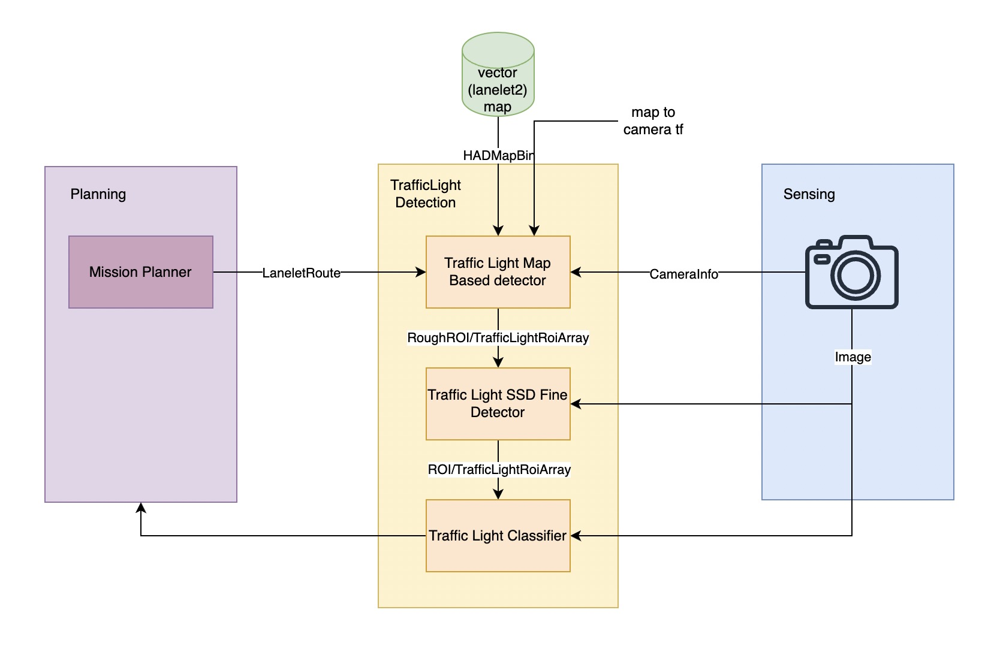
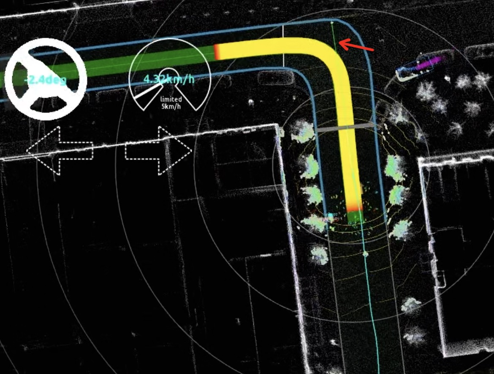
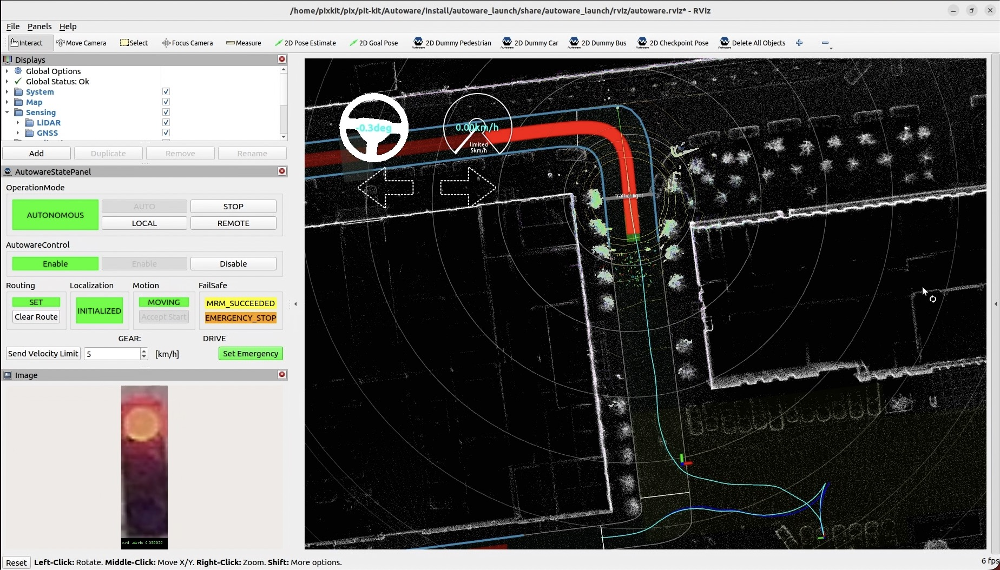
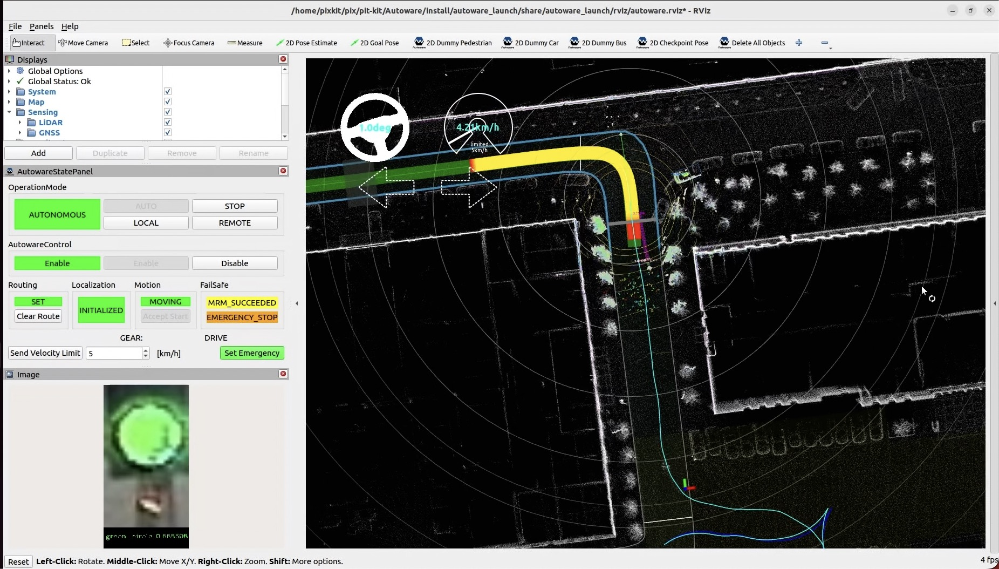

# 交通信号灯检测

## Overview

1. 通过[traffic light map based detector](https://github.com/autowarefoundation/autoware.universe/tree/main/perception/traffic_light_map_based_detector)、[摄像头内参](../%E4%BC%A0%E6%84%9F%E5%99%A8%E6%A0%87%E5%AE%9A/camera%E5%86%85%E5%8F%82%E6%A0%87%E5%AE%9A.md)、[摄像头外参](../%E4%BC%A0%E6%84%9F%E5%99%A8%E6%A0%87%E5%AE%9A/LiDAR-camera%E6%A0%87%E5%AE%9A.md)、[矢量地图](../%E5%9C%B0%E5%9B%BE/lanelet2%E5%9C%B0%E5%9B%BE.md)获取当前道路的交通信号灯的粗ROI
2. 基于粗ROI，通过[traffic light SSD fine detector](https://github.com/autowarefoundation/autoware.universe/tree/main/perception/traffic_light_ssd_fine_detector)获取精细ROI
3. 基于精细ROI，通过[traffic light classifier](https://github.com/autowarefoundation/autoware.universe/tree/main/perception/traffic_light_classifier)对交通信号灯进行分类
4. 交通信号灯分类结果返回给Planning模块中的[behavior velocity planner](https://github.com/autowarefoundation/autoware.universe/tree/main/planning/behavior_velocity_planner)，来对轨迹速度进行修改

## How To Use
### 绘制Lanelet2地图
需要在Lanelet2地图中绘制`lanelet`，还有其参考的`traffic_light`，绘制方法参考[lanelet2地图](../%E5%9C%B0%E5%9B%BE/lanelet2%E5%9C%B0%E5%9B%BE.md)

### 标定摄像头内参与外参
1. 内参标定，参考[camera内参标定](../%E4%BC%A0%E6%84%9F%E5%99%A8%E6%A0%87%E5%AE%9A/camera%E5%86%85%E5%8F%82%E6%A0%87%E5%AE%9A.md)，将内参保存在`~/pix/pix-kit/Autoware/src/sensor_kit/external/pixkit_sensor_kit_launch/data/camera_info.yaml`中
2. 外参标定，参考[LiDAR-Camera外参标定](../%E4%BC%A0%E6%84%9F%E5%99%A8%E6%A0%87%E5%AE%9A/LiDAR-camera%E6%A0%87%E5%AE%9A.md)，将外参保存在`~/pix/pix-kit/Autoware/src/param/autoware_individual_params/individual_params/config/default/pixkit_sensor_kit/sensors_calibration.yaml`中

### 设置Goal Pose
设置Goal Pose以生成`LaneletRoute`，可以看到下图中有一根绿色线段连接`traffic light`与车辆

### 检测交通信号灯
- 当检测到红灯信号后，在停止线后的轨迹变成红色，表明车辆会停在停止线前

- 当检测到绿灯信号后，停止线后的轨迹变为黄色或者绿色，表明车辆越过停止线、通过有信号灯的路口

## 参考资料
- [traffic light map based detector](https://github.com/autowarefoundation/autoware.universe/tree/main/perception/traffic_light_map_based_detector)
- [traffic light SSD fine detector](https://github.com/autowarefoundation/autoware.universe/tree/main/perception/traffic_light_ssd_fine_detector)
- [traffic light classifier](https://github.com/autowarefoundation/autoware.universe/tree/main/perception/traffic_light_classifier)
- [behavior velocity planner](https://github.com/autowarefoundation/autoware.universe/tree/main/planning/behavior_velocity_planner)
- [design of planning in Autoware](https://autowarefoundation.github.io/autoware-documentation/main/design/autoware-architecture/planning/)