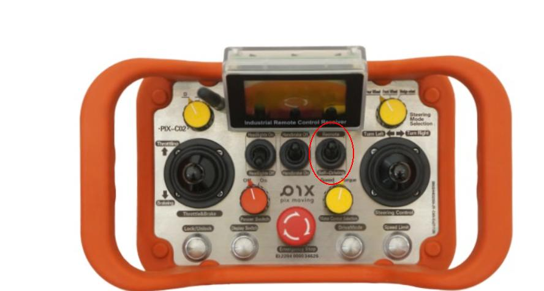

# 启动Autoware

Autoware分为模拟与实车运行两个部分，模拟运行请参考[Autoware Simulator Tutorials](https://autowarefoundation.github.io/autoware-documentation/main/tutorials/)，如需实车运行，请参考以下操作
## launch文件及参数配置
可以使用以下命令来启动Autoware
``` shell
ros2 launch autoware_launch autoware.launch.xml \
map_path:=$HOME/autoware_map/factory_20230325 \ #切换成你的地图文件
vehicle_model:=pixkit \
sensor_model:=pixkit_sensor_kit
```
以上命令可分为以下5个部分

- `autoware_launch`： launch文件所在的package
- `autoware.launch.xml`： launch文件
- `map_path`： 包含点云地图（pointcloud_map.pcd）与矢量地图（lanelet2_map.osm）、地图的地址参数。地图制作方式参考[地图](../%E5%9C%B0%E5%9B%BE/index.md)
- `vehicle_model`： 车辆模型参数，会根据参数来选取相应的车辆[urdf模型](https://docs.ros.org/en/humble/Tutorials/Intermediate/URDF/URDF-Main.html)与[autoware的接口](https://github.com/pixmoving-moveit/pix_driver)，参考[pixkit_launch](https://github.com/pixmoving-moveit/pixkit_launch)
- `sensor_model`： 传感器模型参数，会根据参数来选取相应的传感器[urdf模型](https://docs.ros.org/en/humble/Tutorials/Intermediate/URDF/URDF-Main.html)与传感器驱动，参考[pixkit_sensor_kit_launch](https://github.com/pixmoving-moveit/pixkit_sensor_kit_launch)

## 启动界面
以上命令正常运行后，会出现[rviz2](https://github.com/ros2/rviz)窗口

在可视化窗口内能够看到导入的底盘模型及您的点云地图与矢量地图
## 启动成功验证
- [验证地图是否导入](#验证地图是否导入)
- [验证车辆模型是否启动](#验证车辆模型是否导入)
- [验证传感器是否正常启动](#验证传感器是否正常启动)
### 验证地图是否导入
可通过以下方法查看是否有地图导入
- 可直接观察rviz中是否有点云地图与矢量地图
- 通过[ros2 cli](https://docs.ros.org/en/foxy/Tutorials/Beginner-CLI-Tools.html)查看是否有地图数据发布，如有数据输出则表明明地图导入正常，命令如下
``` bash
ros2 topic echo [topic name]
```

| **Topic** | **类型** | **描述** |
|------| ------ | ------ |
| /map/pointcloud_map | sensor_msgs/msg/PointCloud2 | 点云地图 |
| /map/vector_map | autoware_auto_mapping_msgs/msg/HADMapBin | 矢量地图(lanelet2格式) |

### 验证车辆模型是否导入
1. 观察rviz可视化窗口中是否有车辆模型，如下图所示

2. 查看底盘反馈是否正常，底盘反馈的topic见下表，也通过遥控器转向查看rviz2上的deg是否变化，有变化表示已连接，若不能关闭窗口等待30s重新启动auotware观察，命令如下
``` bash
ros2 top echo [topic name]
```

| **Topic** | **类型** | **描述** |
| ------ | ------ | ----------- |
| /vehicle/status/control_mode | autoware_auto_vehicle_msgs::msg::ControlModeReport | 底盘控制模式反馈 |
| /vehicle/status/velocity_status | autoware_auto_vehicle_msgs::msg::VelocityReport | 底盘速度反馈 |
| /vehicle/status/steering_status | autoware_auto_vehicle_msgs::msg::SteeringReport | 底盘转向反馈 |
| /vehicle/status/gear_status | autoware_auto_vehicle_msgs::msg::GearReport | 底盘档位反馈 |
| /vehicle/status/turn_indicators_status | autoware_auto_vehicle_msgs::msg::TurnIndicatorsReport | 底盘转向灯反馈 |
| /vehicle/status/hazard_lights_status | autoware_auto_vehicle_msgs::msg::HazardLightsReport | 底盘应急灯状态反馈 |

### 验证传感器是否正常启动
1. 通过[ros2 cli](https://docs.ros.org/en/foxy/Tutorials/Beginner-CLI-Tools.html)查看是否有传感器数据发布，如果有数据发布则表明传感器启动正常,若地图上显示不了点云，需要激活雷达，命令如下：
``` bash
ros2 topic echo [topic name]
```
| **Topic** | **类型** | **描述** |
| ------ | ------ | ----------- |
| /sensing/lidar/top/outlier_filtered/pointcloud | sensor_msgs/msg/PointCloud2 | LiDAR数据 |
| /sensing/imu/imu_data | sensor_msgs/msg/Imu | IMU数据 |

- 激活雷达脚本：./activte_ouster.sh

### 给定起点和终点
 - 2D pose Estimate:当前车辆所在地图上的位置，需要匹配上
 - 2D Goal Pose：终点
 - Send Velocity Limit:填写初始速度3～5（单位KM/h）,点击Send Velocity Limit发送生效 
 
### 点击AUTO按键
 遥控器切换self_driving（此状态下遥控器只有紧急驻车可用），车辆进行自动驾驶时，请注意周围车辆及路，紧急停车（遥控器中心红色按钮或切回遥控模式时踩刹车）。
  


## 注意事项

- 启动前需要确保地图文件存在，如map_path指定的文件夹不存在或文件不存在会导致启动失败。