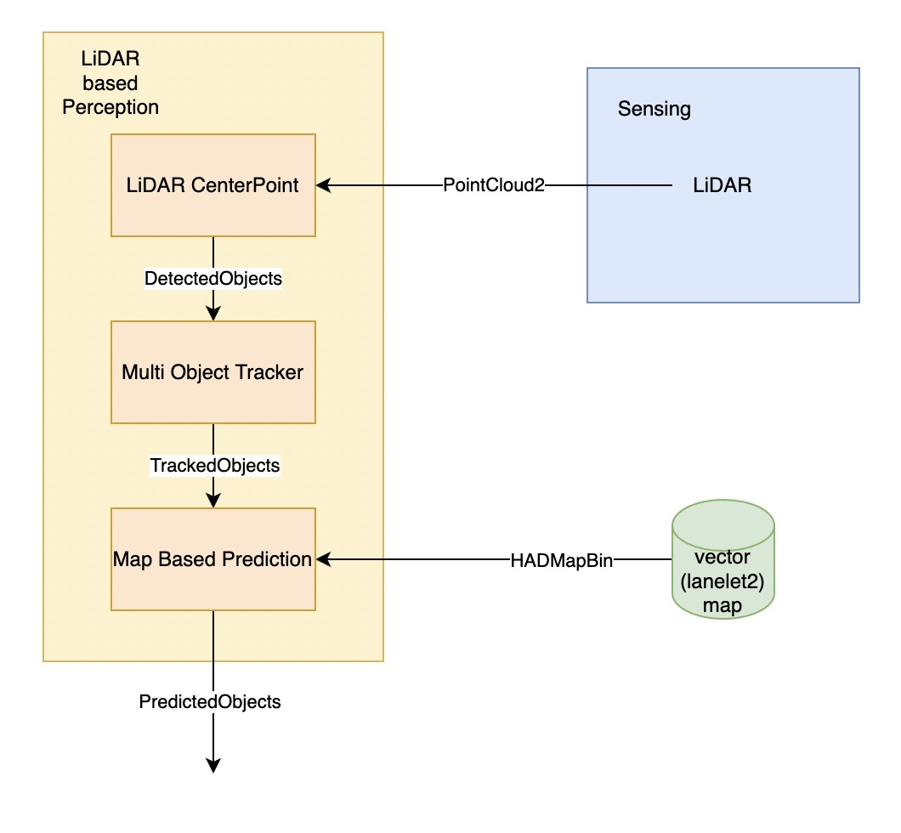
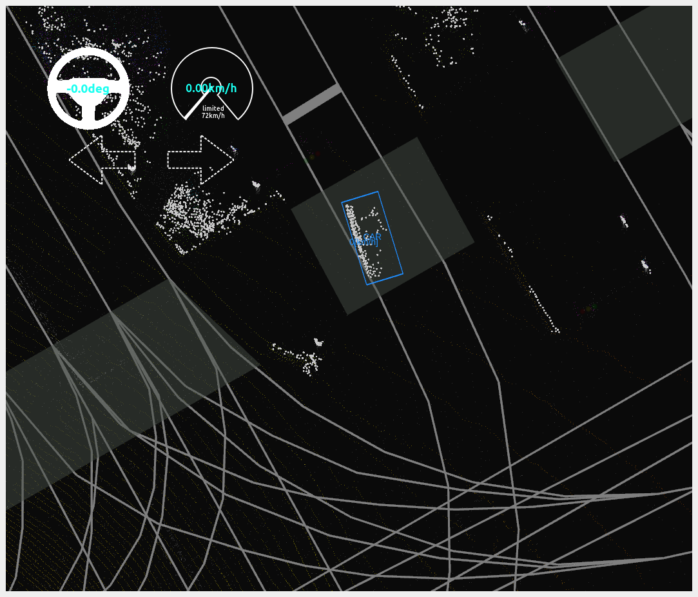
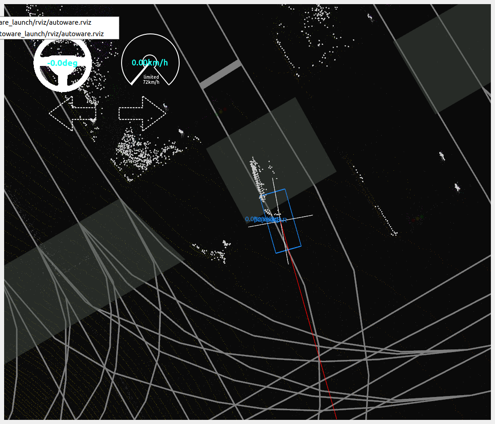
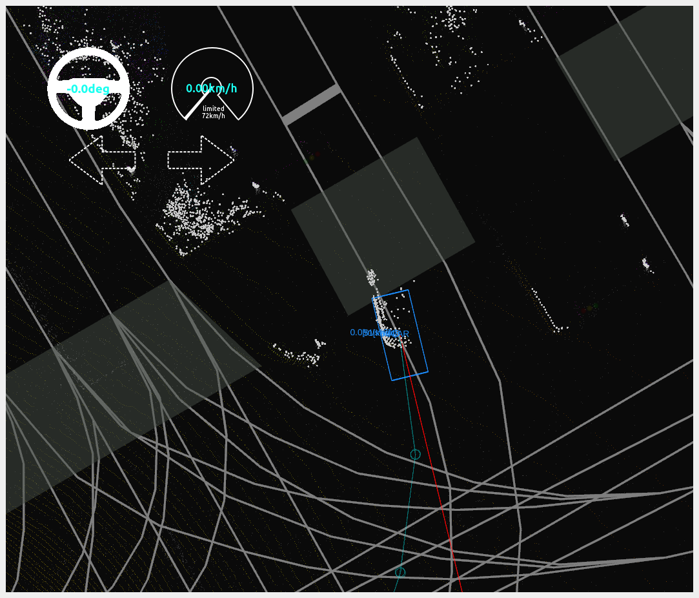

# 基于LiDAR的感知

## Overview

1. LiDAR的点云被[LiDAR CenterPoint](https://github.com/autowarefoundation/autoware.universe/tree/main/perception/lidar_centerpoint)接收，进行点云目标检测，获取目标的分类、位置、尺寸信息，输出[DetectedObjects](https://github.com/tier4/autoware_auto_msgs/blob/tier4/main/autoware_auto_perception_msgs/msg/DetectedObjects.idl)
2. [Multi Object Tracker](https://github.com/autowarefoundation/autoware.universe/tree/main/perception/multi_object_tracker)接收到[DetectedObjects](https://github.com/tier4/autoware_auto_msgs/blob/tier4/main/autoware_auto_perception_msgs/msg/DetectedObjects.idl)，目标进行追踪，获取目标的分类、位置、尺寸、速度、加速度信息，输出[TrackedObjects](https://github.com/tier4/autoware_auto_msgs/blob/tier4/main/autoware_auto_perception_msgs/msg/TrackedObjects.idl)
3. [Map Based Prediction](https://github.com/autowarefoundation/autoware.universe/tree/main/perception/map_based_prediction)接收[TrackedObjects](https://github.com/tier4/autoware_auto_msgs/blob/tier4/main/autoware_auto_perception_msgs/msg/TrackedObjects.idl)，通过[地图信息](../地图/lanelet2%E5%9C%B0%E5%9B%BE.md)对轨迹进行预测，输出[PredictedObjects](https://github.com/tier4/autoware_auto_msgs/blob/tier4/main/autoware_auto_perception_msgs/msg/PredictedObjects.idl)

## How To Use

### 启动感知
[启动Autoware](./%E5%90%AF%E5%8A%A8autoware.md)

### LiDAR CenterPoint

通过[CenterPoint](https://github.com/tianweiy/CenterPoint)对点云进行检测，可以看到蓝色框中的`CAR`物体

#### 输入Topic的
|**topic**|**类型**|**描述**|
|---------|-------|--------|
|/sensing/lidar/concatenated/pointcloud|sensor_msgs/msg/PointCloud2|实时点云数据|

#### 输出Topic的
|**topic**|**类型**|**描述**|
|---------|-------|--------|
|/perception/object_recognition/detection/centerpoint/objects|[autoware_auto_perception_msgs/msg/DetectedObjects](https://github.com/tier4/autoware_auto_msgs/blob/tier4/main/autoware_auto_perception_msgs/msg/DetectedObjects.idl)|检测到的objects|

### Multi Object Tracker

通过`Data Association`与`EKF Tracker`对objects进行多帧目标关联，EKF进行追踪，追踪到的物体被赋予了一个`uuid`，运行的速度通过图中的红线进行可视化

#### Data Association
将多帧感知结果的数据连接，转换为`Min Cost Max Flow问题`，通过[mussp](https://github.com/yu-lab-vt/muSSP)来进行求解，获取多帧感知结果之间的关系
#### EKF Tracker
通过不同的分类选择不同的模型来对感知结果进行追踪，提高追踪的稳定性与精度

#### 输入Topic的
|**topic**|**类型**|**描述**|
|---------|-------|--------|
|/perception/object_recognition/detection/centerpoint/objects|[autoware_auto_perception_msgs::msg::DetectedObjects](https://github.com/tier4/autoware_auto_msgs/blob/tier4/main/autoware_auto_perception_msgs/msg/DetectedObjects.idl)|检测到的objects|

#### 输出Topic的
|**topic**|**类型**|**描述**|
|---------|-------|--------|
|/perception/object_recognition/tracking/objects|[autoware_auto_perception_msgs/msg/TrackedObjects](https://github.com/tier4/autoware_auto_msgs/blob/tier4/main/autoware_auto_perception_msgs/msg/TrackedObjects.idl)|追踪到的object|

### Map Based Prediction

根据地图和追踪到的物体进行物体未来轨迹的预测，提高[路径规划](./%E5%9F%BA%E4%BA%8Elanelet2%E5%9C%B0%E5%9B%BE%E7%9A%84%E5%85%A8%E5%B1%80%E8%B7%AF%E5%BE%84%E8%A7%84%E5%88%92.md)的安全性和稳定性。

#### 移除老的object数据

储存障碍物的时间序列数据，包括障碍物的位置、速度、还有时间信息，来预测一定时间内物体是否需要变道

#### 获取当前的车道并且更新object数据

检测车辆是否需要变道、是向左变道还是向右变道

#### 生成object预测的参考轨迹

根据object是否需要变道、向左变道还是向右变道，再基于地图，生成object的预测参考轨迹

#### 输入Topic的
|**topic**|**类型**|**描述**|
|---------|-------|--------|
|/perception/object_recognition/tracking/objects|[autoware_auto_perception_msgs/msg/TrackedObjects](https://github.com/tier4/autoware_auto_msgs/blob/tier4/main/autoware_auto_perception_msgs/msg/TrackedObjects.idl)|追踪到的object|
|/map/vector_map|autoware_auto_mapping_msgs/msg/HADMapBin|矢量地图(lanelet2)|

#### 输出Topic的
|**topic**|**类型**|**描述**|
|---------|-------|--------|
|/perception/object_recognition/objects|[autoware_auto_perception_msgs::msg::PredictedObjects](https://github.com/tier4/autoware_auto_msgs/blob/tier4/main/autoware_auto_perception_msgs/msg/PredictedObjects.idl)|有预测轨迹的objects|

## 参考资料

- [autoware_auto_perception_msgs](https://github.com/tier4/autoware_auto_msgs/tree/tier4/main/autoware_auto_perception_msgs/msg)
- [lidar centerpoint in Autoware](https://github.com/autowarefoundation/autoware.universe/tree/main/perception/lidar_centerpoint)
- [CenterPoint](https://github.com/tianweiy/CenterPoint)
- [multi object tracker in Autoware](https://github.com/autowarefoundation/autoware.universe/tree/main/perception/multi_object_tracker)
- [muSSP](https://github.com/yu-lab-vt/muSSP)
- [map based prediction](https://github.com/autowarefoundation/autoware.universe/tree/main/perception/map_based_prediction)

