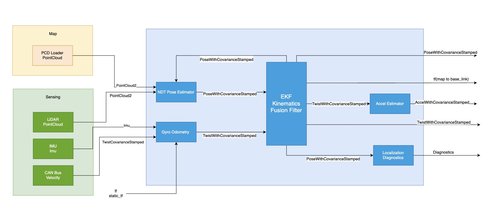

# 多传感器融合定位

## Overview

1. 需要将底盘反馈轮速与IMU的角速度融合，输出`base_link`坐标系下的`TwistWithCovarianceStamped`
2. 使用点云地图与LiDAR点云进行匹配，输出`map`坐标系下的`PoseWithCovarianceStamped`
3. 将融合后的`TwistWithCovarianceStamped`与点云地图的`PoseWithCovarianceStamped`作为输入，通过EKF进行滤波，获得高频与平滑的定位信息
4. 将融合后的`PoseWithCovarianceStamped`作为点云匹配的初始值

## 输入数据
|**topic**|**类型**|**描述**|
|-------------------|---------------------------|---------------------|
|/map/pointcloud_map|sensor_msgs/msg/PointCloud2|点云地图|
|/localization/util/downsample/pointcloud|sensor_msgs/msg/PointCloud2|降采样实时点云|
|/sensing/vehicle_velocity_converter/twist_with_covariance|geometry_msgs/msg/TwistCovarianceStamped|底盘轮速反馈，提供线速度|
|/sensing/imu/imu_data|sensor_msgs/msg/Imu|Imu数据，提供角速度|

## 输出数据
|**topic**|**类型**|**描述**|
|-------------------|---------------------------|---------------------|
|/localization/kinematic_state|nav_msgs/msg/Odometry|融合后Odometry数据|
|/localization/pose_with_covariance/geometry_msgs/msg/PoseWithConvarianceStamped|融合后的pose数据|

## 融合定位demo

## 参考资料
[https://autowarefoundation.github.io/autoware-documentation/main/design/autoware-architecture/localization/](https://autowarefoundation.github.io/autoware-documentation/main/design/autoware-architecture/localization/)