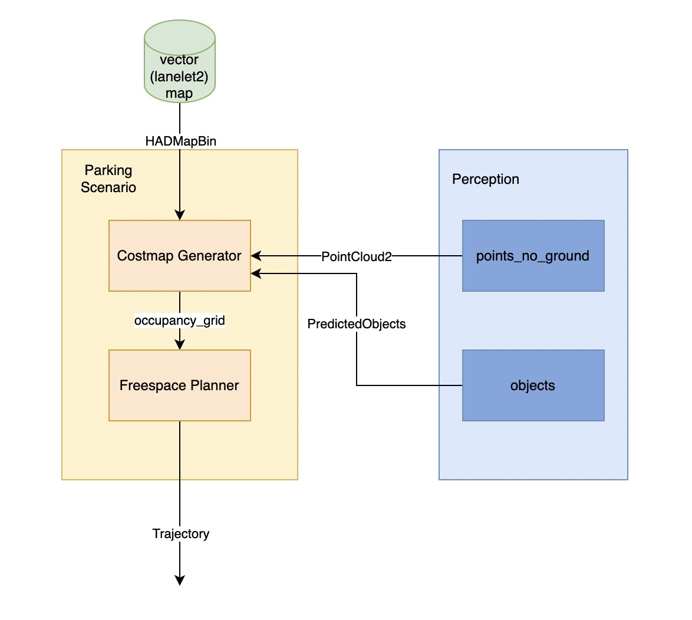
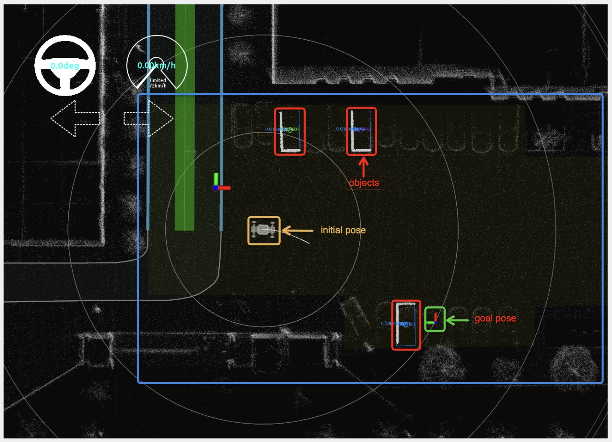
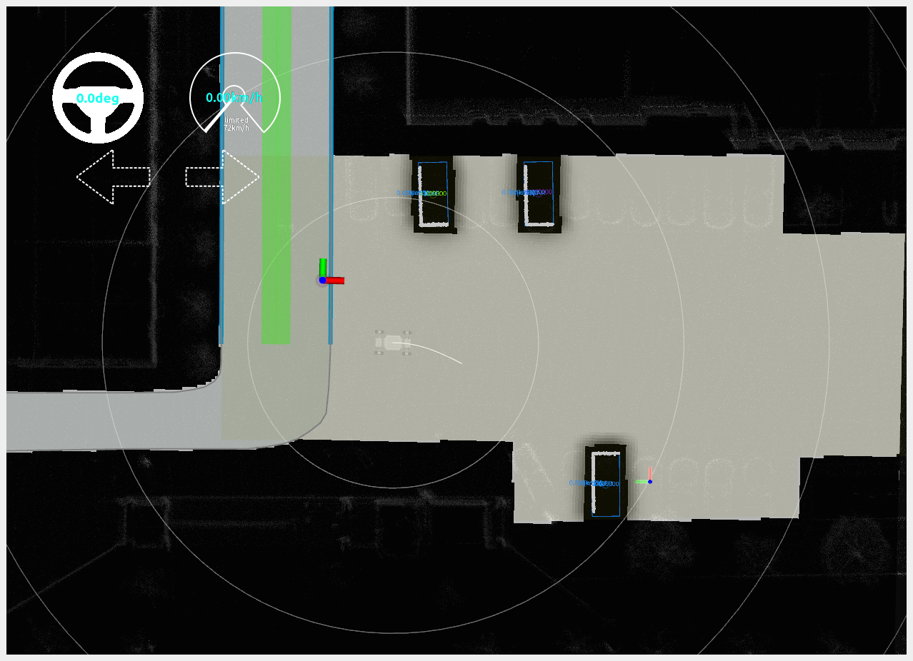

# 自动泊车

## Overview

### How TO Use

1. 需要准备lanelet2地图，在地图中绘制`parking_lot`的`polygon`，绘制lanelet2地图参考[lanelet2地图](../%E5%9C%B0%E5%9B%BE/lanelet2%E5%9C%B0%E5%9B%BE.md)
2. 当车辆位置在`parking_lot`内时，规划器将`scenario`切换至`Parking`模式，这时`costmap_generator`和`freespace_planner`开始工作
3. `costmap_generator`生成`occupancy_grid`作为`freespace_planner`的代价地图
4. `freespace_planner`通过代价图来进行路径搜索与规划
5. `trajectory`最终传递到[轨迹跟踪模块](./%E8%BD%A8%E8%BF%B9%E8%B7%9F%E8%B8%AA.md)生成控制指令

## Costmap Generator
如下图所示，车辆在`parking_lot`(蓝色框内淡黄色多边形)区域内，设定好`goal_pose`（绿色框内坐标轴），其中还有`objects`（红色框）。

在`parking_lot`内设定好目标后，可以可视化`occupancy_grip`代价地图，可行驶区域代价较小，为灰色，被障碍物占用的区域代价较高，为黑色。可以看到，与`parking_lot`有重叠部分的`lanelet`也被考虑进`occupancy_grip`的计算中，这是因为车辆执行自动驾驶任务时，可能会经过[lane_driving的车道内行驶](./%E8%BD%A6%E9%81%93%E5%86%85%E8%A1%8C%E9%A9%B6.md)才能到达`parking_lot`，为避免地图中间的空隙，所以需要将`lanelet`与`parking_lot`通过重叠的方式连接。

### 关键参数

|**名称**|**描述**|**默认值**|
|-------|-------|----------|
|grid_min_value|costmap的损失最小值|0.0|
|grid_max_value|costmap的损失最大值|1.0|
|grid_resolution|costmap的分辨率|0.2(m)|
|grid_length_x|costmap的长|70.0(m)|
|grid_length_y|costmap的宽|70.0(m)|
|grid_position_x|costmap的初始位置x坐标(相对车辆)|0.0(m)|
|grid_position_y|costmap的初始位置y坐标(相对车辆)|0.0(m)|
|maximum_lidar_height_thres|点云相对激光雷达的最大高度|0.3(m)|
|minimum_lidar_height_thres|点云相对激光雷达的最小高度|-2.2(m)|
|expand_rectangle_size|拓展object的尺寸大小|1.0(m)|

## Freespace Planner
获取到车辆位置`initial_pose`与`goal_pose`，通过[A*](https://github.com/autowarefoundation/autoware.universe/tree/main/planning/freespace_planning_algorithms)规划出一条可行的轨迹，让车辆能够到达`goal_pose`。

因为`freespace planner`有可能会产生揉车的重叠轨迹，[控制器](./%E8%BD%A8%E8%BF%B9%E8%B7%9F%E8%B8%AA.md)不能够处理这种轨迹，所以`freespace planner`将揉车轨迹进行分段处理，保证`控制器`的正常运行。

### 关键参数
#### 节点参数

| 参数名称                       | 描述                          | 默认值     |
| ---------------------------- | ------------------------------| --------- |
| `vehicle_shape_margin_m`     | 碰撞边界                        | |
| `waypoints_velocity`         | 规划的轨迹线速度                 | 5.0(km/h) |
| `th_arrived_distance_m`      | 判断是否到达终点的阈值            | 1.0(m)    |
| `th_stopped_time_sec`        | 判断车辆是否停止的判定时间         | 1.0(s)    |
| `th_stopped_velocity_mps`    | 判断车辆是否停止的速度阈值         | 0.01(m/s) |
| `th_course_out_distance_m`   | 判断车辆是否偏离轨迹的距离阈值      | 1.0(m)    |
| `replan_when_obstacle_found` | 当有障碍物在轨迹上是否重新规划轨迹   | true     |
| `replan_when_course_out`     | 当车辆偏离轨迹是否重新规划任务      | true      |

#### planner参数

| 参数名称                      | 描述                        | 默认值      |
| -------------------------    | -------------------------- | ---------- |
| `time_limit`                 | 规划运行的时间，避免规划器阻塞  | 30000.0(s) |
| `minimum_turning_radius`     | 机器人最小转弯半径            |9.0(m)      |
| `maximum_turning_radius`     | 机器人最大转弯半径            |9.0(m)      |
| `theta_size`                 | 将航向角离散化的数量           |144        |
| `lateral_goal_range`         | 目标位置的横向距离范围         | 0.5       |
| `longitudinal_goal_range`    | 目标位置的纵向距离范围         | 2.0        |
| `angle_goal_range`           | 目标位置的偏航角范围          | 6.0(deg)   |
| `curve_weight`               | 轨迹曲线的损失权重            | 1.2        |
| `reverse_weight`             | 反向轨迹的损失权重            | 2.0        |
| `obstacle_threshold`         | 判定grid为障碍物的cost阈值    | 100        |

## 参考资料
- [planning design](https://autowarefoundation.github.io/autoware-documentation/main/design/autoware-architecture/planning/)
- [costmap generator](https://github.com/autowarefoundation/autoware.universe/tree/main/planning/costmap_generator)
- [freespace planner](https://github.com/autowarefoundation/autoware.universe/tree/main/planning/freespace_planner)
- [freespace planner algorithm](https://github.com/autowarefoundation/autoware.universe/tree/main/planning/freespace_planning_algorithms)
