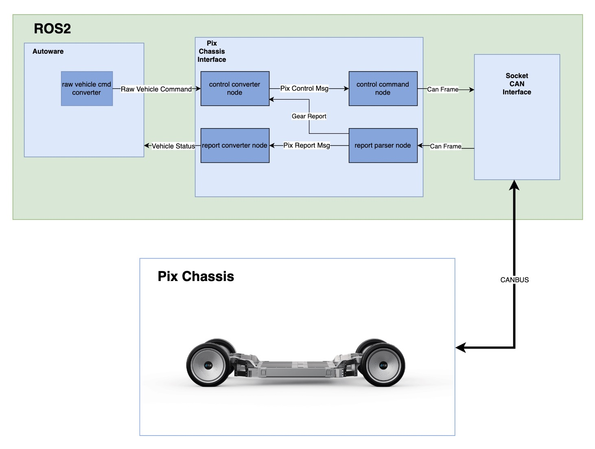

# Pix底盘接口

## Overview

[Pixmoving](https://www.pixmoving.com)的[线控](https://en.wikipedia.org/wiki/Drive_by_wire)底盘，具有自动驾驶接入能力. 我们已经设计了对接[Autoware.universe](https://github.com/autowarefoundation/autoware.universe)的接口。

### 注意
> 源代码请参考[pix_driver](https://github.com/pixmoving-moveit/pix_driver)

> 在你使用接口之前，请先确保[ros2_socketcan](https://github.com/autowarefoundation/ros2_socketcan/tree/1.1.0)在你的工作空间，并已经启动。
## 角色

Pix底盘接口有以下3个主要功能:

- **在CAN frames和pix_hooke_driver_msgs之间翻译**
- **将Autoware的控制指令换完成为pix_hooke_driver_msgs**
- **将pix_hooke_driver_msgs内的车辆状态转换为Autoware messages**

## 软件设计

## Control Command Node

### 输入

#### **Control Command Node的输入**

| Input           | Topic(Data Type)                                                   | Explanation |
| --------------- | ------------------------------------------------------------------ | ----------- |
| autonomous driving to vehicle drive control| `/pix_hooke/a2v_drivectrl_130` ([pix_hooke_driver_msgs/msg/A2vDriveCtrl](https://github.com/pixmoving-moveit/pix_driver/blob/main/pix_hooke_driver_msgs/msg/A2vDriveCtrl.msg)) | [A2vDriveCtrl](#a2vdrivectrl) |
| autonomous driving to vehicle brake control|`/pix_hooke/a2v_brakectrl_131` ([pix_hooke_driver_msgs/msg/A2vBrakeCtrl](https://github.com/pixmoving-moveit/pix_driver/blob/main/pix_hooke_driver_msgs/msg/A2vBrakeCtrl.msg)) | [A2vBrakeCtrl](#a2vbrakectrl) |
| autonomous driving to vehicle steering control |`/pix_hooke/a2v_steerctrl_132` ([pix_hooke_driver_msgs/msg/A2vSteerCtrl](https://github.com/pixmoving-moveit/pix_driver/blob/main/pix_hooke_driver_msgs/msg/A2vSteerCtrl.msg)) | [A2vSteerCtrl](#a2vsteerctrl) |
| autonomous driving to vehicle control|`/pix_hooke/a2v_vehiclectrl_133` ([pix_hooke_driver_msgs/msg/A2vVehicleCtrl](https://github.com/pixmoving-moveit/pix_driver/blob/main/pix_hooke_driver_msgs/msg/A2vVehicleCtrl.msg)) | [A2vVehicleCtrl](#a2vvehiclectrl) |
| autonomous driving to vehicle motor control|`/pix_hooke/a2v_wheelctrl_135` ([pix_hooke_driver_msgs/msg/A2vWheelCtrl](https://github.com/pixmoving-moveit/pix_driver/blob/main/pix_hooke_driver_msgs/msg/A2vWheelCtrl.msg)) | [A2vWheelCtrl](#a2vwheelctrl) |

#### A2vDriveCtrl
**下表为`A2vDriveCtrl(self-driving to vehicle drive control)`的详细介绍**

| Content                  | Data Type        | Explanation                            |
| ----------------------- | ---------------- | -----------                            |
| header | std_msgs/Header | header                   |
| acu_chassis_driver_en_ctrl  | std_msgs/int8 | 使能/失能底盘纵向加速控制 `{0: 'ACU_CHASSISDRIVERENCTRL_DISABLE', 1: 'ACU_CHASSISDRIVERENCTRL_ENABLE'}` |
| acu_chassis_driver_mode_ctrl | std_msgs/int8 | 目标纵向控制模式 `{0: 'ACU_CHASSISDRIVERMODECTRL_SPEED_CTRL_MODE', 1: 'ACU_CHASSISDRIVERMODECTRL_THROTTLE_CTRL_MODE', 2: 'ACU_CHASSISDRIVERMODECTRL_RESERVE', 3: 'ACU_CHASSISDRIVERMODECTRL_RESERVE'}` |
| acu_chassis_gear_ctrl | std_msgs/int8 | 目标档位 `{0: 'ACU_CHASSISGEARCTRL_DEFAULT_N', 1: 'ACU_CHASSISGEARCTRL_D', 2: 'ACU_CHASSISGEARCTRL_N', 3: 'ACU_CHASSISGEARCTRL_R'}` |
| acu_chassis_speed_ctrl | std_msgs/float32 | 目标速度 [m/s] |
| acu_chassis_throttle_pdl_target | std_msgs/float32 | 目标加速踏板开度 `0.0-100.0` |

#### A2vBrakeCtrl
**下表为`A2vBrakeCtrl(self-driving to vehicle brake control)`的详细介绍**

| Content                  | Data Type        | Explanation                            |
| ----------------------- | ---------------- | -----------                            |
| header                | std_msgs/Header | header                   |
| acu_chassis_brake_en  | std_msgs/int8 | 使能/失能底盘刹车控制 `0: 'ACU_CHASSISBRAKEEN_DISABLE', 1: 'ACU_CHASSISBRAKEEN_ENABLE'` |
| acu_chassis_aeb_ctrl | std_msgs/int8 | 使能/失能AEB `0: 'ACU_CHASSISAEBCTRL_DISABLE', 1: 'ACU_CHASSISAEBCTRL_ENABLE'`|
| acu_chassis_brake_pdl_target | std_msgs/float32 | 目标刹车踏板开度 `0.0-100.0`|
| acu_chassis_epb_ctrl | std_msgs/int8 |驻车控制 `0: 'ACU_CHASSISEPBCTRL_DEFAULT', 1: 'ACU_CHASSISEPBCTRL_BRAKE', 2: 'ACU_CHASSISEPBCTRL_RELEASE'`|

#### A2vSteerCtrl
**下表为`A2vSteerCtrl(self-driving to vehicle steering control)`的详细介绍**

| Content                  | Data Type        | Explanation                            |
| ----------------------- | ---------------- | -----------                            |
| header                | std_msgs/Header | header                   |
| acu_chassis_steer_en_ctrl  | std_msgs/int8 | 使能/失能横向/转向控制 `{0: 'ACU_CHASSISSTEERENCTRL_DISABLE', 1: 'ACU_CHASSISSTEERENCTRL_ENABLE'}` |
| acu_chassis_steer_mode_ctrl | std_msgs/int8 | 转向模式 `{0: 'ACU_CHASSISSTEERMODECTRL_FRONT_ACKERMAN', 1: 'ACU_CHASSISSTEERMODECTRL_SAME_FRONT_AND_BACK', 2: 'ACU_CHASSISSTEERMODECTRL_FRONT_DIFFERENT_BACK', 3: 'ACU_CHASSISSTEERMODECTRL_BACK_ACKRMAN', 4: 'ACU_CHASSISSTEERMODECTRL_FRONT_BACK'}` |
| acu_chassis_steer_angle_target | std_msgs/int32 | 目标转向角， `-500-500 从左至右`。 当`ACU_ChassisSteerModeCtrl=ACU_CHASSISSTEERMODECTRL_FRONT_BACK`时， `ACU_ChassisSteerAngleTarget`智能控制前转向|
| acu_chassis_steer_angle_rear_target | std_msgs/int32 |后轮目标转向脚`-500-500`。 只有当`ACU_ChassisSteerModeCtrl=ACU_CHASSISSTEERMODECTRL_FRONT_BACK`起作用|
| acu_chassis_steer_angle_speed_ctrl | std_msgs/float32 |目标转向角速度`0-500` |

#### A2vVehicleCtrl
**下表为`A2vVehicleCtrl(self-driving to vehicle Vehicle Control)`的详细介绍**

| Content                  | Data Type        | Explanation                            |
| ----------------------- | ---------------- | -----------                            |
| header                | std_msgs/Header | header |
| acu_vehicle_pos_lamp_ctrl  | std_msgs/int8 | 示廓灯控制 `{0: 'ACU_VEHICLEPOSLAMPCTRL_OFF', 1: 'ACU_VEHICLEPOSLAMPCTRL_ON'}`|
| acu_vehicle_head_lamp_ctrl | std_msgs/int8 | 头灯控制 `{0: 'ACU_VEHICLEHEADLAMPCTRL_OFF', 1: 'ACU_VEHICLEHEADLAMPCTRL_ON'}`|
| acu_vehicle_left_lamp_ctrl | std_msgs/int8 | 左转向灯控制 `{0: 'ACU_VEHICLELEFTLAMPCTRL_OFF', 1: 'ACU_VEHICLELEFTLAMPCTRL_ON'}`|
| acu_vehicle_right_lamp_ctrl | std_msgs/int8 | 右转向灯控制 `{0: 'ACU_VEHICLERIGHTLAMPCTRL_OFF', 1: 'ACU_VEHICLERIGHTLAMPCTRL_ON'}`|
| acu_vehicl_high_beam_ctrl | std_msgs/int8 | 前大灯控制 `{0: 'ACU_VEHICLEHIGHBEAMCTRL_OFF', 1: 'ACU_VEHICLEHIGHBEAMCTRL_ON'}`|
| acu_vehicle_fog_lamp_ctrl | std_msgs/int8 | 雾灯控制 `{0: 'ACU_VEHICLEFOGLAMPCTRL_OFF', 1: 'ACU_VEHICLEFOGLAMPCTRL_ON'}`|
| acu_vehicle_body_light_crtl| std_msgs/int8| 车体灯控制 `{0: 'ACU_VEHICLEBODYLIGHTCTRL_OFF', 1: 'ACU_VEHICLEBODYLIGHTCTRL_ON'}`|
| acu_vehicle_read_light_crtl| std_msgs/int8| 阅读灯控制(保留) `{0: 'ACU_VEHICLEREADLIGHTCTRL_OFF', 1: 'ACU_VEHICLEREADLIGHTCTRL_ON'}`|
| acu_vehicle_voice| std_msgs/int8| 车辆声音控制(保留) `{0: 'ACU_VEHICLEVOICE_OFF', 1: 'ACU_VEHICLEVOICE_TURN_LEFT', 2: 'ACU_VEHICLEVOICE_TURN_RIGHT', 3: 'ACU_VEHICLEVOICE_BACKWARD'}`|
| acu_vehicle_wipers_crtl | std_msgs/int8| 雨刮器控制(保留) `{0: 'ACU_VEHICLEWIPERSCTRL_OFF', 1: 'ACU_VEHICLEWIPERSCTRL_LOW', 2: 'ACU_VEHICLEWIPERSCTRL_MID', 3: 'ACU_VEHICLEWIPERSCTRL_HIGH'}`|
| acu_vehicle_door_crtl | std_msgs/int8| 车门控制(保留) `{0: 'ACU_VEHICLEDOORCTRL_DEFAULT', 1: 'ACU_VEHICLEDOORCTRL_CLOSE', 2: 'ACU_VEHICLEDOORCTRL_OPEN'}`|
| acu_vehicle_window_crtl| std_msgs/int8| 车窗控制(保留) `{0: 'ACU_VEHICLEWINDOWCTRL_DEFAULT', 1: 'ACU_VEHICLEWINDOWCTRL_CLOSE', 2: 'ACU_VEHICLEWINDOWCTRL_OPEN'}`|
| acu_chassis_speed_limite_mode | std_msgs/int8| 速度模式 `{0: 'ACU_CHASSISSPEEDLIMITEMODE_DEFAULT', 1: 'ACU_CHASSISSPEEDLIMITEMODE_LIMIT'}`|
| acu_chassis_speed_limite_val | std_msgs/int32| 限速控制 `m/s` |

#### A2vWheelCtrl
**下表为`A2vWheelCtrl(self-driving to vehicle motor control)`的详细介绍**

| Content                  | Data Type        | Explanation                            |
| ----------------------- | ---------------- | -----------                            |
| header                | std_msgs/Header | header                   |
| acu_motor_torque_lf_crtl | std_smgs/float32 | 左前电机扭矩控制 [Nm] `-200.0-200.0` |
| acu_motor_torque_rf_crtl | std_smgs/float32 | 右前点击扭矩控制 [Nm] `-200.0-200.0` |
| acu_motor_torque_lr_crtl | std_smgs/float32 | 左后点击扭矩控制 [Nm] `-200.0-200.0` |
| acu_motor_torque_rr_crtl | std_smgs/float32 | 右后点击扭矩控制 [Nm] `-200.0-200.0` |

### 输出

**`Control Command Node`输出[can_msgs/Frame](http://docs.ros.org/en/melodic/api/can_msgs/html/msg/Frame.html)至[Socket CAN Interface](https://github.com/autowarefoundation/ros2_socketcan/tree/1.1.0).**

| Output (to Socket CAN Interface)          | Topic(Data Type)                                                      | Explanation                                 |
| ---------------               | ------------------------------------------------------------------    | ------------------------                    |
| can frame      | `/to_can_bus` ([can_msgs/msg/Frame](http://docs.ros.org/en/melodic/api/can_msgs/html/msg/Frame.html)) | CAN Frames控制信号 |

## Report Parser Node
### 输入
**`Report Parser Node`的输入是来自[Socket CAN Interface](https://github.com/autowarefoundation/ros2_socketcan/tree/1.1.0)的[can_msgs/Frame](http://docs.ros.org/en/melodic/api/can_msgs/html/msg/Frame.html)**

| Input (From Socket CAN Interface)          | Topic(Data Type)                                                      | Explanation                                 |
| ---------------               | ------------------------------------------------------------------    | ------------------------                    |
| can frame      | `/from_can_bus` ([can_msgs/msg/Frame](http://docs.ros.org/en/melodic/api/can_msgs/html/msg/Frame.html)) | CAN Frames的反馈信号 |

### 输出

**Report Parser Node的输出**

| Input           | Topic(Data Type)                                                   | Explanation |
| --------------- | ------------------------------------------------------------------ | ----------- |
| 车辆发送到自动驾驶的驾驶反馈 | `/pix_hooke/v2a_drivestafb` ([pix_hooke_driver_msgs/msg/V2aDriveStaFb](https://github.com/pixmoving-moveit/pix_driver/blob/main/pix_hooke_driver_msgs/msg/V2aDriveStaFb.msg)) | [V2aDriveStaFb](#v2adrivestafb) |
| 车辆发送到自动驾驶的刹车状态反馈 |`/pix_hooke/v2a_brakestafb` ([pix_hooke_driver_msgs/msg/V2aBrakeStaFb](https://github.com/pixmoving-moveit/pix_driver/blob/main/pix_hooke_driver_msgs/msg/V2aBrakeStaFb.msg)) | [V2aBrakeStaFb](#v2abrakestafb) |
| 车辆发送到自动驾驶的转向状态反馈 |`/pix_hooke/v2a_steerstafb` ([pix_hooke_driver_msgs/msg/V2aSteerStaFb](https://github.com/pixmoving-moveit/pix_driver/blob/main/pix_hooke_driver_msgs/msg/V2aSteerStaFb.msg)) | [V2aSteerStaFb](#v2asteerstafb) |
| 车辆发送到自动驾驶的车辆工作状态反馈 |`/pix_hooke/v2a_vehicleworkstafb` ([pix_hooke_driver_msgs/msg/V2aVehicleWorkStaFb](https://github.com/pixmoving-moveit/pix_driver/blob/main/pix_hooke_driver_msgs/msg/V2aVehicleWorkStaFb.msg)) | [V2aVehicleWorkStaFb](#v2avehicleworkstafb) |
| 车辆发送到自动驾驶的电池状态反馈 |`/pix_hooke/v2a_powerstafb` ([pix_hooke_driver_msgs/msg/V2aPowerStaFb](https://github.com/pixmoving-moveit/pix_driver/blob/main/pix_hooke_driver_msgs/msg/V2aPowerStaFb.msg)) | [V2aPowerStaFb](#v2apowerstafb) |
| 车辆发送到自动驾驶的车辆状态反馈 |`/pix_hooke/v2a_vehiclestafb` ([pix_hooke_driver_msgs/msg/V2aVehicleStaFb](https://github.com/pixmoving-moveit/pix_driver/blob/main/pix_hooke_driver_msgs/msg/V2aVehicleStaFb.msg)) | [V2aVehicleStaFb](#v2avehiclestafb) |
| 车辆发送到自动驾驶的错误状态反馈 |`/pix_hooke/v2a_vehiclefltsta` ([pix_hooke_driver_msgs/msg/V2aVehicleFltSta](https://github.com/pixmoving-moveit/pix_driver/blob/main/pix_hooke_driver_msgs/msg/V2aVehicleFltSta.msg)) | [V2aVehicleFltSta](#v2avehiclefltsta) |
| 车辆发送到自动驾驶的轮速反馈 |`/pix_hooke/v2a_chassiswheelrpmfb` ([pix_hooke_driver_msgs/msg/V2aChassisWheelRpmFb](https://github.com/pixmoving-moveit/pix_driver/blob/main/pix_hooke_driver_msgs/msg/V2aChassisWheelRpmFb.msg)) | [V2aChassisWheelRpmFb](#v2achassiswheelrpmfb) |
| 车辆发送到自动驾驶的胎压反馈 |`/pix_hooke/v2a_chassiswheeltirepressfb` ([pix_hooke_driver_msgs/msg/V2aChassisWheelTirePressFb](https://github.com/pixmoving-moveit/pix_driver/blob/main/pix_hooke_driver_msgs/msg/V2aChassisWheelTirePressFb.msg)) | [V2aChassisWheelTirePressFb](#v2achassiswheeltirepressfb) |
| 车辆发送到自动驾驶的车轮角度反馈 |`/pix_hooke/v2a_chassiswheelanglefb` ([pix_hooke_driver_msgs/msg/V2aChassisWheelAngleFb](https://github.com/pixmoving-moveit/pix_driver/blob/main/pix_hooke_driver_msgs/msg/V2aChassisWheelAngleFb.msg)) | [V2aChassisWheelAngleFb](#v2achassiswheelanglefb) |

#### V2aDriveStaFb
**下表为`V2aDriveStaFb(vehicle to autonomous driving status feedback)`的详细介绍**

| Content                  | Data Type        | Explanation                            |
| ----------------------- | ---------------- | -----------                            |
| header | std_msgs/Header | header                   |
| vcu_chassis_driver_en_sta  | std_msgs/int8 | 纵向控制使能反馈 `{0: 'VCU_CHASSISDRIVERENSTA_DISABLE', 1: 'VCU_CHASSISDRIVERENSTA_ENABLE'}` |
| vcu_chassis_diver_slopover | std_msgs/int8 | 纵向控制过载反馈 `{0: 'VCU_CHASSISDIVERSLOPOVER_NORMAL', 1: 'VCU_CHASSISDIVERSLOPOVER_OVER_SLOP'}` |
| vcu_chassis_driver_mode_sta | std_msgs/int8 | 纵向控制模式反馈{0: 'VCU_CHASSISDRIVERMODESTA_SPEED_CTRL_MODE', 1: 'VCU_CHASSISDRIVERMODESTA_THROTTLE_CTRL_MODE', 2: 'VCU_CHASSISDRIVERMODESTA_RESERVE', 3: 'VCU_CHASSISDRIVERMODESTA_RESERVE'}` |
| vcu_chassis_gear_fb | std_msgs/int8 | 档位反馈 `{0: 'VCU_CHASSISGEARFB_NO_USE', 1: 'VCU_CHASSISGEARFB_D', 2: 'VCU_CHASSISGEARFB_N', 3: 'VCU_CHASSISGEARFB_R'}` |
| vcu_chassis_speed_fb | std_msgs/float32 | 速度反馈 [m/s] `-50.0-50.0` |
| vcu_chassis_throttle_padl_fb | std_msgs/float32 | 加速踏板开度反馈 `0.0-100.0` |
| vcu_chassis_accceleration_fb | std_msgs/float32 | 加速度反馈 [m/s2] `-20.0-20.0` |

#### V2aBrakeStaFb
**下表为`V2aBrakeStaFb(vehicle to autonomous driving braking status feedback)`的详细介绍**

| Content                  | Data Type        | Explanation                            |
| ----------------------- | ---------------- | -----------                            |
| header | std_msgs/Header | header                   |
| vcu_chassis_brake_en_sta  | std_msgs/int8 | 刹车控制使能反馈 `{0: 'VCU_CHASSISBRAKEENSTA_DISABLE', 1: 'VCU_CHASSISBRAKEENSTA_ENABLE'}` |
| vcu_vehicle_brake_lamp_fb | std_msgs/int8 | 刹车灯状态反馈 `{0: 'VCU_VEHICLEBRAKELAMPFB_OFF', 1: 'VCU_VEHICLEBRAKELAMPFB_ON'}` |
| vcu_chassis_epb_fb | std_msgs/int8 | EPB状态反馈 `{0: 'VCU_CHASSISEPBFB_RELEASE', 1: 'VCU_CHASSISEPBFB_BRAKE', 2: 'VCU_CHASSISEPBFB_RELEASING', 3: 'VCU_CHASSISEPBFB_BRAKING'}` |
| vcu_chassis_brake_padl_fb | std_msgs/float32 | 刹车踏板开度反馈 `0-100` |
| vcu_aeb_en_sta_fb | std_msgs/int8 | AEB使能反馈 `{0: 'VCU_AEBENSTAFB_OFF', 1: 'VCU_AEBENSTAFB_ON'}` |
| vcu_aeb_trigger_sta_fb | std_msgs/int8 | AEB触发反馈 `{0: 'VCU_AEBTRIGGERSTAFB_OFF', 1: 'VCU_AEBTRIGGERSTAFB_AEB_TRIGGER'}` |

#### V2aSteerStaFb
**下表为`V2aSteerStaFb(vehicle to autonomous driving steering status feedback)`的详细介绍**

| Content                  | Data Type        | Explanation                            |
| ----------------------- | ---------------- | -----------                            |
| header | std_msgs/Header | header |
| vcu_chassis_steer_en_sta | std_msgs/int8 | steering control enable status feedback `{0: 'VCU_CHASSISSTEERENSTA_DISABLE', 1: 'VCU_CHASSISSTEERENSTA_ENABLE'}` |
| vcu_chassis_steer_slopover | std_msgs/int8 | steering slop-over status feedback `{0: 'VCU_CHASSISSTEERSLOPOVER_NORMAL', 1: 'VCU_CHASSISSTEERSLOPOVER_OVER_SLOP'}` |
| vcu_chassis_steer_work_mode | std_msgs/int8 | steering work mode feedback `{0: 'VCU_CHASSISSTEERWORKMODE_MACHINE', 1: 'VCU_CHASSISSTEERWORKMODE_WIRE', 2: 'VCU_CHASSISSTEERWORKMODE_POWER'}` |
| vcu_chassis_steer_mode_fb | std_msgs/int8 | steering mode feedback `{0: 'VCU_CHASSISSTEERMODEFB_FRONT_ACKERMAN', 1: 'VCU_CHASSISSTEERMODEFB_SAME_FRONT_AND_BACK', 2: 'VCU_CHASSISSTEERMODEFB_FRONT_DIFFERENT_BACK', 3: 'VCU_CHASSISSTEERMODEFB_BACK_ACKRMAN', 4: 'VCU_CHASSISSTEERMODEFB_FRONT_BACK'}` |
| vcu_chassis_steer_angle_fb | std_msgs/int32 | steering angle of front steering wheel [deg] `-500-500` |
| vcu_chassis_steer_angle_rear_fb | std_msgs/int32 | steering angle of rear steering wheel [deg] `-500-500` |
| vcu_chassis_steer_angle_speed_fb | std_msgs/float32 | angular speed of steering wheel [deg/s] `0-500` |

#### V2aVehicleWorkStaFb
**下表为`V2aVehicleWorkStaFb(vehicle to autonomous driving vehicle work status feedback)`的详细介绍**

| Content                  | Data Type        | Explanation                            |
| ----------------------- | ---------------- | -----------                            |
| header | std_msgs/Header | header |
| vcu_driving_mode_fb | std_msgs/int8 | VCU控制模式反馈 `{0: 'VCU_DRIVINGMODEFB_STANDBY', 1: 'VCU_DRIVINGMODEFB_SELF_DRIVING', 2: 'VCU_DRIVINGMODEFB_REMOTE', 3: 'VCU_DRIVINGMODEFB_MAN'}` |
| vcu_chassis_power_sta_fb | std_msgs/int8 | 车辆动力状态反馈 `{0: 'VCU_CHASSISPOWERSTAFB_INIT', 1: 'VCU_CHASSISPOWERSTAFB_ON_ACC', 2: 'VCU_CHASSISPOWERSTAFB_READY', 3: 'VCU_CHASSISPOWERSTAFB_OFF'}` |
| vcu_chassis_power_dc_sta | std_msgs/int8 | DC工作状态反馈 `{0: 'VCU_CHASSISPOWERDCSTA_OFF', 1: 'VCU_CHASSISPOWERDCSTA_ON', 2: 'VCU_CHASSISPOWERDCSTA_STANDBY'}` |
| vcu_chassis_speed_limited_mode_fb | std_msgs/int8 | 限速模式反馈 `{0: 'VCU_CHASSISSPEEDLIMITEDMODEFB_DEFAULT', 1: 'VCU_CHASSISSPEEDLIMITEDMODEFB_LIMIT'}` |
| vcu_chassis_power_limite_sta | std_msgs/int8 | 动力限制模式反馈 `{0: 'VCU_CHASSISPOWERLIMITESTA_DEFAULT', 1: 'VCU_CHASSISPOWERLIMITESTA_LIMIT'}` |
| vcu_sys_eco_mode | std_msgs/int8 | Eco模式反馈 `{0: 'VCU_SYSECOMODE_DEFAULT', 1: 'VCU_SYSECOMODE_ECO', 2: 'VCU_SYSECOMODE_SPORT'}` |
| vcu_chassis_speed_limited_val_fb | std_msgs/float32 | 限速反馈 [m/s] `0.0-50.0` |
| vcu_chassis_low_power_volt_sta | std_msgs/float32 | 低电量反馈 [V] `0-25` |
| vcu_chassis_e_stop_sta_fb | std_msgs/int8 | 急停状态反馈 `{0: 'VCU_CHASSISESTOPSTAFB_NO', 1: 'VCU_CHASSISESTOPSTAFB_CHASSIS_ESTOP', 2: 'VCU_CHASSISESTOPSTAFB_REMOTE_ESTOP', 3: 'VCU_CHASSISESTOPSTAFB_CHASSIS_ERR_ESTOP'}` |
| vcu_crash_front_sta | std_msgs/int8 | 前碰撞反馈 `{0: 'VCU_CRASHFRONTSTA_OFF', 1: 'VCU_CRASHFRONTSTA_COLLIDE'}` |
| vcu_crash_rear_sta | std_msgs/int8 | 后碰撞反馈 `{0: 'VCU_CRASHREARSTA_OFF', 1: 'VCU_CRASHREARSTA_COLLIDE'}` |
| vcu_crash_left_sta | std_msgs/int8 | 左碰撞反馈 `{0: 'VCU_CRASHLEFTSTA_OFF', 1: 'VCU_CRASHLEFTSTA_COLLIDE'}` |
| vcu_crash_right_sta | std_msgs/int8 | 右碰撞反馈 `{0: 'VCU_CRASHLEFTSTA_OFF', 1: 'VCU_CRASHLEFTSTA_COLLIDE'}` |
| vcu_life | std_msgs/int32 | 报文计数周期 `0-255` |
| vcu_check_sum | std_msgs/int32 | check sum |

#### V2aPowerStaFb
**下表为`V2aPowerStaFb(vehicle to autonomous driving power status feedback)`的详细介绍**

| Content                  | Data Type        | Explanation                            |
| ----------------------- | ---------------- | -----------                            |
| header | std_msgs/Header | header |
| vcu_chassis_bms_reserved_1 | std_msgs/int32 | 保留位 |
| vcu_chassis_power_charge_sta | std_msgs/int8 | 充电状态反馈 `{0: 'VCU_CHASSISPOWERCHARGESTA_NO_CHARGE', 1: 'VCU_CHASSISPOWERCHARGESTA_CHARGE', 2: 'VCU_CHASSISPOWERCHARGESTA_CHARGE_FULL'}` |
| vcu_chassis_power_charge_sock_sta | std_msgs/int8 | 充电接口状态反馈 `{0: 'VCU_CHASSISPOWERCHARGESOCKSTA_NO_CONNECT', 1: 'VCU_CHASSISPOWERCHARGESOCKSTA_CONNECT'}` |
| vcu_chassis_power_soc_fb | std_msgs/int32 | 电池SOC反馈 [%] `0-100`|
| vcu_chassis_power_volt_fb | std_msgs/float32 | 电池电压反馈 [V] `0.0-1000.0` |
| vcu_chassis_power_curr_fb | std_msgs/float32 | 电池电流反馈 [A] `-1000.0-1000.0` |
| vcu_chassis_bms_max_temp | std_msgs/int32 | BMS最大温度反馈 [°C] `-40-80`|
| vcu_chassis_bms_reserved_2 | std_msgs/int32 | 保留位 |

#### V2aVehicleStaFb
**下表为`V2aVehicleStaFb(vehicle to autonomous driving vehicle status feedback)`的详细介绍**

| Content                  | Data Type        | Explanation                            |
| ----------------------- | ---------------- | -----------                            |
| header | std_msgs/Header | header                   |
| vcu_vehicle_pos_lamp_fb  | std_msgs/int8 | 示廓灯反馈 `{0: 'VCU_VEHICLEPOSLAMPFB_OFF', 1: 'VCU_VEHICLEPOSLAMPFB_ON'}` |
| vcu_vehicle_head_lamp_fb | std_msgs/int8 | 头灯反馈 `{0: 'VCU_VEHICLEHEADLAMPFB_OFF', 1: 'VCU_VEHICLEHEADLAMPFB_ON'}` |
| vcu_vehicle_left_lamp_fb | std_msgs/int8 | 左转向灯反馈 `{0: 'VCU_VEHICLELEFTLAMPFB_OFF', 1: 'VCU_VEHICLELEFTLAMPFB_ON'}` |
| vcu_vehicle_right_lamp_fb | std_msgs/int8 | 右转向灯反馈 `{0: 'VCU_VEHICLERIGHTLAMPFB_OFF', 1: 'VCU_VEHICLERIGHTLAMPFB_ON'}` |
| vcu_vehicle_high_beam_fb | std_msgs/int8 | 前大灯反馈 `{0: 'VCU_VEHICLEHIGHBEAMFB_OFF', 1: 'VCU_VEHICLEHIGHBEAMFB_ON'}` |
| vcu_vehicle_fog_lamp_fb | std_msgs/int8 | 雾灯反馈 `{0: 'VCU_VEHICLEFOGLAMPFB_OFF', 1: 'VCU_VEHICLEFOGLAMPFB_ON'}` |
| vcu_vehicle_hazard_war_lamp_fb | std_msgs/int8 | 紧急状态灯反馈 `{0: 'VCU_VEHICLEHAZARDWARLAMPFB_OFF', 1: 'VCU_VEHICLEHAZARDWARLAMPFB_ON'}` |
| vcu_vehicle_body_lamp_fb | std_msgs/int8 | 车体灯反馈 `{0: 'VCU_VEHICLEBODYLAMPFB_OFF', 1: 'VCU_VEHICLEBODYLAMPFB_ON'}` |
| vcu_vehicle_read_lamp_fb | std_msgs/int8 | 阅读灯反馈 `{0: 'VCU_VEHICLEREADLAMPFB_OFF', 1: 'VCU_VEHICLEREADLAMPFB_ON'}` |
| acu_vehicle_window_fb | std_msgs/int8 | 车窗状态反馈 `{0: 'ACU_VEHICLEWINDOWFB_INVALID', 1: 'ACU_VEHICLEWINDOWFB_OPENING', 2: 'ACU_VEHICLEWINDOWFB_CLOSING', 3: 'ACU_VEHICLEWINDOWFB_OPEN_INPLACE', 4: 'ACU_VEHICLEWINDOWFB_CLOSE_INPLACE', 5: 'ACU_VEHICLEWINDOWFB_OPEN_TIMEOUT', 6: 'ACU_VEHICLEWINDOWFB_CLOSE_TIMEOUT'}` |
| vcu_vehicle_door_sta_fb | std_msgs/int8 | 车门状态反馈 `{0: 'VCU_VEHICLEDOORSTAFB_INVALID', 1: 'VCU_VEHICLEDOORSTAFB_OPENING', 2: 'VCU_VEHICLEDOORSTAFB_CLOSING', 3: 'VCU_VEHICLEDOORSTAFB_OPEN_INPLACE', 4: 'VCU_VEHICLEDOORSTAFB_CLOSE_INPLACE', 5: 'VCU_VEHICLEDOORSTAFB_OPEN_TIMEOUT', 6: 'VCU_VEHICLEDOORSTAFB_CLOSE_TIMEOUT'}` |
| vcu_vehicle_wipers_sta_fb | std_msgs/int8 | 雨刮器状态反馈 `{0: 'VCU_VEHICLEWIPERSSTAFB_OFF', 1: 'VCU_VEHICLEWIPERSSTAFB_LOW', 2: 'VCU_VEHICLEWIPERSSTAFB_MID', 3: 'VCU_VEHICLEWIPERSSTAFB_HIGH'}` |
| vcu_vehicle_safety_belt_1 | std_msgs/int8 | 安全带1反馈 `{0: 'VCU_VEHICLESAFETYBELT1_NO', 1: 'VCU_VEHICLESAFETYBELT1_SIT', 2: 'VCU_VEHICLESAFETYBELT1_SAFETYBELT', 3: 'VCU_VEHICLESAFETYBELT1_UNKNOW_SENSOR_ERROR'}` |
| vcu_vehicle_safety_belt_2 | std_msgs/int8 | 安全带2反馈 `{0: 'VCU_VEHICLESAFETYBELT2_NO', 1: 'VCU_VEHICLESAFETYBELT2_SIT', 2: 'VCU_VEHICLESAFETYBELT2_SAFETYBELT', 3: 'VCU_VEHICLESAFETYBELT2_UNKNOW_SENSOR_ERROR'}` |
| vcu_vehicle_safety_belt_3 | std_msgs/int8 | 安全带3反馈 `{0: 'VCU_VEHICLESAFETYBELT3_NO', 1: 'VCU_VEHICLESAFETYBELT3_SIT', 2: 'VCU_VEHICLESAFETYBELT3_SAFETYBELT', 3: 'VCU_VEHICLESAFETYBELT3_UNKNOW_SENSOR_ERROR'}` |
| vcu_vehicle_safety_belt_4 | std_msgs/int8 | 安全带4反馈 `{0: 'VCU_VEHICLESAFETYBELT4_NO', 1: 'VCU_VEHICLESAFETYBELT4_SIT', 2: 'VCU_VEHICLESAFETYBELT4_SAFETYBELT', 3: 'VCU_VEHICLESAFETYBELT4_UNKNOW_SENSOR_ERROR'}` |

#### V2aVehicleFltSta
**下表为`V2aVehicleFltSta(vehicle to autonomous driving vehicle fault feedback)`的详细介绍**

| Content                  | Data Type        | Explanation                            |
| ----------------------- | ---------------- | -----------                            |
| header | std_msgs/Header | header |
| vcu_sys_motor_over_temp_sta | std_msgs/int8 | 电机高温状态反馈 `{0: 'VCU_SYSMOTOROVERTEMPSTA_NORMAL', 1: 'VCU_SYSMOTOROVERTEMPSTA_OVER_TEMP'}` |
| vcu_sys_bms_over_temp_sta | std_msgs/int8 | BMS高温状态反馈 `{0: 'VCU_SYSBMSOVERTEMPSTA_NORMAL', 1: 'VCU_SYSBMSOVERTEMPSTA_OVER_TEMP'}` |
| vcu_sys_brake_over_temp_sta | std_msgs/int8 | 制动系统高温状态反馈 `{0: 'VCU_SYSBRAKEOVERTEMPSTA_NORMAL', 1: 'VCU_SYSBRAKEOVERTEMPSTA_OVER_TEMP'}` |
| vcu_sys_steer_over_temp_sta | std_msgs/int8 | 转向系统高温状态反馈 `{0: 'VCU_SYSSTEEROVERTEMPSTA_NORMAL', 1: 'VCU_SYSSTEEROVERTEMPSTA_OVER_TEMP'}` |
| vcu_sys_under_volt | std_msgs/int8 | 电池低电压反馈 `{0: 'VCU_SYSUNDERVOLT_NORMAL', 1: 'VCU_SYSUNDERVOLT_UNDER_VOLT'}` |
| vcu_sys_flt | std_msgs/int8 | 系统错误 `{0: 'VCU_SYSFLT_NORMAL', 1: 'VCU_SYSFLT_FAULT_LEVEL_1', 2: 'VCU_SYSFLT_FAULT_LEVEL_2', 3: 'VCU_SYSFLT_FAULT_LEVEL_3', 4: 'VCU_SYSFLT_FAULT_LEVEL_4'}` |
| vcu_sys_brake_flt | std_msgs/int8 | 制动系统错误 `{0: 'VCU_SYSBRAKEFLT_NORMAL', 1: 'VCU_SYSBRAKEFLT_FAULT_LEVEL_1', 2: 'VCU_SYSBRAKEFLT_FAULT_LEVEL_2', 3: 'VCU_SYSBRAKEFLT_FAULT_LEVEL_3', 4: 'VCU_SYSBRAKEFLT_FAULT_LEVEL_4'}` |
| vcu_sys_parking_flt | std_msgs/int8 | 驻车错误 `{0: 'VCU_SYSPARKINGFLT_NORMAL', 1: 'VCU_SYSPARKINGFLT_FAULT_LEVEL_1', 2: 'VCU_SYSPARKINGFLT_FAULT_LEVEL_2', 3: 'VCU_SYSPARKINGFLT_FAULT_LEVEL_3', 4: 'VCU_SYSPARKINGFLT_FAULT_LEVEL_4'}` |
| vcu_sys_steer_front_flt | std_msgs/int8 | 前转向系统错误 `{0: 'VCU_SYSSTEERFRONTFLT_NORMAL', 1: 'VCU_SYSSTEERFRONTFLT_FAULT_LEVEL_1', 2: 'VCU_SYSSTEERFRONTFLT_FAULT_LEVEL_2', 3: 'VCU_SYSSTEERFRONTFLT_FAULT_LEVEL_3', 4: 'VCU_SYSSTEERFRONTFLT_FAULT_LEVEL_4'}` |
| vcu_sys_steer_back_flt | std_msgs/int8 | 后转向系统错误 `{0: 'VCU_SYSSTEERBACKFLT_NORMAL', 1: 'VCU_SYSSTEERBACKFLT_FAULT_LEVEL_1', 2: 'VCU_SYSSTEERBACKFLT_FAULT_LEVEL_2', 3: 'VCU_SYSSTEERBACKFLT_FAULT_LEVEL_3', 4: 'VCU_SYSSTEERBACKFLT_FAULT_LEVEL_4'}` |
| vcu_sys_motor_lf_flt | std_msgs/int8 | 左前电机错误 `{0: 'VCU_SYSMOTORLFFLT_NORMAL', 1: 'VCU_SYSMOTORLFFLT_FAULT_LEVEL_1', 2: 'VCU_SYSMOTORLFFLT_FAULT_LEVEL_2', 3: 'VCU_SYSMOTORLFFLT_FAULT_LEVEL_3', 4: 'VCU_SYSMOTORLFFLT_FAULT_LEVEL_4'}` |
| vcu_sys_motor_rf_flt | std_msgs/int8 | 右前电机错误 `{0: 'VCU_SYSMOTORRFFLT_NORMAL', 1: 'VCU_SYSMOTORRFFLT_FAULT_LEVEL_1', 2: 'VCU_SYSMOTORRFFLT_FAULT_LEVEL_2', 3: 'VCU_SYSMOTORRFFLT_FAULT_LEVEL_3', 4: 'VCU_SYSMOTORRFFLT_FAULT_LEVEL_4'}` |
| vcu_sys_motor_lr_flt | std_msgs/int8 | 左后电机错误 `{0: 'VCU_SYSMOTORLRFLT_NORMAL', 1: 'VCU_SYSMOTORLRFLT_FAULT_LEVEL_1', 2: 'VCU_SYSMOTORLRFLT_FAULT_LEVEL_2', 3: 'VCU_SYSMOTORLRFLT_FAULT_LEVEL_3', 4: 'VCU_SYSMOTORLRFLT_FAULT_LEVEL_4'}` |
| vcu_sys_motor_rr_flt | std_msgs/int8 | 右后电机错误 `{0: 'VCU_SYSMOTORRRFLT_NORMAL', 1: 'VCU_SYSMOTORRRFLT_FAULT_LEVEL_1', 2: 'VCU_SYSMOTORRRFLT_FAULT_LEVEL_2', 3: 'VCU_SYSMOTORRRFLT_FAULT_LEVEL_3', 4: 'VCU_SYSMOTORRRFLT_FAULT_LEVEL_4'}`|
| vcu_sys_bms_flt | std_msgs/int8 | BMS错误 `{0: 'VCU_SYSBMSFLT_NORMAL', 1: 'VCU_SYSBMSFLT_FAULT_LEVEL_1', 2: 'VCU_SYSBMSFLT_FAULT_LEVEL_2', 3: 'VCU_SYSBMSFLT_FAULT_LEVEL_3', 4: 'VCU_SYSBMSFLT_FAULT_LEVEL_4'}`|
| vcu_sys_dc_flt | std_msgs/int8 | DC系统错误 `{0: 'VCU_SYSDCFLT_NORMAL', 1: 'VCU_SYSDCFLT_FAULT_LEVEL_1', 2: 'VCU_SYSDCFLT_FAULT_LEVEL_2', 3: 'VCU_SYSDCFLT_FAULT_LEVEL_3', 4: 'VCU_SYSDCFLT_FAULT_LEVEL_4'}` |

#### V2aChassisWheelRpmFb
**下表为`V2aChassisWheelRpmFb(vehicle to autonomous driving vehicle wheel speed feedback)`的详细介绍**

| Content                  | Data Type        | Explanation                            |
| ----------------------- | ---------------- | -----------                            |
| header | std_msgs/Header | header |
| vcu_chassis_wheel_rpm_lf | std_msgs/int32 | 左前电机转速 [rpm] `-2000-2000` |
| vcu_chassis_wheel_rpm_rf | std_msgs/int32 | 右前电机转速 [rpm] `-2000-2000` |
| vcu_chassis_wheel_rpm_lr | std_msgs/int32 | 左后电机转速 [rpm] `-2000-2000` |
| vcu_chassis_wheel_rpm_rr | std_msgs/int32 | 右后电机转速 [rpm] `-2000-2000` |

#### V2aChassisWheelTirePressFb
**下表为`V2aChassisWheelTirePressFb(vehicle to autonomous driving tire pressure feedback)`的详细介绍**

| Content                  | Data Type        | Explanation                            |
| ----------------------- | ---------------- | -----------                            |
| header | std_msgs/Header | header |
| vcu_chassis_wheel_tire_press_lf | std_msgs/float32 | 左前胎压 [bar] `0.0-20.0` |
| vcu_chassis_wheel_tire_press_rf | std_msgs/float32 | 右前胎压 [bar] `0.0-20.0` |
| vcu_chassis_wheel_tire_press_lr | std_msgs/float32 | 左后胎压 [bar] `0.0-20.0` |
| vcu_chassis_wheel_tire_press_rr | std_msgs/float32 | 右后胎压 [bar] `0.0-20.0` |

#### V2aChassisWheelAngleFb
**下表为`V2aChassisWheelAngleFb(vehicle to autonomous driving steering wheel angle feedback)`的详细介绍**

| Content                  | Data Type        | Explanation                            |
| ----------------------- | ---------------- | -----------                            |
| header | std_msgs/Header | header |
| vcu_chassis_wheel_angle_lf | std_msgs/float32 | 左前转向角 [deg] `-90|90` |
| vcu_chassis_wheel_angle_rf | std_msgs/float32 | 右前转向角 [deg] `-90|90` |
| vcu_chassis_wheel_angle_lr | std_msgs/float32 | 左后转向角 [deg] `-90|90` |
| vcu_chassis_wheel_angle_rr | std_msgs/float32 | 右后转向角 [deg] `-90|90` |

## Control Converter Node
### 输入

| 输入(来自Autoware和底盘反馈)          | Topic(Data Type)                                                      | Explanation                                 |
| ---------------               | ------------------------------------------------------------------    | ------------------------                    |
| raw vehicle command | `/control/command/actuation_cmd` ([tier4_vehicle_msgs/msg/ActuationCommandStamped](https://github.com/tier4/tier4_autoware_msgs/blob/tier4/universe/tier4_vehicle_msgs/msg/ActuationCommandStamped.msg)) | 原始控制指令，包括油门、刹车踏板和转向角 |
| gear command | `/control/command/gear_cmd` ([autoware_auto_vehicle_msgs/msg/GearCommand]()) | 来自[Autoware Shift Decider](https://github.com/tier4/autoware.universe/tree/tier4/main/control/shift_decider)的档位命令 |
| drive status feedback | `/pix_hooke/v2a_drivestafb` ([V2aDriveStaFb](#the-detailed-contents-in-v2adrivestafbvehicle-to-autonomous-driving-status-feedback-are-as-follows)) | 当需要换挡时查看档位反馈，如果与目标档位不一致时将速度设为0|

### 输出 

| 输出 (发送至[Control Command Node](#control-command-node)) | Topic(Data Type)                                                   | Explanation |
| --------------- | ------------------------------------------------------------------ | ----------- |
| 自动驾驶发送到车辆的加速命令| `/pix_hooke/a2v_drivectrl_130` ([A2vDriveCtrl](#the-detailed-contents-in-a2vdrivectrlself-driving-to-vehicle-drive-control-are-as-follows)) | |
| 自动驾驶发送到车辆的制动控制|`/pix_hooke/a2v_brakectrl_131` ([A2vBrakeCtrl](#the-detailed-contents-in-a2vbrakectrlself-driving-to-vehicle-brake-control-are-as-follows)) | |
| 自动驾驶发送到车辆的转向控制 |`/pix_hooke/a2v_steerctrl_132` ([A2vSteerCtrl](#the-detailed-contents-in-a2vsteerctrlself-driving-to-vehicle-steering-control-are-as-follows)) | |
| 自动驾驶发送到车辆的灯光等控制 | `/pix_hooke/a2v_vehiclectrl_133` ([A2vVehicleCtrl](#the-detailed-contents-in-a2vvehiclectrlself-driving-to-vehicle-vehicle-control-are-as-follows)) | |

## Report Converter Node
### 输入

| 输入 (来自[Report Parser Node](#report-parser-node) )   | Topic(Data Type)     | Explanation |
| --------------- | ------------------------------------------------------------------ | ----------- |
| 车辆发送到自动驾驶的加速状态反馈 | `/pix_hooke/v2a_drivestafb` ([pix_hooke_driver_msgs::msg::V2aDriveStaFb](#the-detailed-contents-in-v2adrivestafbvehicle-to-autonomous-driving-status-feedback-are-as-follows)) |  |
| 车辆发送到自动驾驶的制动状态反馈 | `/pix_hooke/v2a_brakestafb` ([pix_hooke_driver_msgs/msg/V2aBrakeStaFb](#the-detailed-contents-in-v2abrakestafbvehicle-to-autonomous-driving-braking-status-feedback-are-as-follows)) |  |
| 车辆发送到自动驾驶的转向状态反馈 |`/pix_hooke/v2a_steerstafb` ([pix_hooke_driver_msgs/msg/V2aSteerStaFb](#the-detailed-contents-in-v2asteerstafbvehicle-to-autonomous-driving-steering-status-feedback-are-as-follows)) |  |
| 车辆发送到自动驾驶的车辆工作状态反馈 |`/pix_hooke/v2a_vehicleworkstafb` ([pix_hooke_driver_msgs::msg::V2aVehicleWorkStaFb](#the-detailed-contents-in-v2avehicleworkstafbvehicle-to-autonomous-driving-vehicle-work-status-feedback-are-as-follows)) |  |
| 车辆发送到自动驾驶的车辆状态反馈 |`/pix_hooke/v2a_vehiclestafb` ([pix_hooke_driver_msgs::msg::V2aVehicleStaFb](#the-detailed-contents-in-v2avehiclestafbvehicle-to-autonomous-driving-vehicle-status-feedback-are-as-follows)) |  |

### 输出

| 输出 (发送至Autoware)          | Topic(Data Type)    | Explanation |
| ---------------               | ----------------    | ----------  |
| 控制模式状态 | `/vehicle/status/control_mode` ([autoware_auto_vehicle_msgs/msg/ControlModeReport](https://github.com/tier4/autoware_auto_msgs/blob/tier4/main/autoware_auto_vehicle_msgs/msg/ControlModeReport.idl)) | 反馈给Autoware的车辆控制模式状态  |
| 速度状态     | `/vehicle/status/velocity_status` ([autoware_auto_vehicle_msgs/msg/ControlModeReport](https://github.com/tier4/autoware_auto_msgs/blob/tier4/main/autoware_auto_vehicle_msgs/msg/VelocityReport.idl))  | 反馈给Autoware的车辆横向与纵向速度 [m/s]   |
| 转向状态  | `/vehicle/status/steering_status` ([autoware_auto_vehicle_msgs/msg/SteeringReport](https://github.com/tier4/autoware_auto_msgs/blob/tier4/main/autoware_auto_vehicle_msgs/msg/SteeringReport.idl))      | 反馈给Autoware的车辆转向角 [rad]   |
| 档位状态  | `/vehicle/status/gear_status` ([autoware_auto_vehicle_msgs/msg/GearReport](https://github.com/tier4/autoware_auto_msgs/blob/tier4/main/autoware_auto_vehicle_msgs/msg/GearReport.idl))     | 反馈给Autoware的车辆档位状态 [-]               |
| 转向灯信号状态 | `/vehicle/status/turn_indicators_status` ([autoware_auto_vehicle_msgs/msg/TurnIndicatorsReport](https://github.com/tier4/autoware_auto_msgs/blob/tier4/main/autoware_auto_vehicle_msgs/msg/TurnIndicatorsReport.idl)) | 反馈给Autoware的转向灯信号状态 [-]|
| 紧急灯光状态 | `/vehicle/status/hazard_lights_status` ([autoware_auto_vehicle_msgs::msg::HazardLightsReport](https://github.com/tier4/autoware_auto_msgs/blob/tier4/main/autoware_auto_vehicle_msgs/msg/HazardLightsReport.idl)) | 反馈给Autoware的紧急灯光状态 [-] |
| 执行状态 | `/vehicle/status/actuation_status` [tier4_vehicle_msgs/msg/ActuationStatusStamped](https://github.com/tier4/tier4_autoware_msgs/blob/tier4/universe/tier4_vehicle_msgs/msg/ActuationStatusStamped.msg) | 为了[车辆动力学标定](https://github.com/autowarefoundation/autoware.universe/tree/main/vehicle/accel_brake_map_calibrator/accel_brake_map_calibrator)反馈给Autoware的车辆加速踏板、制动踏板和转向状态 [0-100]|

## 参考资料 
- [pix_driver](https://github.com/pixmoving-moveit/pix_driver)
- [tier4_autoware_msgs/tier4_vehicle_msgs](https://github.com/tier4/tier4_autoware_msgs/tree/tier4/universe/tier4_vehicle_msgs)
- [autoware_auto_msgs](https://github.com/tier4/autoware_auto_msgs)
- [ros2_socketcan](https://github.com/autowarefoundation/ros2_socketcan/tree/1.1.0)
