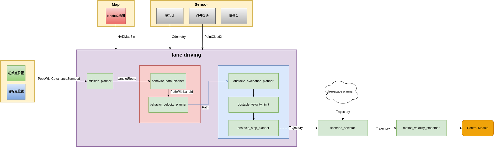
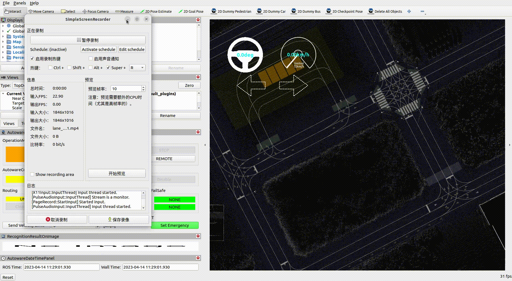

# 车道内行驶
## 概述

本教程介绍如何使用Autoware实现车辆的车道驾驶功能，内容包括：车道内行驶的整体流程，相关的指令操作，以及调试参数的方法，仿真运行效果展示。

## 整体流程
车道内行驶的整体流程如下图所示。
 

>  * 该功能需要在具有车道信息的lanlet地图中进行，因此，请使用lanlet2地图绘制工具进行地图绘制，具体绘制方法请参考[lanelet2地图](../地图/lanelet2地图.md)。
> * 若需要在实车内进行使用，请确保车辆的激光雷达，摄像头和GNSS能够正常工作，具体的硬件配置请参考[LiDAR安装](../硬件安装/LiDAR安装.md)、[camera安装](../硬件安装/camera安装.md)、[GNSS安装](../硬件安装/GNSS安装.md)。

涉及到车道内行驶的功能模块，主要包括：任务规划(mission_planner)，行为规划(behavior_path_planner、behavior_velocity_planner)，运动规划(obstacle_avoidance_planner、obstacle_veocity_limit、obstacle_stop_planner)

**mission_planner** ：通过接收车辆的初始位置，目标终点以及lanelet2地图数据，规划出一条到达目标终点的行驶线路（Route）   
**behavior_path_planner** ： 在接收到任务规划输出的线路后,结合车辆的传感器数据和道路交通状况，生成车辆的行驶路径（Path），划分车辆的可行驶区域以及车辆的转向信息。
**behavior_velocity_planner** : 获取到行驶路径后，进一步根据交通规则，重新计算行驶路径上的每一个路径点的速度   
**obstacle_avoidance_planner** : 在接收到行为规划输出的路径后，根据当前车辆自身的传感器和周围的障碍物信息，规划出一条无碰撞的行驶轨迹(Trajectory)   
**obstacle_velocity_limit** : 进一步对轨迹的速度进行优化。比如：优化过后的轨迹会降低在弯道行驶过程中的速度   
**obstacle_stop_planner** : 该模块根据周围的障碍信息和车辆状态，实现车辆的停车，减速通过，或者自适应巡航等功能    
**scenario_selector** : 选择不同的场景选择相应的轨迹，autoware中的场景分为：lane_driving和freespace。由于我们只考虑lane_driving场景下，因此可以忽略该模块     
**motion_velocity_optimizer** : 对输出轨迹进行速度平滑，下发至控制模块    

主要订阅话题

| 输入                             | 话题名称(数据类型)                                                                                 | 说明                                                                                                             |
| ------------------------------- | ------------------------------------------------------------------------------------------------ | --------------------------------------------------------------------------------------------------------------- |
| 目标终点        | `/planning/mission_planning/goal`<br>(geometry_msgs::PoseStamped)                                                 | 由用户指定，通过UI界面或者指令的方式进行下发得到                                                                        |
| 车辆初始点      | `/initialpose`<br>(geometry_msgs::PoseWithCovarianceStamped)                                                       | 由用户指定，通过UI界面或者指令的方式进行下发得到                                                                       |
| 里程计         | `/localization/kinematic_state`<br>(_nav_msgs/msg/Odometry_)                                                       | 这包括了车辆的位姿和速度信息，它用于预测未来的轨迹，以便与其他对象进行碰撞检测                                               |
| lanelet2地图   | `/map/vector_map`<br>(autoware_auto_mapping_msgs/msg/HADMapBin_)                                                   | 这包括关于环境的所有静态信息，例如： <ul><li> 地图之间车道连接信息 </li> <li>与交通规则有关的信息（车道限速等等） </li>|</ul>  |
| 动态障碍物      | `/perception/object_recognition/objects`<br>(autoware_auto_perception_msgs/msg/PredictedObjects)                   | 由感知模块通过分析点云(激光雷达)，图像(摄像头)等传感器数据得到，                                                          |
| 交通灯识别结果   | `/perception/traffic_light_recognition/traffic_signals`<br>(autoware_auto_perception_msgs/msg/TrafficSignalArray) | 由感知模块通过分析图像(摄像头)数据得到的                                                                               |

主要发布话题

| 输出           | 话题(数据类型)                                                                                | 说明                                                                                                                                      |
| ------------- | ------------------------------------------------------------------------------------------- | ----------------------------------------------------------------------------------------------------------------------------------------- |
| 输出轨迹    | `/planning/scenario_planning/trajectory`<br>(_autoware_auto_planning_msgs/msg/Trajectory_)  | 轨迹是一组包含了位姿，速度和加速度的序列，它需要由控制模块来执行，要求轨迹必须平滑，满足车辆运动学要求（能够被控制器所执行）                                    |
| 转向灯信号   | `/planning/turn_indicators_cmd`<br>(_autoware_auto_vehicle_msgs/msg/TurnIndicatorsCommand_) | 这是用于控制车辆转向灯的输出。规划模块需要确保转向灯将根据规划结果而打开                                                                              |                                                                         |


## 快速上手
本节将介绍如何通过界面操作或指令下发的方式实现Autoware的车道内行驶功能
> 注意：下面的将使用autoware官方提供的地图文件和车辆仿真模型。若用户使用自己绘制的地图或车辆模型，请根据自己的实际情况进行修改。    
1. 启动Autoware仿真程序,执行以下指令：
```bash
$ ros2 launch autoware_launch planning_simulator.launch.xml map_path:=$HOME/autoware_map/sample-map-planning vehicle_model:=sample_vehicle sensor_model:=sample_sensor_kit
```

需要注意，上面参数map_path需要填写地图文件的具体位置。当前例子中`$HOME/autoware_map/sample-map-planning`表示地图实际存放在home目录下的autoware_map文件夹，其地图文件名是sample-map-planning。    
2. 在RVIZ界面中设定车辆的起始点位置以及需要到达目标终点，车辆会根据目标点的位置，进行路径规划，生成车辆的运动轨迹。

需要注意：目标终点的选取方向需要与地图上的车道点一致，否则会导致路径规划失败。下面的例子中，目标终点方向与车道线不一致，因此路径规划失败。

3. 在RVIZ界面中，选择`AutowareStatePanel`面板中，点击`AUTO`，车辆会开始自动行驶。

或者使用以下指令
```bash
$ ros2 topic pub -1 /autoware/engage autoware_auto_vehicle_msgs/msg/Engage engage:\ true
```
需要注意：在实车测试的时候，根据所处环境的变化，车辆初始化过程不会简单顺利，在Localization一栏中会出现`UNINITIALIZED`的字样，表示初始化定位未成功，此时`AUTO`不可点击，一般来说，等待一会即可，但若长时间仍未能成功，请检查传感器是否正常工作。    
4. 添加移动障碍物，观察车辆的行驶效果（以行人为例）。

设置移动障碍物（以行人为例）


## 调试参数
本节将介绍如何通过修改规划模块中的配置文件，来调整车辆的行驶效果    
**待完善**
