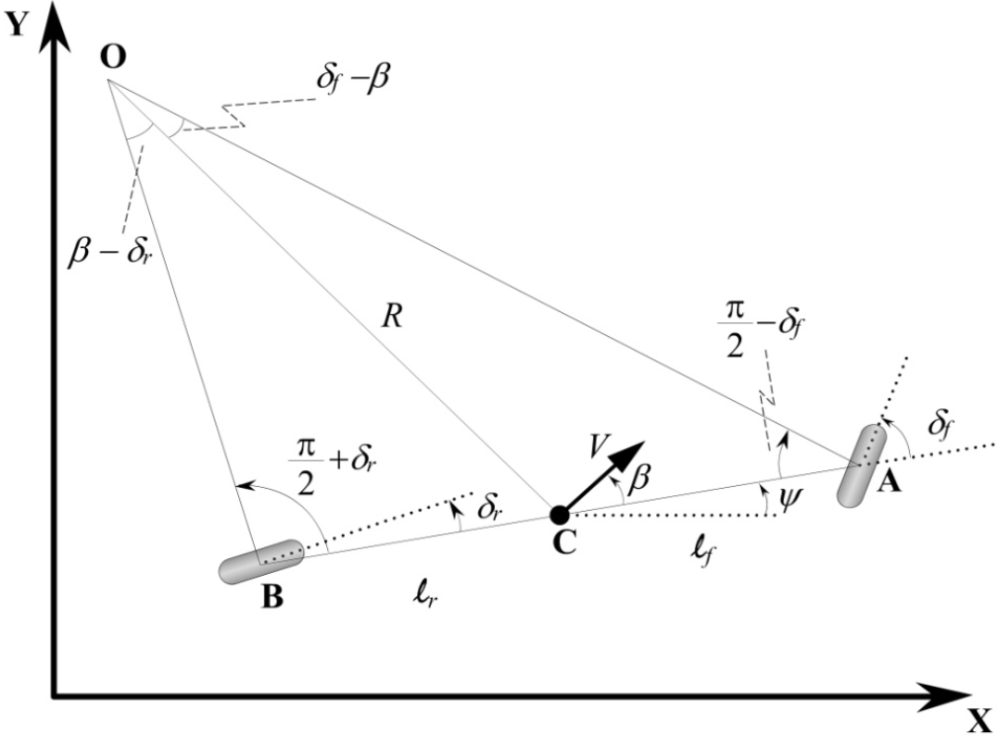
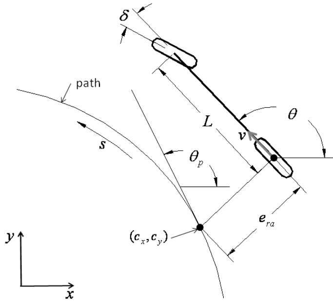

# 轨迹跟踪
> 本文档将介绍轨迹跟踪模块的文件结构，各通讯节点之间的数据交互，以及启动文件和算法的参数配置。 
## 概述
轨迹跟踪模块是Autoware中的核心模块，它负责将轨迹规划模块下发的轨迹点作为参考轨迹，通过横向和纵向控制器，实现车辆在轨迹上的跟踪。   

## 文件结构
轨迹跟踪模块位于[autoware.universe/control](https://github.com/autowarefoundation/autoware.universe/tree/main/control)，结构如下:     

|文件目录                           | 简要说明  
|----------------------------------|------------------------------------------------------------------------------------------------------------------------  
|autonomous_emergency_braking      | 自动紧急制动(AEB)，防止预测轨迹(由横向控制器提供)与障碍物发生碰撞
|control_performance_analysis      | 控制性能分析，分析轨迹跟踪控制模块的跟踪性能并监控车辆的行驶状态
|external_cmd_selector             | 外部命令选择器，根据输入指令与当前模式，切换车辆模式（遥控模式/自动驾驶模式）
|joy_controller                    | 手柄控制器，将遥控器消息转换为autoware所需要车辆控制命令（例如：转向角，档位，转向信号，启动键等）
|mpc_lateral_controller            | mpc横向控制器，线性模型预测控制（MPC）算法的实现。它将生成横向控制指令（转向角和转向速率）来跟踪路径，并使用车辆模型来模拟控制命令产生的轨迹。 
|obstacle_collision_checker        | 障碍物碰撞检查器，检查由横向控制器生成预测轨迹的对障碍物碰撞检测，并在发现碰撞时发布诊断错误
|operation_mode_transition_manager | 操作模式转换管理器，负责管理 Autoware 系统的不同操作模式。可能的模式是：`Autonomous`，`Local`，`Remote`，'`Stop`',
|pid_longitudinal_controller       | PID纵向控制器，将Planner模块下发轨迹点速度作为参考速度，使用PID算法计算车辆加速度控制信号，以实现在通过目标轨迹时达到指定的目标速度。
|pure_pursuit                      | 纯追踪横向控制器，纯跟踪(pure_pursuit)算法的实现，它将生成横向控制指令（转向角和转向速率）来跟踪路径。 
|shift_decider                     | 档位决策器，根据有跟踪控制器输出的控制指令来确定档位大小
|trajectory_follower_base          | 轨迹跟踪控制器接口，为`trajectory_follower_node`提供横向和纵向的控制器提供统一规范的接口
|trajectory_follower_node          | 轨迹跟踪控制器节点，它是在派生自`trajectory_follower_base`的控制器类中实现的功能节点，生成控制指令去跟踪参考轨迹
|vehicle_cmd_gate                  | 车辆命令油门，从紧急处理程序、计划模块、外部控制器获取信息并向车辆发送消息的包

  
## 数据交互
#### 话题订阅
|话题名称 | 消息类型 | 订阅节点
|----------------------------------------------------------|--------------------------------------------------------|----------------------------------------------
|/autoware/state                                           | autoware_auto_system_msgs/msg/AutowareState            | shift_decider
|/control/command/control_cmd                              | autoware_auto_control_msgs/msg/AckermannControlCommand | operation_mode_transition_manager
|/control/gate_mode_cmd                                    | tier4_control_msgs/msgs/GateMode                       | vehicle_cmd_gate
|/control/shift_decider/gear_cmd                           | autoware_auto_vehicle_msgs/msg/GearCommand             | vehicle_cmd_gate
|/control/trajectory_follower/control_cmd                  | autoware_auto_control_msgs/msg/AckermannControlCommand | shift_decider
|/control/trajectory_follower/lateral/predicted_trajectory | autoware_auto_planning_msgs/msg/Trajectory             | autonomous_emergency_braking  lane_departure_checker  obstacle_collision_checker  
|/control/vehicle_cmd_gate/operation_mode                  | autoware_adapi_v1_msgs/msg/OperationModeState          | operation_mode_transition_manager
|/external/selected/control_cmd                            | autoware_auto_control_msgs/msg/AckermannControlCommand | vehicle_cmd_gate
|/external/selected/hazard_lights_cmd                      | autoware_auto_vehicle_msgs/msg/HazardLightsCommand     | vehicle_cmd_gate
|/external/selected/gear_cmd                               | autoware_auto_vehicle_msgs/msg/GearCommand             | vehicle_cmd_gate
|/external/selected/heartbeat                              | tier4_external_api_msgs/msg/Heartbeat                  | vehicle_cmd_gate
|/localization/acceleration                                | geometry_msgs/msgs/AccelWithCovarianceStamped          | trajectory_follower_node  vehicle_cmd_gate
|/localization/kinematic_state                             | nav_msgs/msgs/Odometry                                 | autonomous_emergency_braking  lane_departure_checker  obstacle_collision_checker  operation_mode_transition_manager   trajectory_follower_node  vehicle_cmd_gate  
|/map/vector_map                                           | autoware_auto_mapping_msgs/msg/HADMapBin               | lane_departure_checker  obstacle_collision_checker
|/perception/obstacle_segmentation/pointcloud              | sensor_msgs/msg/PointCloud2                            | autonomous_emergency_braking  obstacle_collision_checker
|/planning/hazard_lights_cmd                               | autoware_auto_vehicle_msgs/msg/HazardLightsCommand     | vehicle_cmd_gate 
|/planning/mission_planning/route                          | autoware_auto_planning_msgs/msg/LaneletRoute           | lane_departure_checker  obstacle_collision_checker
|/planning/scenario_planning/trajectory                    | autoware_auto_planning_msgs/msg/Trajectory             | trajectory_follower_node  obstacle_collision_checker  operation_mode_transition_manager   lane_departure_checker
|/planning/turn_indicators_cmd                             | autoware_auto_vehicle_msgs/msg/TurnIndicatorsCommand   | vehicle_cmd_gate
|/sensing/imu/imu_data                                     | sensor_msgs/msg/Imu                                    | autonomous_emergency_braking
|/system/emergency/control_cmd                             | autoware_auto_control_msgs/msg/AckermannControlCommand | vehicle_cmd_gate
|/system/emergency/gear_cmd                                | autoware_auto_vehicle_msgs/msg/GearCommand             | vehicle_cmd_gate
|/system/emergency/hazard_lights_cmd                       | autoware_auto_vehicle_msgs/msg/HazardLightsCommand     | vehicle_cmd_gate
|/system/fail_safe/mrm_state                               | autoware_adpi_v1_msgs/msgs/MrmState                    | vehicle_cmd_gate 
|/system/operation_mode/state                              | autoware_adpi_v1_msgs/msgs/OperationModeState          | vehicle_cmd_gate  trajectory_follower_node
|/vehicle/status/control_mode                              | autoware_auto_vehicle_msgs/msg/ControlMoedReport       | operation_mode_transition_manager
|/vehicle/status/gear_status                               | autoware_auto_vehicle_msgs/msg/GearReport              | vehicle_cmd_gate
|/vehicle/status/steering_status                           | autoware_auto_vehicle_msgs/msgs/SteeringReport         | operation_mode_transition_manager  trajectory_follower_node  vehicle_cmd_gate  
|/vehicle/status/velocity_status                           | autoware_auto_vehicle_msgs/msgs/VelocityReport         | autonomous_emergency_braking

#### 话题发布
|话题名称 | 消息类型 | 发布节点
|----------------------------------------------------------|--------------------------------------------------------|----------------------------------------------
|/api/autoware/get/engage                                  | autoware_auto_vehicle_msgs/msg/Engage                  | vehicle_cmd_gate
|/api/autoware/get/emergency                               | autoware_auto_vehicle_msgs/msg/Emergency               | vehicle_cmd_gate
|/control/command/emergency_cmd                            |tire4_vehicle_msgs/msg/VehicleEmergencyStamped          | vehicle_cmd_gate      
|/control/command/control_cmd                              | autoware_auto_control_msgs/msg/AckermannControlCommand | vehicle_cmd_gate
|/control/command/gear_cmd                                 |autoware_auto_vehicle_msgs/msg/GearCommand              | vehicle_cmd_gate
|/control/command/turn_indicators_cmd                      |autoware_auto_vehicle_msgs/msg/TurnIndicatorsCommand    | vehicle_cmd_gate
|/control/command/hazard_lights_cmd                        | autoware_auto_vehicle_msgs/msg/HazardLightsCommand     | vehicle_cmd_gate
|/control/current_gate_mode                                |tire4_control_msgs/msg/GateMode                         | vehicle_cmd_gate
|/control/shift_decider/gear_cmd                           |autoware_auto_vehicle_msgs/msg/GearCommand              | shift_decider
|/control/trajectory_follower/control_cmd                  |autoware_auto_control_msgs/msg/AckermannControlCommand  | trajectory_follower_node
|/control/trajectory_follower/lateral/predicted_trajectory |autoware_auto_planning_msgs/msg/Trajectory              | trajectory_follower_node
|/control/trajectory_follower/lateral/diagnostic           |tier4_debug_msgs/Float32MultiArrayStamped               | trajectory_follower_node
|/control/trajectory_follower/longitudinal/slope_angle     |tier4_debug_msgs/Float32MultiArrayStamped               | trajectory_follower_node
|/control/trajectory_follower/longitudinal/diagnostic      |tier4_debug_msgs/Float32MultiArrayStamped               | trajectory_follower_node
|/control/vehicle_cmd_gate/operation_mode | autoware_adapi_v1_msgs/msgs/OperationModeState                          | vehicle_cmd_gate

## 参数配置 
该模块各节点的配置文件位置：[autoware_launch/config/control](https://github.com/autowarefoundation/autoware_launch/tree/main/autoware_launch/config/control)                                                                                                                     
>注意：autoware.universe/control/*/config具有与autoware_launch/config/control相同的配置文件，但默认是从autoware_launch/config/control加载的

#### 关键配置参数
|参数名称 |参数类型| 参数描述 | 可选值 
|----------------------------------|--------|------------------------------------------------------------------------------------------------------------------------------------------------------------------------------------------------------------------------------|-------------------
|lateral_controller_mode           | string | 在[启动时](https://github.com/autowarefoundation/autoware_launch/blob/main/autoware_launch/launch/components/tier4_control_component.launch.xml)，加载指定的横向跟踪控制器                                                         | `mpc`（默认），`pure_pursuit` 
|mpc_weight_steering_input         | double | 在[mpc](https://github.com/autowarefoundation/autoware_launch/blob/main/autoware_launch/config/control/trajectory_follower/lateral/mpc.param.yaml)中表示转向输入权重，当权重增大，转向更平稳，但会使得车辆与参考轨迹之间的状态误差增大           | 0~inf
|mpc_weight_lat_error              | double | 在[mpc](https://github.com/autowarefoundation/autoware_launch/blob/main/autoware_launch/config/control/trajectory_follower/lateral/mpc.param.yaml)中表示横向误差权重，当权重越大，车辆更贴近参考轨迹，但容易发生振荡                          | 0~inf
|mpc_weight_heading_error          | double | 在[mpc](https://github.com/autowarefoundation/autoware_launch/blob/main/autoware_launch/config/control/trajectory_follower/lateral/mpc.param.yaml)中表示航向误差权重，当权重越大，车辆与轨迹平行度更高，但可能会使得横向误差收敛速度降低         | 0~inf
|mpc_weight_terminal_lat_error     | double | 在[mpc](https://github.com/autowarefoundation/autoware_launch/blob/main/autoware_launch/config/control/trajectory_follower/lateral/mpc.param.yaml)中表示末端处的横向误差，当权重越大，车辆末端终点的横向误差更小，但可能影响行使过程的稳定性      | 0~inf
|mpc_weight_terminal_heading_error | double | 在[mpc](https://github.com/autowarefoundation/autoware_launch/blob/main/autoware_launch/config/control/trajectory_follower/lateral/mpc.param.yaml)中表示末端处的航向误差，当权重越大，车辆末端终点的航向误差更小，但可能影响行使过程的稳定性       | 0~inf
|mpc_prediction_horizon            | double | 在[mpc](https://github.com/autowarefoundation/autoware_launch/blob/main/autoware_launch/config/control/trajectory_follower/lateral/mpc.param.yaml)中表示预测时间窗口，该参数越大，车辆的预测时间越长，提高跟踪性能，但计算量会增大               | 0~inf 单位为秒
|mpc_prediction_dt                 | double | 在[mpc](https://github.com/autowarefoundation/autoware_launch/blob/main/autoware_launch/config/control/trajectory_follower/lateral/mpc.param.yaml)中表示预测时间间隔，该参数越小，车辆的预测时间间隔越小，提高跟踪性能，但计算量会增大           | 0~inf 单位为秒
|kp                                | double | 在[pid](https://github.com/autowarefoundation/autoware_launch/blob/main/autoware_launch/config/control/trajectory_follower/longitudinal/pid.param.yaml)中表示纵向误差的权重，该参数越大，误差越小，但过大会使得电机输出过大，需要合理设置范围 | 0~inf
|ki                                | double | 在[pid](https://github.com/autowarefoundation/autoware_launch/blob/main/autoware_launch/config/control/trajectory_follower/longitudinal/pid.param.yaml)中表示纵向累积误差的权重，该参数会使得纵向误差越来越小，需要合理设置范围              | 0~inf
|kd                                | double | 在[pid](https://github.com/autowarefoundation/autoware_launch/blob/main/autoware_launch/config/control/trajectory_follower/longitudinal/pid.param.yaml)中表示纵向误差的变化率权重，该参数可以减少纵向误差的的振荡，需要合理设置范围           | 0~inf

#### 详细配置参数
关于各节点详细参数配置，如下所示:  

|节点名称 | 文件位置 |
|--------|---------|
|autonomous_emergency_braking      | <https://autowarefoundation.github.io/autoware.universe/main/control/autonomous_emergency_braking/#parameters>
|control_performance_analysis      | <https://autowarefoundation.github.io/autoware.universe/main/control/control_performance_analysis/#parameters> 
|joy_controller                    | <https://autowarefoundation.github.io/autoware.universe/main/control/joy_controller/#parameters>
|lane_departure_checker            | <https://autowarefoundation.github.io/autoware.universe/main/control/lane_departure_checker/#parameters>
|mpc_lateral_controller            | <https://autowarefoundation.github.io/autoware.universe/main/control/mpc_lateral_controller/#parameter-description>
|obstacle_collision_checker        | <https://autowarefoundation.github.io/autoware.universe/main/control/obstacle_collision_checker/#parameters>
|operation_mode_transition_manager | <https://autowarefoundation.github.io/autoware.universe/main/control/operation_mode_transition_manager/#parameters>
|pid_longitudinal_controller       | <https://autowarefoundation.github.io/autoware.universe/main/control/pid_longitudinal_controller/#parameter-description>
|pure_pursuit                      | None
|shift_decider                     | None
|vehicle_cmd_gate                  | <https://autowarefoundation.github.io/autoware.universe/main/control/vehicle_cmd_gate/#parameters>

## 四轮转向车辆运动学模型
具备四轮转向结构的车辆比一般常见的前轮转向结构的车辆更灵活，与同尺寸前轮转向结构的车辆相比，具有更小的转向半径，这意味着它能在更狭小的空间进行移动或转向。在高速道路行驶时，具备四轮转向结构的车辆可以通过调整后轮的转向，使车辆获得更大的转弯半径以提高车身的稳定性
### 基于笛卡尔坐标系的四轮转向运动学模型

根据上图所示，$A$ 、$B$、$C$分别表示前后轮中心以及车辆重心。$V$表示车辆的速度，$\ell_f$、$\ell_r$
表示前轮和后轮分别到车辆重心的距离，$\delta_f$、$\delta_r$表示分别前轮转角与后轮转角。$\psi$表示车辆航向角，$\beta$表示车辆侧偏角。$O$表示车辆的旋转中心，$R$表示车辆的旋转半径。
将车辆当前速度$V$沿全局坐标系的方向进行分解，记为$\dot{X}$和$\dot{Y}$，其中$\dot{X}$表示车辆的沿全局坐标方向下的速度，$\dot{Y}$表示车辆沿全局坐标方向下的速度，那么有：

\[
\begin{align}
\dot{X}=V \cos(\psi+\beta) \\
\dot{Y}=V \sin(\psi+\beta)
\end{align} 
\tag{1.1}
\]

 

根据正弦定理，在$\angle OCA$中有：
$$
\frac{\sin \left(\delta_f-\beta\right)}{\ell_f}=\frac{\sin \left(\frac{\pi}{2}-\delta_f\right)}{R} \tag{1.2}
$$

同理，在$\angle OCB$中有：
$$
\frac{\sin \left(\beta-\delta_r\right)}{\ell_r}=\frac{\sin \left(\frac{\pi}{2}+\delta_r\right)}{R} \tag{1.3}
$$

根据积化和差公式对式(1.2)展开，有：
$$
\frac{\sin(\delta_f) \cos(\beta) - \cos(\delta_f) \sin(\beta)}{\ell_f} = \frac{\cos(\delta_f)}{R} \tag{1.4}
$$

同理，对式(1.3)展开，有：
$$
\frac{\sin(\beta) \cos(\delta_r) - \cos(\beta) \sin(\delta_r)}{\ell_r} = \frac{\cos(\delta_r)}{R} \tag{1.5}
$$

对等式(1.4)两边同时乘以 $\frac{\ell_f}{\cos(\delta_f)}$ 有：
$$
\tan(\delta_f) \cos(\beta) - \sin(\beta) = \frac{\ell_f}{R} \tag{1.6}
$$

对等式(1.5)两边同时乘以 $\frac{\ell_r}{\cos(\delta_r)}$ 有：
$$
\sin(\beta) - \cos(\beta) \tan(\delta_r) = \frac{\ell_r}{R} \tag{1.7}
$$

等式(1.6)与(1.7)相加，有：
$$
\cos(\beta)(\tan(\delta_f) - \tan(\delta_r)) = \frac{\ell_f + \ell_r}{R}  \tag{1.8}
$$

当车辆低速行驶时，车辆的角速度表示如下：
$$
\dot{\psi} =\frac{V}{R} \tag{1.9} 
$$

联合等式(1.8)和(1.9)，有： 
$$
\dot{\psi} = \frac{V\cos(\beta)}{\ell_f + \ell_r} (\tan(\delta_f) - \tan(\delta_r)) \tag{1.10}
$$

那么车辆的运动学方程可以表示为： 

\[
\begin{aligned}
\dot{X} & =V \cos (\psi+\beta) \\
\dot{Y} & =V \sin (\psi+\beta) \\
\dot{\psi} & =\frac{V \cos (\beta)}{\ell_f+\ell_r}\left(\tan \left(\delta_f\right)-\tan \left(\delta_r\right)\right)
\end{aligned} \tag{1.11}
\]

 

其中，$\dot{X}$、$\dot{Y}$、$\dot{\psi}$分别表示车辆在全局坐标系下的沿$X$轴、$Y$轴方向的速度和航向角速度。  
假设前后轮转向满足同角异向运动形式，即：当车辆发生转向时，前后轮的转角大小相等，方向相反。进一步地，当车辆在低速行驶时，几乎忽略侧滑角对车辆运动的影响，那么有$\beta=0$，此时车辆的航向角与车辆的前进方向一致，基于以上假设，关于式$(1.11)$的车辆运动学方程可以简化为:

\[
\begin{align*}
\dot{X} & =V \cos (\psi) \\  
\dot{Y} & =V \sin (\psi) \\
\dot{\psi} & =\frac{2 V \tan \left(\delta_f\right)}{\ell_f+\ell_r} 
\end{align*} \tag*{1.12}
\]

### 基于道路坐标系的四轮转向运动学模型
从前面的模型推导中不难看出，车辆运动状态的描述依赖于坐标系本身。当车辆行驶在道路时，我们更希望使用基于道路坐标来描述车辆运动状态。
<!-- 插入图片 -->
   
根据上图所示， $e_{ra}$表示车辆到道路的横向距离，$\theta$表示车辆在全局坐标下的航向角，$v$表示车辆当前速度，$\delta$表示车辆的转向角。$\left(c_x,c_y\right)$表示车辆在道路下的投影点（即车辆在道路下的最近点），$\theta_p$表示该投影点的切线与全局坐标系的$x$轴的夹角。$s$表示道路的起点到投影点的距离，我们将使用$\kappa(s)$表示道路投影点的曲率。
车辆在道路投影点的曲率可以表述为：
$$
\kappa(s)=\frac{d\theta_p}{ds} \tag{2.1}
$$
将投影点沿切线方向与其垂直方向建立坐标系，其垂直方向到车辆的距离记为车辆相对于道路坐标下的横向距离$e_{ra}$。其中，车辆相对道路坐标下的旋转角$\theta_{e}$可以表示为：
$$
\theta_e = \theta - \theta_p \tag{2.2}
$$

因此，车辆的在道路坐标下的状态变量可以用 $\begin{bmatrix} s & e_{ra} & \theta_e \end{bmatrix} ^ \mathrm{T}$ 来表示。

根据式$(2.1)$，求$\theta_p$关于时间$t$的导数，有：
$$
\dot{\theta}_p=\kappa(s)\dot{s} \tag{2.3}
$$

由文献[2]的分析可知:

\[
\dot{s}=v{\rm{cos}}(\theta_e)+\dot{\theta}_pe_{ra} \tag{2.4}
\]

将式(2.3)代入式(2.4)，整理得:
$$ 
\dot{s}=\frac{v\rm{cos}(\theta_e)}{1-e_{ra}\kappa(s)} \tag{2.5}
$$ 

那么，车辆在frenet坐标系下的横向速度可以表示为:  

\[
\dot{e}_{ra}= v_{x_{car}} - v_{x_{traj}} \tag{2.6}
\]

$v_{x_{car}}$表示为车辆在frenet坐标系下的横向速度，$v_{x_{traj}}$表示为（参考轨迹）投影点在frenet坐标下的横向速度，由于投影点在（frenet坐标下）垂直方向的速度为0。即：$v_{x_{traj}}=0$，即：

\[
\dot{e}_{ra}=v{\rm{sin}}(\theta_e) \tag{2.7}
\]

根据式子(2.2)可知，车辆相对于道路的旋转角速度为：
$$
\dot{\theta}_e=\dot{\theta}-\dot{\theta}_p \tag{2.8}
$$

由式子(1.12)可知，$\dot{\theta}=\frac{2 v \tan \left(\delta_f\right)}{L}，$由文献[2]可知，$\dot{\theta}_p=\frac{ v \kappa(s){\rm{cos}}(\theta_e)}{1-e_{ra}\kappa(s)}$，将其代入到式(2.8)有：

\[
\dot{\theta}_e=\frac{2 v \tan \left(\delta_f\right)}{L}-\frac{ v \kappa(s){\rm{cos}}(\theta_e)}{1-e_{ra}\kappa(s)} \tag{2.9}
\]

联立上述公式就可以得到四轮转向的车辆运行学模型在道路坐标系下的方程为：

\[
\left[ \begin{array}{c} \dot{s} \\ \dot{e}_{ra} \\ \dot{\theta}_e  \end{array} \right] =\left[ \begin{array}{c} \frac{v\rm{cos}(\theta_e)}{1-e_{ra}\kappa(s)} \\ {v \rm{sin}(\theta_e)} \\ \frac{2 v \rm{tan}(\delta)}{L} - \frac{v \kappa(s)\rm{cos}(\theta_e)}{1-e_{ra}\kappa(s)} \end{array}  \right]\tag{2.10}
\]

## 控制算法
在Autoware.core/universe中，车辆控制分为横向控制与纵向控制。通过对控制问题的解耦，降低算法复杂度以满足控制性能的要求。纵向控制用于车辆速度的加减速。横向控制则用于车辆的转向控制。

## 基于道路坐标系下车辆纵向控制算法
待完善

## 基于道路坐标系下车辆横向控制算法
目前，车辆的横向控制算法基本分为三类：   
    1. 基于几何的横向控制算法，如：Pure Pursuit，Stanley   
    2. 基于模型的横向控制算法，如：LQR，MPC   
    3. 基于机器学习的横向控制算法，如：强化学习，深度学习   

在Autoware.core/universe中，提供了两种横向控制算法，分别是Pure Pursuit以及MPC，用户可以根据自己的需求选择合适的算法。

### MPC算法
模型预测控制(MPC)算法，该算法的基本思想是通过对目标对象建立数学模型，然后利用模型的预测系统在某一未来时间段内的表现来进行优化控制，通过求解优化问题的最优解来获得当前的最佳输出。

> 下面章节的内容是对mpc算法基本思想的概括与总结，可能与Autoware.core/universe中的mpc算法的代码实现存在差异，后面会对相关内容进行补充
#### 选择控制变量
由于参考轨迹已知，因此投影点处的角速度$\dot{\theta}_p=v_{y_{traj}}k(s)$，$v_{y_{traj}}$是投影点在参考轨迹处的纵向速度，$k(s)$表示参考轨迹在投影点处的曲率。结合式(1.12)，式(2.3)，式(2.7)和式(2.8)，可以得到：

\[             
\left[ \begin{array}{c} \dot{e}_{ra} \\ \dot{\theta}_e  \end{array} \right]= \left[ \begin{array}{c} v\rm{sin}(\theta_e) \\ \frac{2v \tan(\delta)}{L} - v_{ref}k(s) \end{array} \right] \tag{3.1}
\]

记状态变量$x=\begin{bmatrix}e_{ra} \\ \theta_e \end{bmatrix}$，输入变量$u=\delta$，则状态方程可以表示为：
$$
\dot{x}=f(x,u) \tag{3.2}
$$

#### 运动模型线性化
假设车辆在跟踪过程中，车辆在道路投影点的附近。通过对模型在投影点处进行一阶泰勒展开来线性化，得到：
$$
\dot{x}=f(x_{ref},u_{ref})+\frac{\partial f(x,u)}{\partial x}(x-x_{ref})+\frac{\partial f(x,u)}{\partial u}(u-u_{ref})
 \tag{3.3}
$$

其中

\[             
\frac{\partial f(x,u)}{\partial x} = \begin{bmatrix} 0 & vcos \theta_{e}\\  0 & 0 \end{bmatrix}, \frac{\partial f(x,u)}{\partial u} = \begin{bmatrix} 0 \\ \frac{2v}{Lcos^2 \delta} \end{bmatrix} \tag{3.14}
\]

进一步，记$A=\frac{\partial f(x,u)}{\partial x}$，$B=\frac{\partial f(x,u)}{\partial u}$，则有：
$$
\dot{x}=f(x_{ref},u_{ref})+A(x-x_{ref})+B(u-u_{ref}) \tag{3.5}
$$

至此，我们得到四轮转向车辆的运动学线性状态方程。

#### 构建误差模型
我们可以在参考点处构建误差状态方程，即：    

\[   
\begin{align*}
\dot{x}-\dot{x}_{ref} &= f(x_{ref},u_{ref})+A(x-x_{ref})+B(u-u_{ref}) - f(x_{ref},u_{ref}) \\
\dot{\bar{x}} &= A\bar{x} +B\bar{u}
\end{align*}  \tag{3.6}
\]

其中，$\dot{\bar{x}}=\dot{x}-\dot{x}_{ref}$，$\bar{x} = x-x_{ref}$，$\bar{u} = u-u_{ref}$

#### 误差模型离散化
对式子(3.6)进行离散化，我们可以得到： 

\[ 
\bar{x}_{k+1}-\bar{x}_k = A\bar{x}_k + B\bar{u}_k \tag{3.7}
\]

整理得：
$$
\bar{x}_{k+1} = (I+AT)\bar{x}_k+BT\bar{u}_k \tag{3.8}
$$

记：$\bar{A}=(I+AT)$，$\bar{B}=BT$，则有：
$$
\bar{x}_{k+1}=\bar{A}\bar{x}_k+\bar{B}\bar{u}_k \tag{3.9}
$$

#### 模型预测
由于我们的目标是预测车辆在未来的状态，因此我们需要对模型进行预测。假设预测未来n步的状态，则有：

\[   
\begin{bmatrix} \bar{x}_0 \\ \bar{x}_1 \\ \bar{x}_2 \\ \bar{x}_3 \\ \vdots \\ \bar{x}_n\end{bmatrix} = \begin{bmatrix}I \\ \bar{A} \\\bar{A}^2 \\\bar{A}^3 \\\vdots\\\bar{A}^n \\\end{bmatrix}\bar{x}_0 + \begin{bmatrix}0 & 0 & 0 & \cdots & 0 \\ \bar{B} & 0 & 0 & \cdots & 0\\\bar{A}\bar{B} & \bar{B} & 0 & \cdots & 0\\\bar{A}^2\bar{B} & \bar{A}\bar{B} & \bar{B} & \cdots & 0\\\vdots & \vdots & \vdots & \ddots & \vdots\\\bar{A}^{n-1}\bar{B} & \bar{A}^{n-2}\bar{B} & \bar{A}^{n-3}\bar{B} & \cdots & \bar{B}\end{bmatrix}\begin{bmatrix} \bar{u}_0 \\ \bar{u}_1 \\ \bar{u}_2 \\ \vdots \\ \bar{u}_{n-1}\end{bmatrix} \tag{3.10}
\]

简记为：
$$
\tilde{X}=\tilde{A}\bar{x}_0+\tilde{B}\tilde{U} \tag{3.11}
$$

#### 构建带约束的二次规划问题
我们的目标是通过构建一个最小化函数，在满足一定的物理约束下，使得当前的状态序列$\bar{x}_{i},i\in[0,n]$与期望的状态序列$\bar{x}_{i_{ref}},i\in[0,n]$的误差以及预测输入$\bar{u}_j,j\in[0,n-1]$最小。

\[ 
J = min\sum_{i=0}^{n-1}((\bar{x}_i-\bar{x}_{i_{ref}})^\mathrm{T}Q(\bar{x}_i-\bar{x}_{i_{ref}}) + \bar{u}_{i}^\mathrm{T}R\bar{u}_{i}) + (\bar{x}_n-\bar{x}_{n_{ref}})^\mathrm{T}F(\bar{x}_n-\bar{x}_{n_{ref}}) \tag{3.12}
\]

由于$\bar{x}_i$表示误差状态，不难看出，期望的误差状态$\bar{x}_{i_{ref}}=0$。整理得：

\[ 
J =\text{min} \begin{bmatrix} \bar{x}_0 \\ \bar{x}_1 \\ \bar{x}_2 \\ \bar{x}_3 \\ \vdots \\ \bar{x}_n \end{bmatrix}^T \begin{bmatrix} Q & 0 & 0 & 0 & \cdots & 0\\ 0 & Q & 0 & 0 & \cdots & 0 \\ 0 & 0 & Q & 0 & \cdots & 0 \\ 0 & 0 & 0 & Q & \cdots & 0 \\ \vdots & \vdots & \vdots & \vdots & \ddots & \vdots \\ 0 & 0 & 0 & 0 & \cdots & F \end{bmatrix} \begin{bmatrix} \bar{x}_0 \\ \bar{x}_1 \\ \bar{x}_2 \\ \bar{x}_3 \\ \vdots \\ \bar{x}_n \end{bmatrix} + \begin{bmatrix} \bar{u}_0  \\ \bar{u}_1 \\ \bar{u}_2 \\ \vdots \\ \bar{u}_{n-1} \end{bmatrix}^T \begin{bmatrix} R & 0 & 0 & \cdots & 0 \\ 0 & R & 0 & \cdots & 0 \\ 0 & 0 & R & \cdots & 0 \\ \vdots & \vdots & \vdots & \ddots & \vdots \\ 0 & 0 & 0 & \cdots & R\end{bmatrix} \begin{bmatrix} \bar{u}_0  \\ \bar{u}_1 \\ \bar{u}_2 \\ \vdots \\ \bar{u}_{n-1} \end{bmatrix} \tag{3.13}
\]

简记为：

\[ 
\begin{align*}
J = \text{min} \quad &  \mathbf{\tilde{X}}^\top \mathbf{\tilde{Q}} \mathbf{\tilde{X}} + \mathbf{\tilde{U}}^\top \mathbf{\tilde{R}} \mathbf{\tilde{U}} 
\end{align*} \tag{3.14}
\]

现将式(3.14)转化为如下的标准形式：

$$
\begin{align*}
\text{minimize} \quad & \frac{1}{2} \mathbf{x}^\top \mathbf{H} \mathbf{x} + \mathbf{c}^\top \mathbf{x} \\
\text{subject to} \quad & \mathbf{A} \mathbf{x} \leq \mathbf{b} \\
& \mathbf{G} \mathbf{x} = \mathbf{h}
\end{align*}
$$

将式(3.11)代入到式(3.14)中并展开，有：     

\[ 
\begin{align*}
J &= \text{min} \quad \mathbf{\bar{x}_0^\top\tilde{A}^\top \tilde{Q} \tilde{A}\bar{x}_0 +\tilde{U}^\top\tilde{B}^\top \tilde{Q} \tilde{B}\tilde{U} + \bar{x}_0^\top\tilde{A}^\top \tilde{Q} \tilde{B}\tilde{U} + \tilde{U}^\top\tilde{B}^\top \tilde{Q} \tilde{A}\bar{x}_0 + \tilde{U}^\top\tilde{R}\tilde{U}}
\end{align*} \tag{3.15}
\]

其中，$\bar{x}_0^\top\tilde{A}^\top \tilde{Q} \tilde{A}\bar{x}_0$只与初始状态有关，因此可以看作常数$C$，$\tilde{U}^\top\tilde{B}^\top \tilde{Q} \tilde{A}\bar{x}_0$是$\bar{x}_0^\top\tilde{A}^\top \tilde{Q} \tilde{B}\tilde{U}$的转置，而且是1xn维向量，两者相加的结果是$2\bar{x}_0^\top\tilde{A}^\top\tilde{Q}\tilde{B}\tilde{U}$。综上所述，整理得：

\[ 
\begin{align*}
J &= \text{min} \quad \mathbf{ \frac{1}{2} \tilde{U}^\top (\tilde{B}^\top \tilde{Q} \tilde{B} + \tilde{R}) \tilde{U} + \bar{x}_0^\top\tilde{A}^\top\tilde{Q}\tilde{B}\tilde{U}}
\end{align*} \tag{3.16}
\]

其中，$H=\tilde{B}^\top \tilde{Q} \tilde{B} + \tilde{R}$，$c^\top=\bar{x}_0^\top\tilde{A}^\top\tilde{Q}\tilde{B}$
对预测输入增加不等式约束，那么有：

\[ 
\begin{aligned}
&min \quad \frac{1}{2} \tilde{U}^\top (\tilde{B}^\top \tilde{Q} \tilde{B} + \tilde{R}) \tilde{U} + \bar{x}_0^\top\tilde{A}^\top\tilde{Q}\tilde{B}\tilde{U} \\
&s.t. \quad \tilde{U}_{min} \leq \tilde{U} \leq \tilde{U}_{max} 
\end{aligned} \tag{3.17}
\]

利用求解器对式(3.17)进行求解，得到的最优解直接作为车辆的控制信号下发到车辆控制单元中，实现车辆的横向控制。

## 参考资料
[1]: Rajamani, Rajesh. Vehicle dynamics and control. Springer Science & Business Media, 2011.  
[2]: A. De Luca, G.Oriolo, and C. Samson.  Feedback control of anonholonomic car-like robot.  InRobot MotionPlanning and Control, pages 171–249. 1998