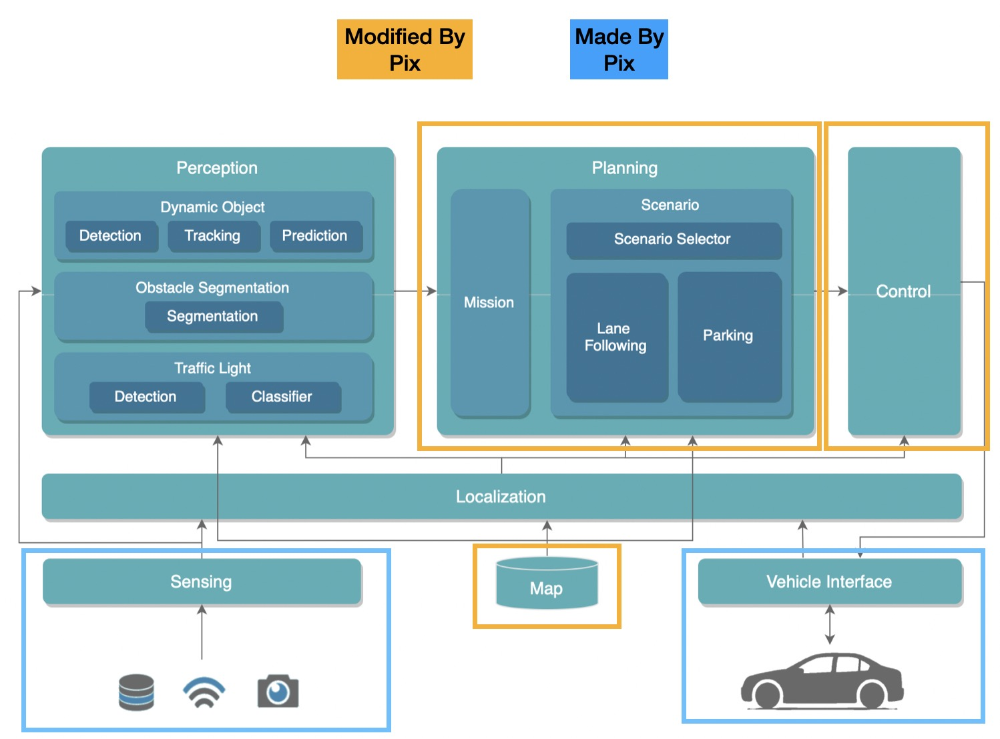
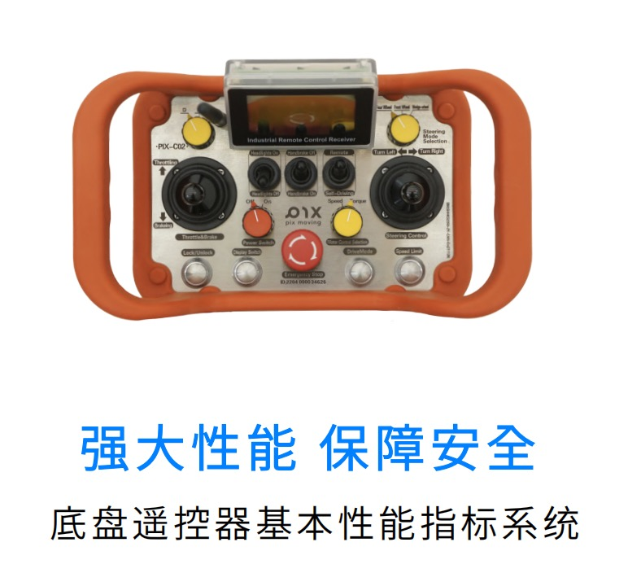
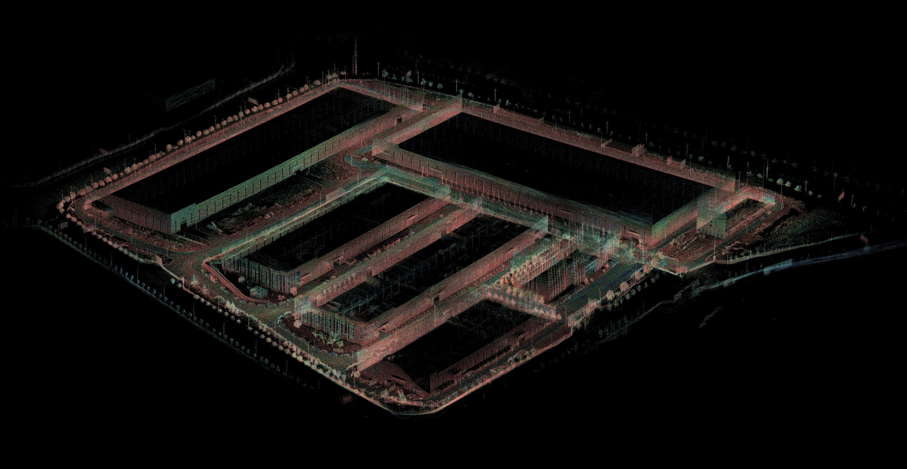
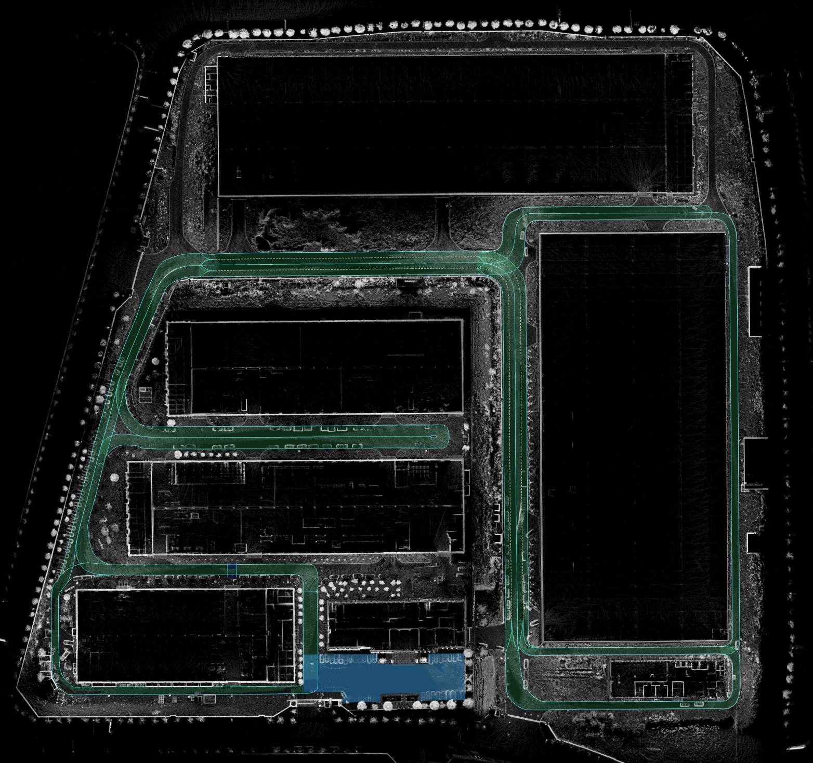

<!--
 Copyright 2023 Pixmoving, Inc.
 
 Licensed under the Apache License, Version 2.0 (the "License");
 you may not use this file except in compliance with the License.
 You may obtain a copy of the License at
 
     http://www.apache.org/licenses/LICENSE-2.0
 
 Unless required by applicable law or agreed to in writing, software
 distributed under the License is distributed on an "AS IS" BASIS,
 WITHOUT WARRANTIES OR CONDITIONS OF ANY KIND, either express or implied.
 See the License for the specific language governing permissions and
 limitations under the License.
-->

# PIXKIT开源自动驾驶开发教学套件
## Pixmoving Inc

### Who Are We
[PIX Moving](http://www.pixmoving.city)选择从零开始打造全新产业生态，由来自“中国、意大利、印度、日本、巴基斯坦、美国”等全球6个国家的近200名喜欢冒险的天才组成。我们从研发自动驾驶“滑板底盘”开始，因为它是铺平智能汽车规模化应用的基石，也是未来城市的基础设施。同时，PIX自主开发了屡获殊荣的大型金属3D打印系统、无模具成型系统、复合材料成型技术，结合PIX独有的车辆参数化设计算法，成功减少了60%的汽车零部件及装配工作，让产品开发者能够使用PIX滑板底盘及工具快速完成产品开发及制造。PIX被汽车产业誉为下一代汽车制造的灯塔工厂，并成为数字工业巨头Autodesk公司全球创新合作伙伴。

## PIXKIT


- 提供一站式自动驾驶开发解决方案，为客户提供0-1的自动驾驶开发平台
- 为客户完成计算平台、线控底盘、传感器与自动驾驶系统的集成，让客户专注于算法开发
- 提供地图与传感器标定工具链，降低开发门槛
- 开源所有源代码并提供详细的文档，让开发更得心应手
- 持续更新、迭代软件与算法，保持技术前沿
- 得益于ROS/Autoware的社区资源，为开发提供源源不断动力
- 提供不同ODD示例，将Autoware拓展到不同场景（后续提供支持）

### 硬件构成

#### 1.[纯电开源Pix Ultra-Skateboard线控底盘](http://www.pixmoving.city/?page_id=673)

#### 2.传感器套件及模块化支架

#### 3.底盘工业遥控器


### 自动驾驶开发工具链
#### 传感器标定
- [camera内参标定](./%E4%BC%A0%E6%84%9F%E5%99%A8%E6%A0%87%E5%AE%9A/camera%E5%86%85%E5%8F%82%E6%A0%87%E5%AE%9A.md)
````yaml
image_width: 1920
image_height: 1080
camera_name: trafficlight
camera_matrix:
  rows: 3
  cols: 3
  data: [1010.2744 ,    0.     ,  941.65588,
            0.     , 1008.70001,  517.61131,
            0.     ,    0.     ,    1.     ]
distortion_model: plumb_bob
distortion_coefficients:
  rows: 1
  cols: 5
  data: [-0.336502, 0.091380, -0.001975, 0.000444, 0.000000]
rectification_matrix:
  rows: 3
  cols: 3
  data: [1., 0., 0.,
         0., 1., 0.,
         0., 0., 1.]
projection_matrix:
  rows: 3
  cols: 4
  data: [723.01111,   0.     , 947.26543,   0.     ,
           0.     , 895.51398, 508.08632,   0.     ,
           0.     ,   0.     ,   1.     ,   0.     ]
````
- [LiDAR-camera外参标定](./%E4%BC%A0%E6%84%9F%E5%99%A8%E6%A0%87%E5%AE%9A/LiDAR-camera%E6%A0%87%E5%AE%9A.md)
```yaml
rs162camera:
  x: 0.5789871
  y: -0.08247789
  z: -0.3453706
  roll: -1.55877693
  pitch: 0.00713767
  yaw: -1.55820481
```

- [IMU标定](./%E4%BC%A0%E6%84%9F%E5%99%A8%E6%A0%87%E5%AE%9A/IMU%E6%A0%87%E5%AE%9A.md)
```yaml
Gyr:
    unit: " rad/s"
    avg-axis:
    gyr_n: 1.5059072284923697e-03
    gyr_w: 4.3430855283551206e-05
    x-axis:
    gyr_n: 1.6901233770452774e-03
    gyr_w: 5.0850707578827144e-05
    y-axis:
    gyr_n: 1.3392742394140514e-03
    gyr_w: 3.7654685426892668e-05
    z-axis:
    gyr_n: 1.4883240690177805e-03
    gyr_w: 4.1787172844933785e-05
Acc:
    unit: " m/s^2"
    avg-axis:
    acc_n: 5.9215155351791055e-03
    acc_w: 1.3379378640306186e-04
    x-axis:
    acc_n: 6.0017230453598448e-03
    acc_w: 1.0726720420556991e-04
    y-axis:
    acc_n: 6.7689914243794181e-03
    acc_w: 1.6961241589651517e-04
    z-axis:
    acc_n: 4.9938321357980535e-03
    acc_w: 1.2450173910710051e-04
```

#### 高精度地图制作
- [点云地图](./%E5%9C%B0%E5%9B%BE/%E7%82%B9%E4%BA%91%E5%9C%B0%E5%9B%BE.md)

- [Lanelet2地图](./%E5%9C%B0%E5%9B%BE/lanelet2%E5%9C%B0%E5%9B%BE.md)


### 自动驾驶软硬件文档支持
- [硬件集成](./%E7%A1%AC%E4%BB%B6%E5%AE%89%E8%A3%85/index.md)
- [pix底盘使用手册](./pix%E5%BA%95%E7%9B%98%E4%BD%BF%E7%94%A8%E6%89%8B%E5%86%8C/index.md)
- [传感器标定](./%E4%BC%A0%E6%84%9F%E5%99%A8%E6%A0%87%E5%AE%9A/camera%E5%86%85%E5%8F%82%E6%A0%87%E5%AE%9A.md)
- [地图制作](./%E5%9C%B0%E5%9B%BE/index.md)
- [Autoware教学](./Autoware%E4%B8%8A%E6%89%8B/%E5%90%AF%E5%8A%A8autoware.md)

## 联系我们
对PIX或我们所提供的产品感兴趣？请随时与我们取得联系。 
PIX 期待与全球跨领域的企业、组织、先行者们建立合作，共同致力于汽车产业与城市的创新变革。

- 生态合作：<chase@pixmoving.com>
- 商务合作：<sean@pixmoving.com>
- 媒体报道：<yoki@pixmoving.com>
- 获得更多关于产品的信息：

