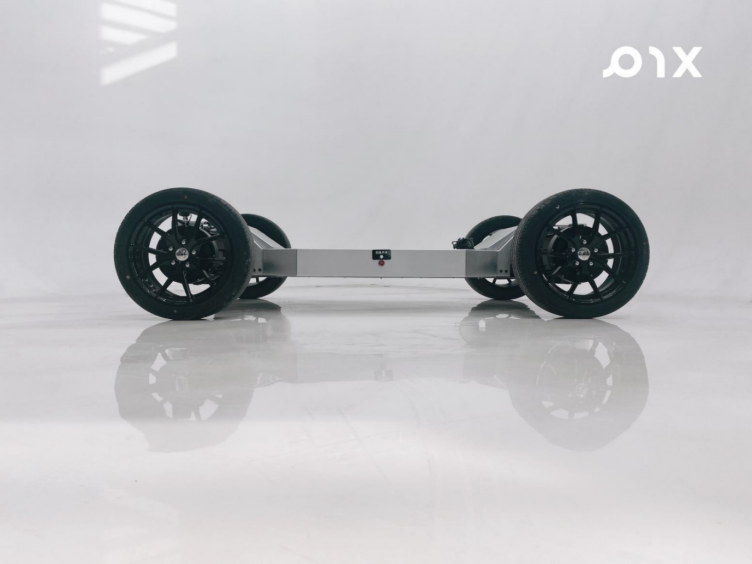

# pix底盘使用手册

## PIXLOOP线控底盘HOOKE用户使用说明书

## 前言

非常感谢您选择我们 PIX 的产品，您的认可和满意是我们最大的动力。 

PIXLOOP-HOOKE 线控底盘是PIX Moving 为工程师打造的一款纯线控底盘，针对园区内 L4级低速自动驾驶提供的线控底盘。该底盘采用了全新的转向模式和新的驱动方式。整车电力由一块72V的动力电池和一个12V免维护铅酸电池共同提供。全车采用高强度钢材搭建。通过遥控器可以轻松控制底盘的转向与动力，同时 PIXLOOP 底盘可自行搭载自动驾驶系统。本文将以HOOKE4轮4驱版本详细介绍底盘每一个功能的同时让你能快速使用本产品 。

1. 本手册在印刷时已尽可能的包含各项功能介绍和使用说明。但由于产品功能不断完善、设计变更等，仍可能与您购买的产品有不符之处。由于产品更新，本手册与实际产品在颜色、外观等方面可能有所偏差，请以实际产品为准。

2. 为保护用户的合法权益，请您在使用本产品前务必仔细阅读我们随附本产品提供的说明书。套件提供商保留对上述文档进行更新的权利。请您使用前务必认真阅读此说明书并按照说明书操作本产品。

3. 本产品不适合未满18周岁及其他不具备完全民事行为能力的人士使用，请您避免上述人士接触本产品，在有上述人士出现的场合操作时请您格外注意。

4. 一旦开始使用本产品，即视为您已阅读、理解、认可和接受本产品的说明书、免责声明的全部条款和内容。使用者承诺对自已的行为及因此而产生的所有后果负责。

5. 在使用本产品的过程中，请您务必严格遵守并执行包括但不限于说明书里的要求。对于违反说明书所提示的使用行为或不可抗因素导致的一切人身伤害、事故、财产损失、法律纠纷，及其他一切造成利益冲突的不利事件，均由用户自己承担相关责任和损失，产品提供商将不承担任何责任。

6. 用户使用本产品直接或间接发生的任何违反法律规定的行为，套件提供商将不承担任何责任。

## 目录
- [产品介绍](./%E4%BA%A7%E5%93%81%E4%BB%8B%E7%BB%8D.md)
- [使用与开发](./%E4%BD%BF%E7%94%A8%E4%B8%8E%E5%BC%80%E5%8F%91.md)
- [车辆安全机制](./%E8%BD%A6%E8%BE%86%E5%AE%89%E5%85%A8%E6%9C%BA%E5%88%B6.md)
- [底盘性能参数](./%E5%BA%95%E7%9B%98%E6%80%A7%E8%83%BD%E5%8F%82%E6%95%B0.md)
- [常见问题处理](./%E5%B8%B8%E8%A7%81%E9%97%AE%E9%A2%98%E5%A4%84%E7%90%86.md)
- [日常维护与注意事项](./%E6%97%A5%E5%B8%B8%E7%BB%B4%E6%8A%A4%E4%B8%8E%E6%B3%A8%E6%84%8F%E4%BA%8B%E9%A1%B9.md)
- [售后与技术支持](./%E5%94%AE%E5%90%8E%E4%B8%8E%E6%8A%80%E6%9C%AF%E6%94%AF%E6%8C%81.md)