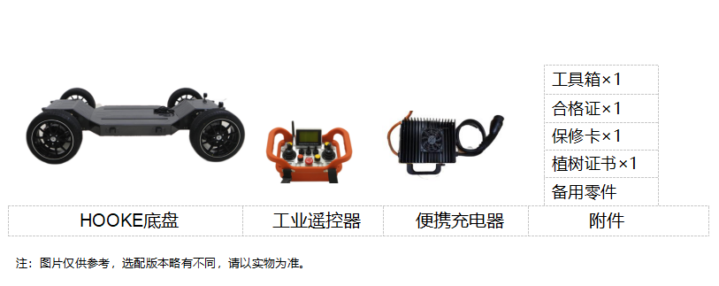
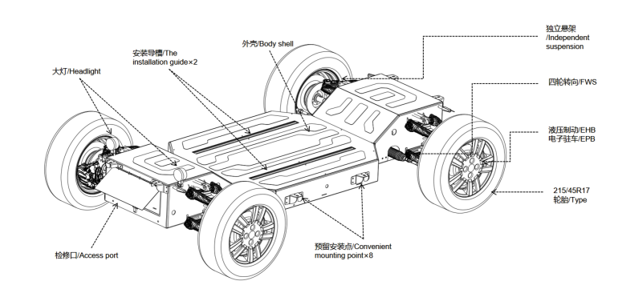
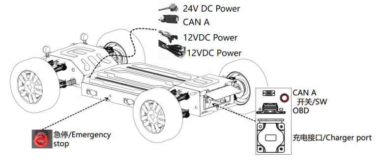
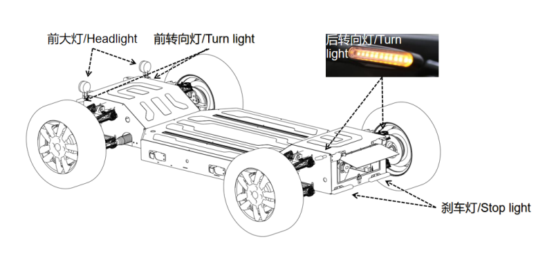
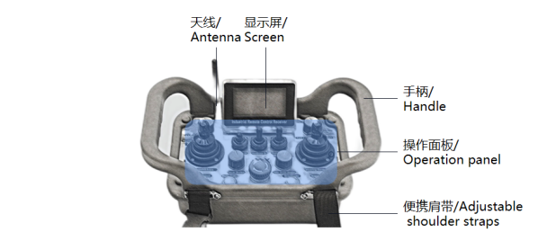
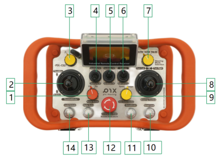
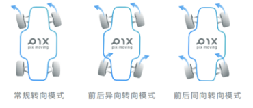
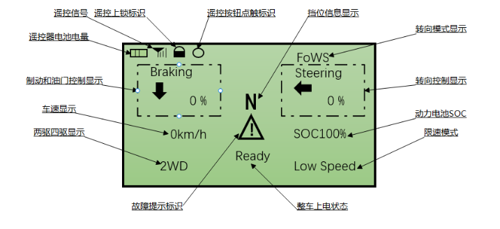
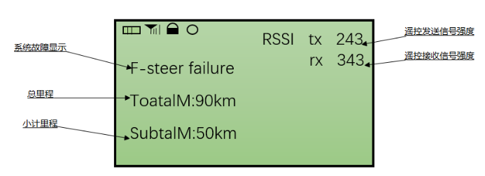
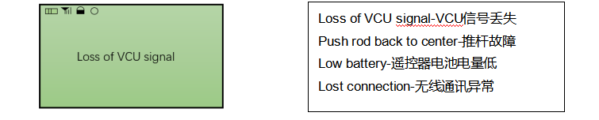

# 产品介绍

## 1 产品清单

## 2 基本功能

底盘通过无线遥控器与底盘本体连接，通过无线遥控器或者其他CAN通讯控制系统可以对底盘进行基本控制，也可以部署自动驾驶后实现自动驾驶功能，其中包括：

- 四轮独立运动控制（后驱，四驱，高级功能下可开放四轮独立控制和差速转向模式）

- 底盘挡位切换(进档，退档，空挡)

- 两种转向模式(前轮阿克曼转向模式，四轮转向模式)

- 底盘电子驻车控制/液压制动控制

- 底盘制动控制

- 多种电压平台供电功能

- 自动驾驶/遥控驾驶切换

- 低速行车模式

- 高级自动驾驶开发等

## 3 产品概述

PIXLOOP底盘主体承重结构采用高强度钢装配而成，表面盖板为喷涂铝板。车轮悬架部分采用专业冲压加工方式成型，设计过程采用有限元分析，充分满足车辆运动控制和不同场景因素带来的各种冲击和挑战。表面成形盖板可提供高强度机械性能还兼具美观。底盘车身采用互通箱体式结构设计，为底盘设备安装和后期扩展提供相对较大的空间冗余。

 

###  3.1 开关接口

 底盘开关以及开放接口示意图如下：

#### 急停

车身急停开关按压后触发，触发立即生效，底盘失去动力,转向灯“双闪”,底盘进入驻车状态。按照图示右旋即可解除急停状态。

#### CAN A

自动驾驶CAN，用于接收命令和反馈底盘信息，位于车身后部检修板下和底盘表面，一共两处。

#### OBD

 故障检修口，用于底盘检修。

#### 电源接口

24V电源接口，提供额定300W24V直流电源；12V额定500W直流电源,提供两种类型多个12V直流电源接口。对应线束上标注有电压标识。

### 3.2 灯光指示

底盘提供了车辆基本的灯光系统，与传统车辆相比，包含前大灯，前后转向灯，制动灯。

#### 前大灯

底盘大灯由遥控器拨动开关控制。底盘打开时，当拨动开关位于下位时，大灯处于蓝色微亮状态；当拨动开关位于上位时，大灯处于常亮状态，灯光颜色白色；同时大灯提供系统开发接口，满足二次大灯控制策略开发。

#### 转向灯

底盘转向灯为标准转向状态灯，前后左右转向灯规格相同。默认情况下转向灯为自动控制，且同时提供系统开发接口。底盘触发急停或失联时四个转向灯持续“双闪”。

#### 刹车灯

底盘刹车灯位于车身尾部，又叫尾灯。当系统开机后尾灯保持持续点亮状态，刹车时候高亮。同时尾灯提供系统开发接口，满足二次尾灯控制策略开发。

### 3.3 无线遥控器

无线遥控器是与PIX底盘连接的基本操控器，所有底盘基本控制都能在无线遥控器运行情况下实现对底盘的控制，也是非车身控制之外权限最高的底盘控制接口。

| 遥控器频段    | 443MHz       | 接收机通讯接口  | CAN 接口        |
| -------- | ------------ | -------- | ------------- |
| 遥控器供电方式  | 3×1.5V 五号干电池 | 遥控器显示器   | LCD 显示屏       |
| 接收机供电    | 12-24V DC 供电 | 通讯距离     | 150M（视周围环境而定） |

操作面板集成多种开关，分别包含遥控器摇杆×2；两段拨动开关×3；按钮×4；旋钮开关×4，功能介绍如下:

| 编号/No | 按键名称/Name                   | 编号/No | 按键名称/Name                      |
| ----- | --------------------------- | ----- | ------------------------------ |
| 1     | 遥控开关Power Switch            | 8     | 转向推杆 Sterring Control          |
| 2     | 加速Throttling/制动Brakeing推杆   | 9     | 动力控制模式Motor Control  Selection |
| 3     | 挡位切换 D N R                  | 10    | 低速模式开关 Speed Limit             |
| 4     | 大灯开关 Headlights             | 11    | 四驱切换开关 Drive Mode              |
| 5     | 驻车开关 Handbrake              | 12    | 急停按钮 Emergency Stop            |
| 6     | 控制模式 Remote/Self-driving    | 13    | 显示页面切换 Display Switch          |
| 7     | 转向模式Sterring Mode Selection | 14    | 遥控器锁定 Lock                     |

#### 电源开关

电源开关为遥控器上电开关。

#### 加速/制动推杆

此摇杆控制车辆油门信号与制动信号，油门控制和制动控制都为 0-1024 级单向摇杆控制，上推该摇杆实现底盘加速操作，下推实现底盘电子制动操作。

#### 挡位切换D N R

该旋钮控制车辆挡位切换，提供 D，N，R 三种挡位模式。

- D 档：前进挡位，推动油门时车辆向前运动

- N 档：空挡位同时为泊车挡位，推动油门时车辆无动作响应

- R 档：倒退挡位，推动油门时车辆向后运动

#### 驻车开关

为两段拨动开关，可控制电子驻车。拨动开关处于上位为关闭停机驻车功能。拨动开关处于下位为启动停机驻车功能

控制模式 Remote/Self-driving

该按钮可切换底盘控制模式。往下拨按钮切换为自动驾驶模式，往上拨动按钮退出自动驾驶模式切换为人工遥控模式。

#### 转向模式

该旋钮控制车辆转向模式切换，提供提供常规转向模式、前后异向转向模式、前后同向转向模式三种转向模式。

#### 转向推杆

此摇杆控制车辆转向信号， 转向控制为 -1024至+1024 级双向摇杆控制。向左拨动摇杆底盘实现左转，向右拨动摇杆底盘实现右转。

#### 动力控制模式

车辆支持扭矩控制方法，扭矩控制模式下，遥控器输出的是扭矩值，即电机的驱动力的大小。

#### 低速模式开关

该按钮可启动低速模式。低速模式主要是为了防止操作者在不熟悉操作方式时产生速度过快发生危险的情况。在速度控制模式下，限速5km/h。油门模式下，当速度大于4km/h时，底盘会限制请求的扭矩，超过5km/h时请求扭矩会减小为0。若在下坡，由于重力作用，速度可能会超过5km/h。

#### 四驱切换开关

电机驱动两驱和四驱切换。

#### 急停按钮

控制车辆急停。按下急停开关按钮底盘启动紧急停止，右旋急停开关按钮为释放紧急停止功能。

> 注：急停开关仅在紧急情况下使用。请勿将急停开关按钮长期处于按下状态

#### 显示页面切换

遥控器主要有两个页面，可以通过遥控上Display Switch切换。第一显示屏主要显示操作指令和车辆基本状态， 第二显示界面主要显示车辆里程、系统具体故障和遥控器信号强度（信号强度由0-255代表由弱到强）。

#### 遥控器锁定

遥控器锁定后不可操作。

#### 显示面板介绍

遥控器有两个主页面，可以通过遥控上Display Switch切换。第一显示屏主要显示操作指令和车辆基本状态，详细的介绍如下图。

第二显示界面主要显示车辆里程、系统具体故障和遥控器信号强度，详细的介绍如下图（信号强度由0-255代表由弱到强）。

 此外，遥控器还有提示界面，用于遥控器的故障信号显示。

#### 遥控器安全操作提示

1. 遥控器开启和关闭时需保证各键位处于关闭状态，即驻车、空挡、遥控接管，无油门；

2. 进入遥控模式后，请勿一次性将油门推到最大，以免发生危险，应慢慢推动油门控制方向验  证各键位是否正常工作；

3. 在空旷环境遥控器使用范围保证在50米；

4. 停车后保证车辆驻车、空挡状态，避免在坡道停车；

5. 出于安全考虑，任何人在使用遥控器前需仔细阅读遥控器相关说明，切勿将遥控器交给不熟悉相关操作的人员使用，以免发生危险；

6. 遥控器失联后底盘触发安全保护机制，急停驻车；

7. 为了您的安全，在进入自动驾驶模式前，请务必提前熟悉遥控器的各项操作，尤其关于急停功能的使用，请在每次进入自动驾驶模式前进行遥控操作确认。为了您的安全，我们已在工控机与底层协议层定义了遥控器的绝对优先权，即平台移动的任何状态下（请在每次运行前确保遥控器电量充足），只要遥控器上电且处于遥控器接管状态，平台即进入人工接管模式，为您的安全测试保驾护航。