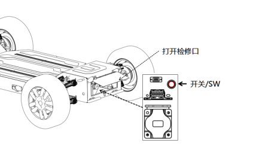
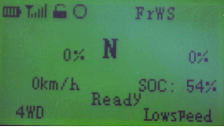
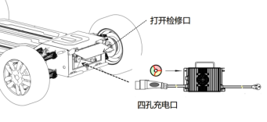
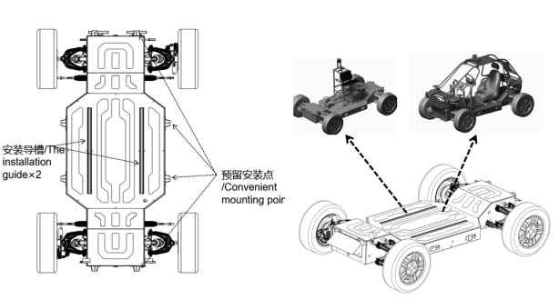
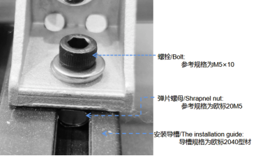
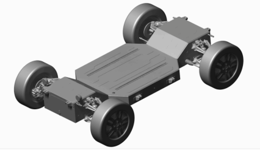
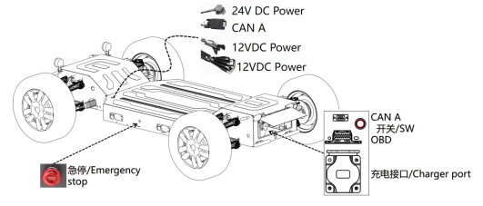
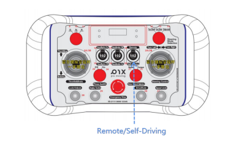

# 使用与开发

## 1 遥控底盘

### 1.1 底盘开机

1. 打开车身尾部检修盖板

2. 按下底盘电源开关，底盘进入初始化和自检，大约需要5S，自检完成后启动。

> 提示：开关自带指示灯，开关打开指示灯呈红色，底盘关闭指示灯熄灭。

### 1.2 连接遥控器

旋转无线遥控器电源开关至ON档，开启遥控器开关，并处于遥控接管模式，拨杆处于驻车、空挡，左右摇杆处于中间位置状态，使遥控器上电，进入遥控接管模式。启动成功后遥控器页面显示如下：

> 提示：如果出现异常，请检查车身急停和和遥控器按钮，参照常见问题处理，确认无误后再进行下一步。

### 1.3 底盘关机

确保车辆停放正确后，将遥控器的驻车按钮启动，关闭遥控器电源按钮，按下底盘电源按键，确保车辆下电。

## 2 充电

充电环境应保持干燥通风，车辆及充电设备周围2米范围内不能有可燃物,按照以下步骤充电：

1. 关闭底盘电源
2. 连接便携式充电机与底盘充电插座
3. 连接220V电源

#### 指示灯的状态

-  红色和绿色交替闪烁（间隔一秒），电池没有连接，未能检测到电池；

-  红色指示灯每秒闪烁一次 风机转动， 电池容量＜80%；

- 黄灯/（绿灯）指示灯每一秒闪烁一次 电池电量≥80%

- 绿色指示灯常亮（关机）电池电量= 100%

1. 当充电机指示灯为绿灯常亮说明充电完成 

2. 拔下充电机电源接头 

3. 拔下充电机充电口接头

## 3 开发使用

### 3.1 快速搭载自定义上装

#### 预留安装点

硬件安装点，底盘提供便捷的硬件安装点，客户可以依据布置的安装点快速简易的安装支架和设备，示例如下：

连接推荐采用以下规格安装连接材料：

弹片螺母/Shrapnel nut，参考规格为欧标20M5，安装导槽/The installation guide，导槽规格为欧标2040型材，螺栓/Bolt，参考规格为M5×10

#### 底盘边界模型

模型包含cgr和3dxml两个格式，是消参格式，客户可以用目前主流的3D工程软件打开，包括不限于达索CATIA、UG、Autodesk。CGR CATIA打开需要以插入形式打开。

注意此文件不可随意传播，部分部件和实物有差异，仅可作为参考。

### 3.2 自动驾驶应用

- 底盘为自动驾驶实施提供自动驾驶常用电源，专用CAN接口，标准底盘开放自动驾驶协议和对应DBC文件。

- 电源接口输出额定功率累计值为12V500W，24V300W，接口类型参考“产品概述—开关接口。

- 提供两个自动驾驶专用CAN接口，插件型号DB9，CAN2.0B通讯，属于底盘CAN-A。

- 提供标准底盘自动驾驶CAN协议和对应DBC文件。

> 打开自动驾驶时，需要在遥控上切换自动驾驶模式。

### 3.3 高级权限（选配）

支持分布式驱动研发，实现高级运动控制，灯光控制接口开放，高级驾驶接口是为需要研究底盘动力学模型和需要根据自己实际应用去优化动力学模型的控制接口。启用高级模式后，可以绕开VCU的主要控制算法和逻辑，直接下达指令到各个运动执行机构。此项需要在采购时下单开放权限，常规车辆不具备此功能。