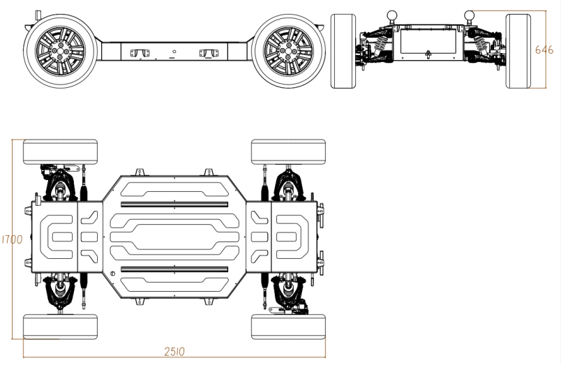

# 底盘性能参数

## 1 车身整体参数

| 外形尺寸（mm）            | 2510×1700×646 |
| ------------------- | ------------- |
| 轴距 （mm）             | 1900          |
| 前/后轮距 （mm）          | 1465/1465     |
| 前/后悬 （mm）           | 237/237       |
| 最小离地间隙 （mm）（满载）     | 175/170       |
| 最小转弯半径（m）           | 3月6日          |
| 整备质量 （kg）           | 450/420       |
| 最大允许载质量 (kg)        | 500/400       |
| 满载质量 (kg)           | 950/820       |
| 常规车速 (Km/h)         | ≤40           |
| 最高车速 （Km/h） 空载      | 60/55         |
| 最大爬坡度（%）空载          | 30/20         |
| 加速时间 （s）(0-30Km) 空载 | 4.5/9         |
| 内/外轮转角 （°）          | 30/27         |
| 悬挂类型                | 前后双叉臂独立悬挂     |
| 防护等级                | IP56          |
| 悬架弹簧行程 (mm) 满载      | 30±3          |
| 车架材质                | 高强度钢          |
| 驱动形式                | 四轮驱动          |
| 续航里程 （Km） 空载        | 90            |

## 2 转向系统参数

转向系统主要由转向供电系统，转向机总成和转向机控制器组成。转向机供电由12VDC 标准车载系统提供，转向机和控制器均符合量产车规级标准。

| 额定功率 （KW）     | 0.5         |
| ------------- | ----------- |
| 额定扭矩 （N.M）    | 4.5         |
| 额定转速 （r/min）  | 1050        |
| 工作电压 （V）      | 10.8~14     |
| 方向机转向范围 （°）   | ±450        |
| 转向结构          | 线控电动转向      |
| 转向类型          | 阿克曼转向       |
| 转向形式          | 四轮/楔形转向     |
| 工作温度 （℃）      | -40~105     |
| 通讯速度  (kps)   | 500         |
| 转向精度 (°)      | 1           |
| 响应时间 （ms）     | ≤150        |
| 转向拉杆最大输出力 (N) | 10000       |
| 通讯协议          | CAN2.0B     |
| 稳态误差 (°)      | ±1          |
| 超调量 （°）     | ≤15         |
| 控制方式          | 目标方向盘转角和角速度 |
| 前束 (mm)       | 5           |

## 3 制动系统参数

制动系统和传统的汽车制动系统相比，减少了人工制动相关执行机构，全车制动均采用电 子控制方式完成。制动系统主要组成部分包括：制动供电系统，制动液压油管回路，刹车碟与电子卡钳。除了液压制动，整车还提供电子驻车功能。

| 行车制动类型        | 线控液压制动  |
| ------------- | ------- |
| 驻车制动类型        | 电子驻车系统  |
| 超调量 （Mpa）     | 0.5     |
| 制动器型式         | 盘式      |
| 电机类型          | 永磁无刷电机  |
| 额定功率 （KW）     | 0.45    |
| 额定扭矩 （N.M）    | 2.3     |
| 额定转速 （r/min）  | 1700    |
| 工作电压 （V）      | 9~14    |
| 响应时间 （ms）     | ≤200    |
| 通讯协议          | CAN2.0B |
| 最大制动压力（Mpa）   | 7       |
| 最大压力建压时间 （ms） | ≤300ms  |
| 控制方式          | 目标压力闭环  |

## 4 动力系统参数

动力系统主要由 72VDC 供电电池，动力电池配电箱，轮毂电机，轮毂电机控制器，整车控制系统与连接线束组成。动力系统参数如下。

| 额定功率 （KW）    | 4×3/2×3           |
| ------------ | ----------------- |
| 额定扭矩 （N.M）   | 4×126/2×126       |
| 额定转速 （r/min） | 230               |
| 峰值功率 （KW）    | 4×3.8/2×3.8       |
| 峰值扭矩 （N.M）   | 4×180             |
| 峰值转速 （r/min） | 550               |
| 额定电压 （V）     | 72V               |
| 冷却方式         | 风冷                |
| 控速精度 （km/h）  | 0.1               |
| 电机尺寸 （mm）    | ø280              |
| 响应速度 （ms）    | ≤200ms            |
| 稳态误差 （km/h）  | 0.2               |
| 通讯协议         | CAN2.0B           |
| 驱动电机类型       | 永磁直流无刷电机          |
| 超调量 （km/h）   | 0.4               |
| 控制方式         | 加速踏板开度（扭矩控制、转速控制） |

## 5 供电系统参数

全车动力系统供电均由72V动力电池提供，同时还为12VDC 设备供电提供实时电压转换供电，整车平台除DC/DC和动力系统其他部分设备均采用12V 电压平台供电，12V 电压平台为本车基本设备供电平台。

| 动力电池类型                 | 三元锂电     |
| ---------------------- | -------- |
| 电池系统额定电压 (V)           | 72       |
| 电池系统额定容量  (AH)         | 100/150  |
| 电池系统能量 (kW.h)          | 7.2/10.8 |
| 电池系统最大输出功率 (KW) （≤60S） | 25       |
| 动力电池过放保护方式             | BMS      |
| 动力电池过充保护方式             | BMS      |
| 充电方式                   | 交流慢充     |
| 充电时间（h）                | 6        |
| 冷却方式                   | 自然冷却     |
| 低压启动电源                 | 12V铅酸蓄电池 |

## 6 外形尺寸图

