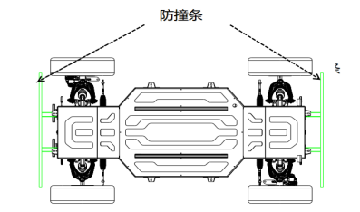
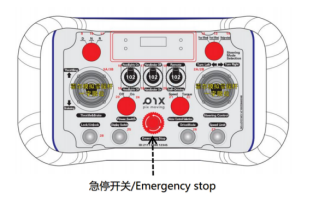
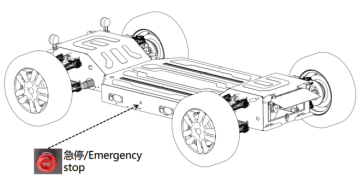

# 车辆安全机制

## 1 车辆遥控防误触

为保证车辆行驶安全，遥控器加速推杆设置误操作机制，即在猛推加速推杆时底盘不动作，防止车辆急速“窜出”。

> 注意：安全起见，遥控驾驶车辆时车辆请确保车辆前方和后方10M内无行人和障碍物，并时刻注意危险情况，随时做好接管准备，正常测试建议遥控器专人负责。

## 2 碰撞传感器（选配）

标准底盘在车体前舱和后舱标配预留了防撞条线束接口。

选配防撞条的车辆前后分别有一条防撞条，能够感应防撞条与车体间的压力从而判断是否发生了碰撞，碰撞传感器最小触发力≤50N，触发后车辆立即进入紧急制动状态，车辆进入紧急制动模式，车辆会以最大刹车力进行制动，此模式下车辆无法移动，且无法控制。车辆与碰撞物体脱离接触或者防撞条形变恢复（内部开关断开连接），可解除紧急制动状态。

## 3 遥控器急停

-  当车辆遇到紧急情况时按下遥控器中间急停按钮启动底盘紧急停止，驻车制动，遥控器界面将会显示“ESTOP! ”。

-  右旋急停按钮为释放紧急停止功能。急停后车辆转向灯双闪，尾灯强亮，解除急停恢复。

## 4 车身急停开关

急停开关作用是给车辆提供紧急停车信号，该按键位于车身左侧。

-  按下车身急停开关，触发紧急制动，车辆进入紧急制动状态，车辆会以最大刹车力进行制动。

-  急停后车辆转向灯双闪，尾灯强亮，解除急停恢复。在紧急制动状态下，车辆挡位为空挡，油门驱动无效。将急停按钮顺时针旋起即解除紧急制动状态。

