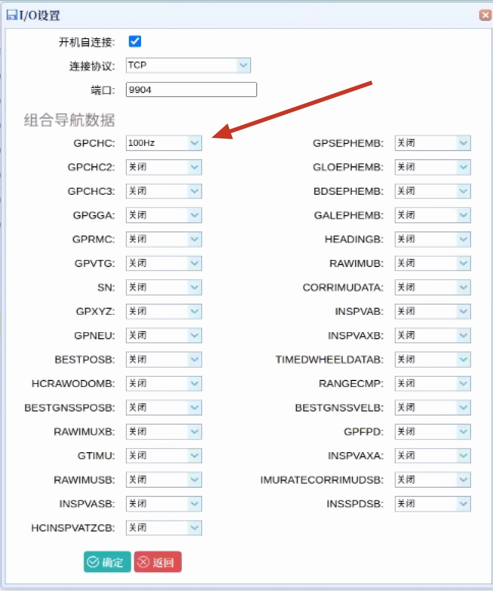
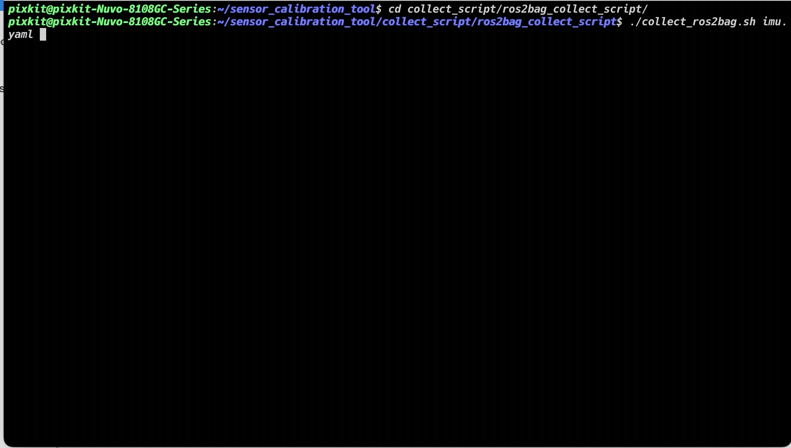
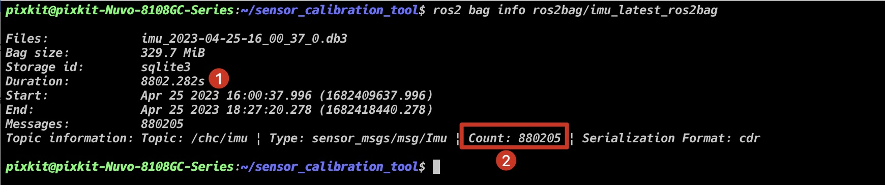
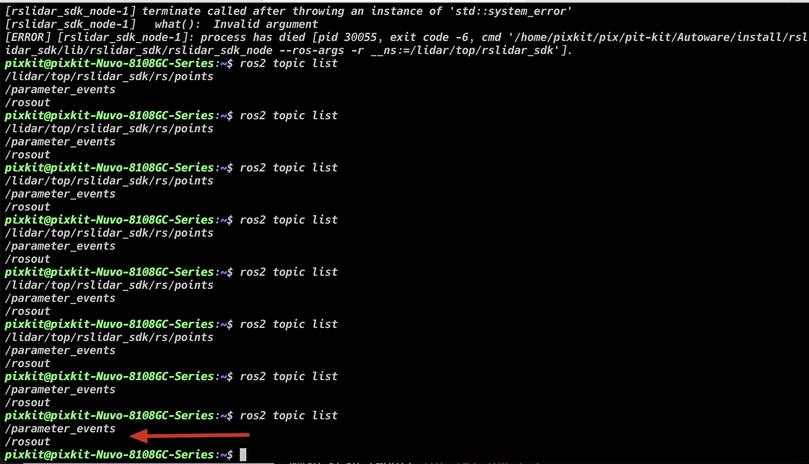
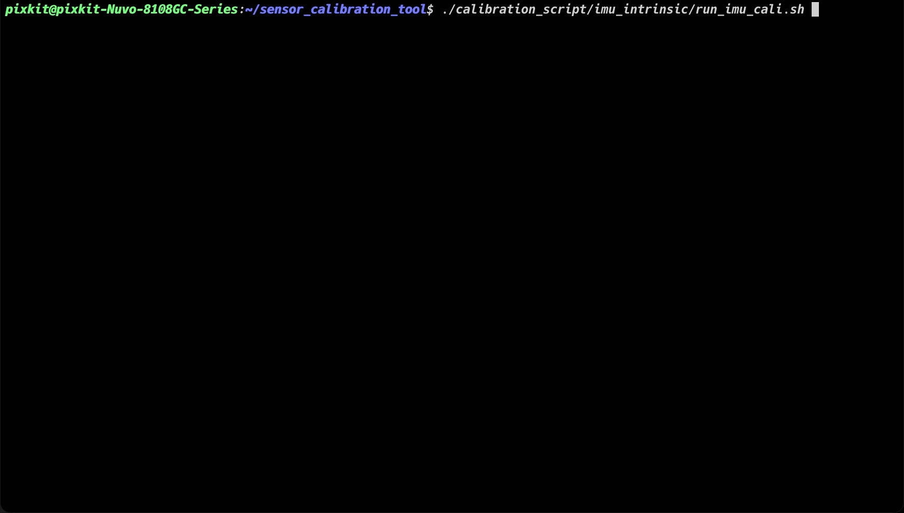
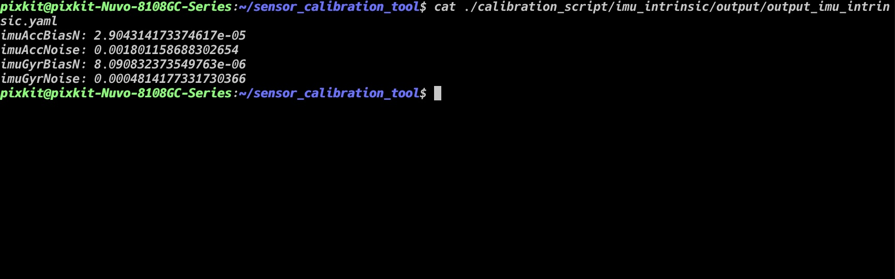

# IMU标定

## 概要

IMU（惯性测量单元）是自主驾驶汽车中重要的传感器之一，可以测量车辆在三维空间中的加速度和角速度信息。为了保证自主驾驶汽车的精确控制和定位，需要对IMU进行内参标定。内参标定的目的是精确定量测量设备的误差参数，包括加速度计和陀螺仪的偏置、比例因子、非正交性等参数。通过内参标定可以提高IMU的精度，从而提高自主驾驶汽车的定位精度和控制精度。

## 前提条件
- 完成了[标定工具安装](./%E6%A0%87%E5%AE%9A%E5%B7%A5%E5%85%B7%E5%AE%89%E8%A3%85.md)
- 准备硬件：
    - [华测CHC® CGI-410](https://www.huace.cn/product/product_show/467)
- 数据类型: `sensor_msgs/msg/Imu`
- 数据要求: 只录制`angular_velocity`和`linear_acceleration`即可

> 满足`数据要求时，其他传感器ros2bag数据，也可以进行imu标定`

## 开始标定
> 注意点：保持工控机没有运行其他ros程序，防止占用传感器


### step-1: 配置`华测CHC® CGI-410`，并检测组合导航是否联通工控机
1. 打开`google_chrome`浏览器
2. 输入网址：`192.168.1.110`，输入用户名`admin`和密码`password`
3. 依次点击：`I/O设置` -> `TCP Server/NTRIP Caster4` -> <kbd>断开</kbd> -> <kbd>连接</kbd>

4. `GPCHC`设置成`100Hz`,其他设置成`关闭`

5. 打开终端输入：`nc 192.168.1.110 9904`确定组合导航是否联通工控机


### step-2: 录制imu数据准备
- 录制时间：2个小时
- 水平地面，车辆静止放置
- 启动传感器

```shell
source pix/pit-kit/Autoware/install/setup.bash
ros2 launch pixkit_sensor_kit_launch sensing.launch.xml
```


- 开始录制
```shell
# 工作路径是标定工具根目录<sensor_calibration_tool>
cd collect_script/ros2bag_collect_script/
./collect_ros2bag.sh imu.yaml
cd -
```


- 录制成功标志

```
ros2 bag info ros2bag/imu_latest_ros2bag
```
> 检查录制时间`Duration`是否是大于`2hr`(2个小时)[8802.282/3600=2.45h]

> 检查`Count`和[Duration乘以频率计算结果]是否相差不多:表示数据没有丢失过多

> - imu频率为100hz`8802.282*100=880228.2`




### step-3: 启动标定程序脚本

- 把启动的传感器程序停止

> 输入`ros2 topic list`, 只剩下两个话题表示没有ROS节点在运行



- 运行标定脚本

```shell
./calibration_script/imu_intrinsic/run_imu_cali.sh
```


### step-4:成功标志
```shell
#  有结果输出
cat ./calibration_script/imu_intrinsic/output/output_imu_intrinsic.yaml
```



### 标定结果
>imu内参标定文件参数对应关系

|xsens_imu_param.yaml | param.yaml |
|---- | ---- |
|`gyr_n`|`imuGyrNoise`|
|`gyr_w`|`imuGyrBiasN`|
|`acc_n`|`imuAccNoise`|
|`acc_w`|`imuAccBiasN`|


sensor_calibration_tool/shared_folder/pix_data/imu/result/xsens_imu_param.yaml
```
Gyr:
    unit: " rad/s"
    avg-axis:
    gyr_n: 1.5059072284923697e-03
    gyr_w: 4.3430855283551206e-05
    x-axis:
    gyr_n: 1.6901233770452774e-03
    gyr_w: 5.0850707578827144e-05
    y-axis:
    gyr_n: 1.3392742394140514e-03
    gyr_w: 3.7654685426892668e-05
    z-axis:
    gyr_n: 1.4883240690177805e-03
    gyr_w: 4.1787172844933785e-05
Acc:
    unit: " m/s^2"
    avg-axis:
    acc_n: 5.9215155351791055e-03
    acc_w: 1.3379378640306186e-04
    x-axis:
    acc_n: 6.0017230453598448e-03
    acc_w: 1.0726720420556991e-04
    y-axis:
    acc_n: 6.7689914243794181e-03
    acc_w: 1.6961241589651517e-04
    z-axis:
    acc_n: 4.9938321357980535e-03
    acc_w: 1.2450173910710051e-04
```

calibration_script/imu_intrinsic/config/param.yaml
```
# IMU Settings
imuAccNoise: 5.9215155351791055e-03
imuGyrNoise: 1.5059072284923697e-03
imuAccBiasN: 1.3379378640306186e-04
imuGyrBiasN: 4.3430855283551206e-05
```


## NEXT
现在，您已经完成`camera内参标定`，[LiDAR-IMU标定](./LiDAR-IMU%E6%A0%87%E5%AE%9A.md)