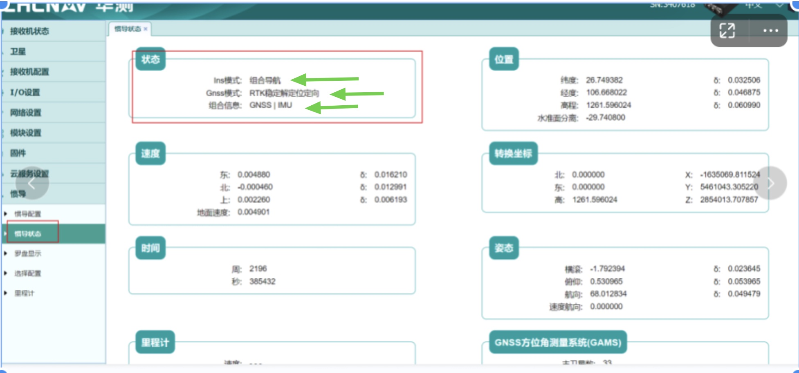
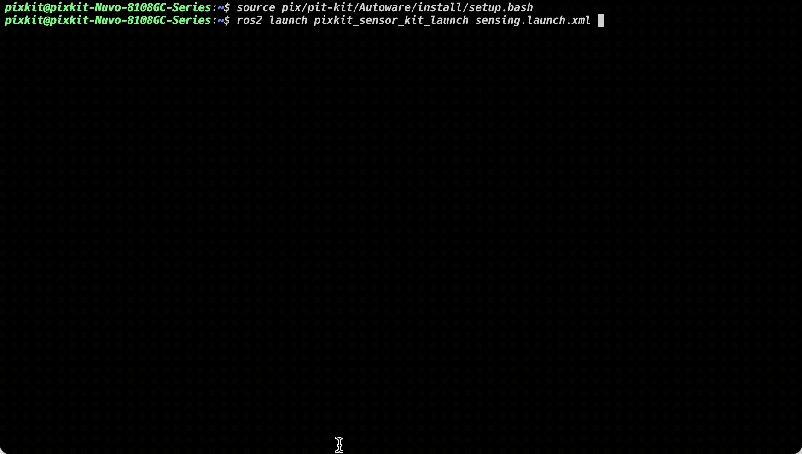
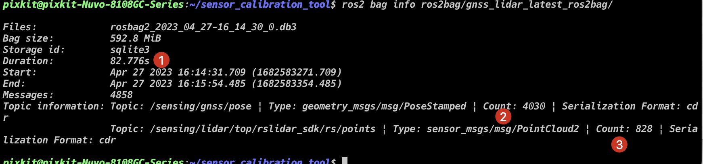
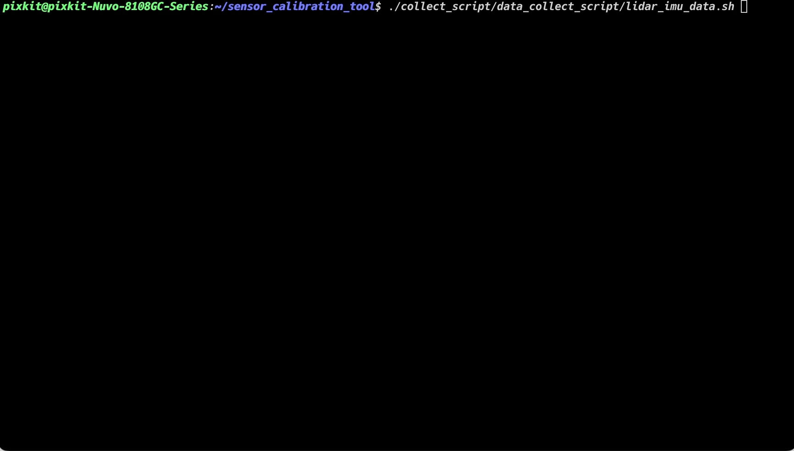
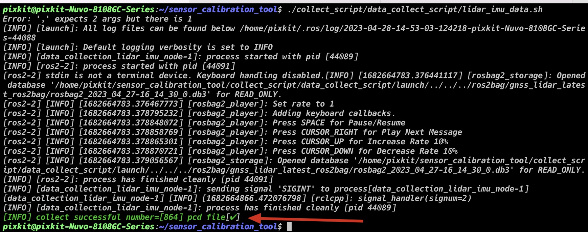
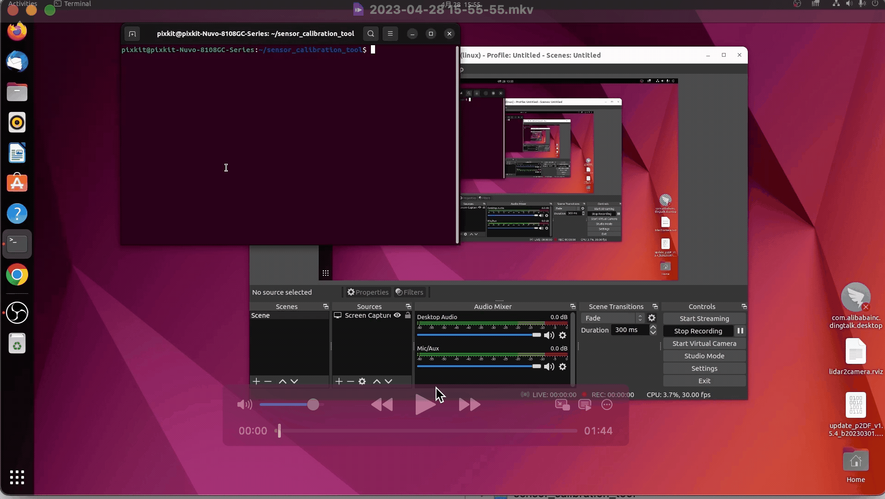
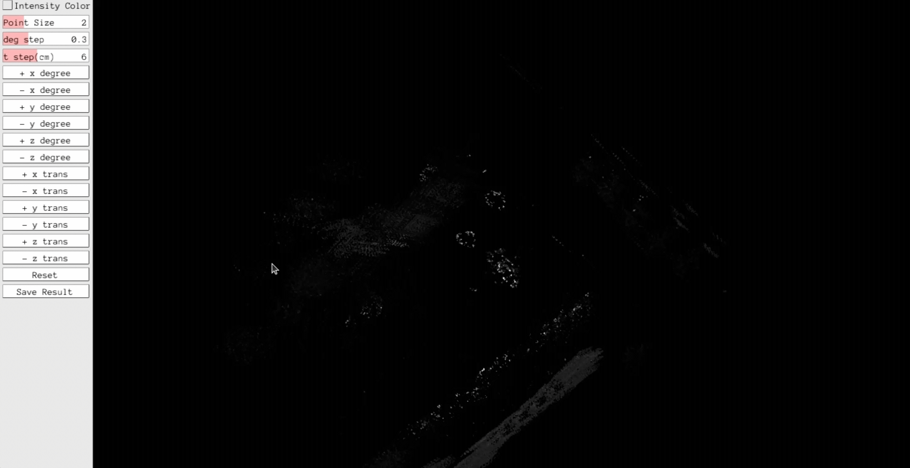
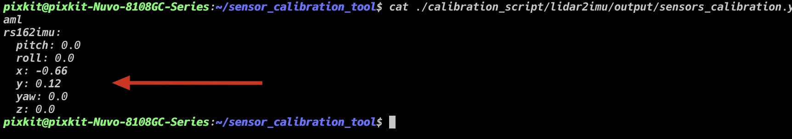

# LiDAR-IMU标定
## 概要
LiDAR-IMU标定（LiDAR-IMU Calibration）是将激光雷达（LiDAR）和惯性测量单元（IMU）的数据进行配准的过程，其目的是使两个传感器的数据在时间和空间上相互对齐。这样可以解决传感器之间时间和空间误差带来的问题，从而提高SLAM、定位、建图等应用的精度和稳定性。

LiDAR和IMU是机器人领域中常用的传感器。LiDAR主要用于获取环境的三维点云数据，而IMU则可以测量机器人的姿态（包括角度和角速度）。通过将两个传感器的数据进行标定，可以精确地确定它们之间的相对位置、姿态和时序关系，从而实现更准确、更稳定的机器人定位、导航和建图。

在标定过程中，需要采集一组已知姿态下的数据（如旋转和平移），并对数据进行处理以确定两个传感器之间的相对姿态和时间偏差。这个过程需要进行多项计算和优化，通常使用标定板等工具来辅助完成。

需要注意的是，不同的LiDAR和IMU可能存在不同的误差和噪声特性，因此标定过程需要根据具体的传感器进行调整和优化，以达到最佳的效果

## 前提条件
- 完成了[标定工具安装](./%E6%A0%87%E5%AE%9A%E5%B7%A5%E5%85%B7%E5%AE%89%E8%A3%85.md)
- 完成了[GNSS安装->设备校准](./../%E7%A1%AC%E4%BB%B6%E5%AE%89%E8%A3%85/GNSS%E5%AE%89%E8%A3%85.md)
- 准备硬件：
    - [华测CHC® CGI-410](https://www.huace.cn/product/product_show/467)
    - 顶部激光雷达[RS-Helios-16P]



## 开始标定

### step-1: 采集数据
- 启动传感器
```shell
source pix/pit-kit/Autoware/install/setup.bash
ros2 launch pixkit_sensor_kit_launch sensing.launch.xml
```


- 开始录制

```shell
cd collect_script/ros2bag_collect_script/
./collect_ros2bag.sh gnss_lidar.yaml
cd -
```

- 录制成功标志

> 录制要求： 
>   - 车辆走8字，走三圈
>   - 录制时，不要有动态物体移动


```shell
ros2 bag info ros2bag/gnss_lidar_latest_ros2bag
```

> 检查`Count`和[Duration乘以频率]是否相差不多:表示数据没有丢失过多

> - gnss频率为50hz--82.776*50=4138.8
> - lidar频率为10hz--82.776*10=827.76



### step-2: 处理数据
- 开始处理
```
./collect_script/data_collectscript/lidar_imu_data.sh
```


- 处理数据成功标志

查看终端打印结果, `number=[864]`表示在`ros2bag/gnss_lidar/lidar_top`文件夹中，产生了`864`张PCD文件  



### step-3: 开始标定

> 鼠标单击移动视角

> 鼠标双击旋转视角



#### 外参调节
| 按钮 | 说明 | 
| --- | --- | 
| +x degree | 调节翻滚角 | 
| +y degree | 调节俯仰角 | 
| +z degree | 调节偏航角 |
| +x trans | 调节x轴位移 | 
| +y trans | 调节y轴位移 |
| +z trans | 调节z轴位移 | 



#### 成功标志

```shell
cat ./calibration_script/lidar2imu/output/sensors_calibration.yaml
```



## NEXT
现在，您已经完成`LiDAR-IMU标定`，接下来可以开始[LiDAR-LiDAR标定](./LiDAR-camera%E6%A0%87%E5%AE%9A.md)

## 常见问题
### Q1: 执行`step-3: 开始标定`GUI界面闪退
- 问题原因: 在`step-1: 采集数据`步骤采集的数据有问题
- 解决方法: 重新执行`step-1: 采集数据`