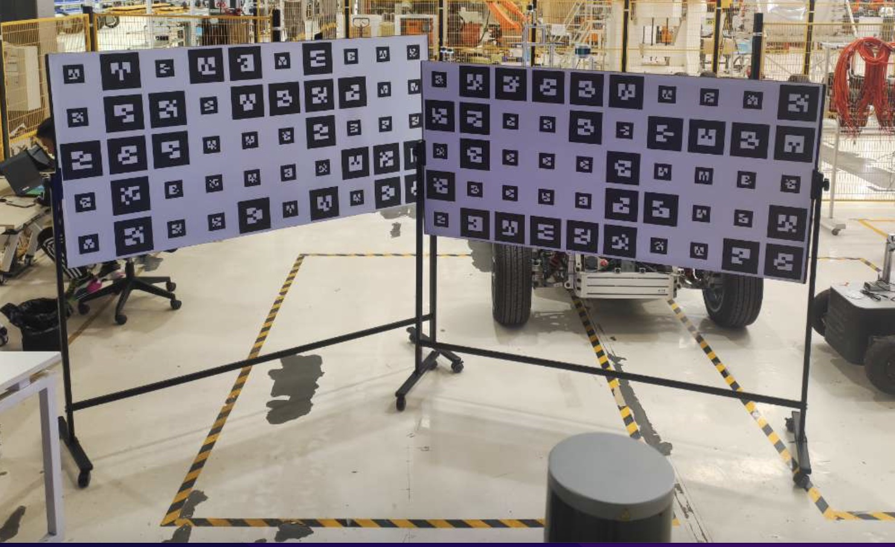
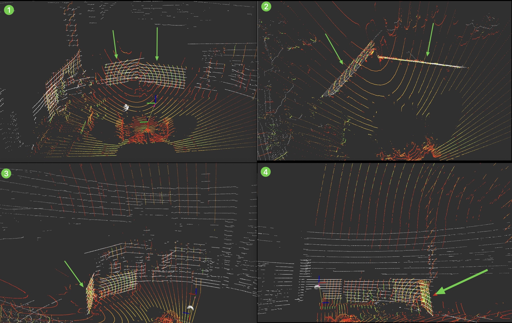

# LiDAR-LiDAR标定

## 概述
## 前提条件
- 完成了[标定工具安装](./%E6%A0%87%E5%AE%9A%E5%B7%A5%E5%85%B7%E5%AE%89%E8%A3%85.md)
- 准备硬件：
    - 顶部激光雷达[RS-Helios-16P]
    - 车头补盲雷达[RS-Bpearl]
    
## 开始标定
### step-1: 选择标定场地
- 1.8m X 0.9m 木板 准备两块
- 两块木板放置，两个lidar的共视区域
- 两块木板放置，成120度夹角放置


> 如果没有这样的两块木板，选择一个墙角作为参照物也可以

### step-2: 启动标定程序

```shell
./calibration_script/lidar2lidar/run_lidar2lidar.sh
```


### step-3: 检查标定结果

> 观察rviz2，当白色点云和彩色点云，[左视图|右视图|俯视图|正视图]完全重合时标定结束

> - 白色点云: 是顶部雷达
> - 彩色点云: 是车头补盲雷达




