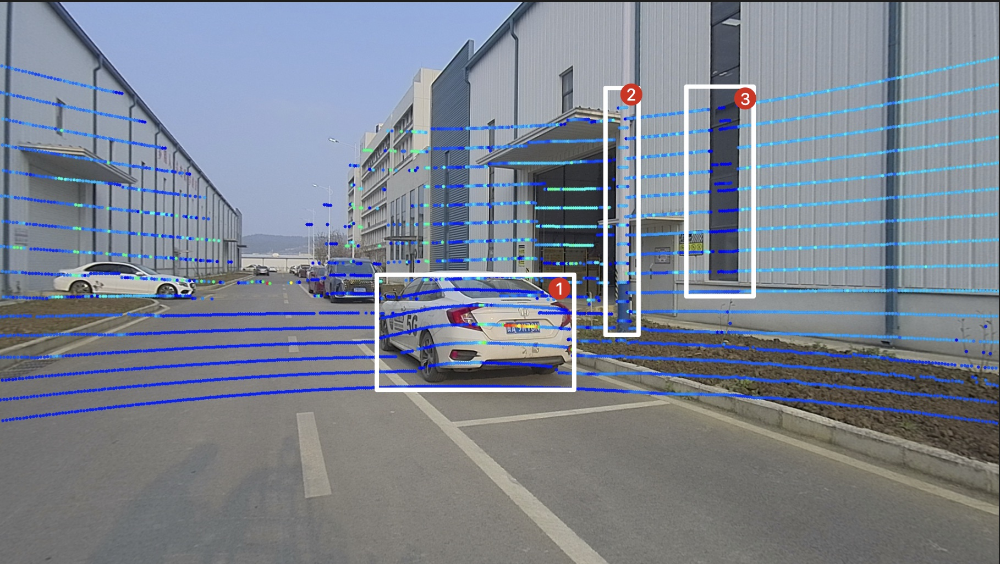
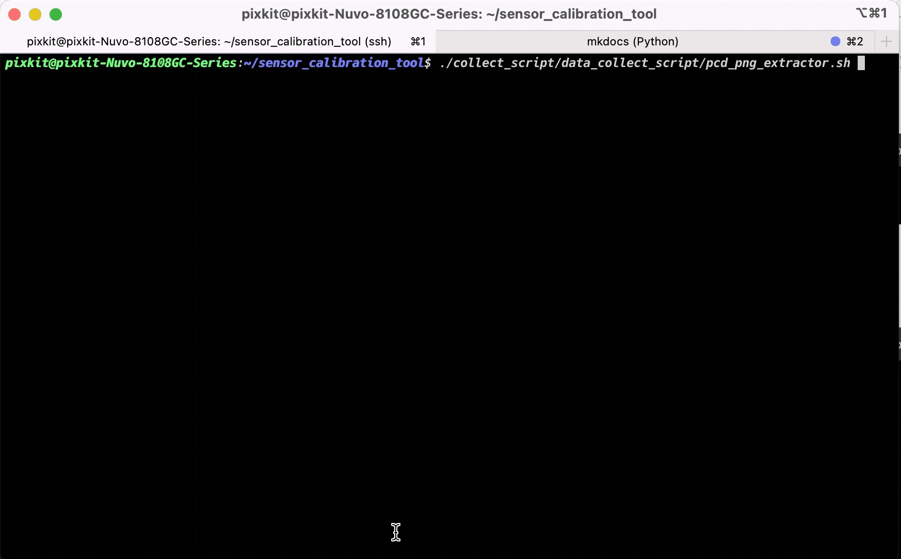
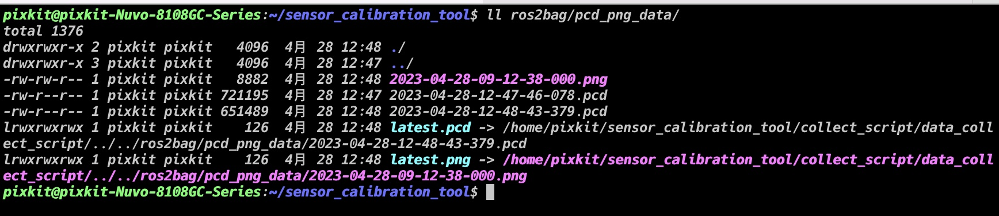
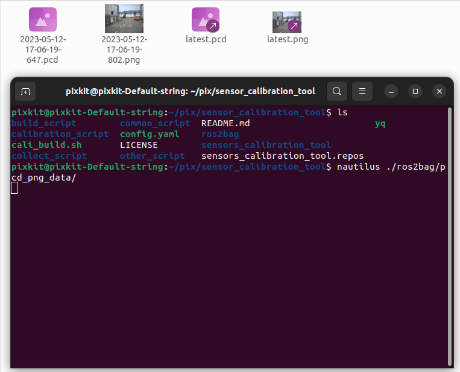
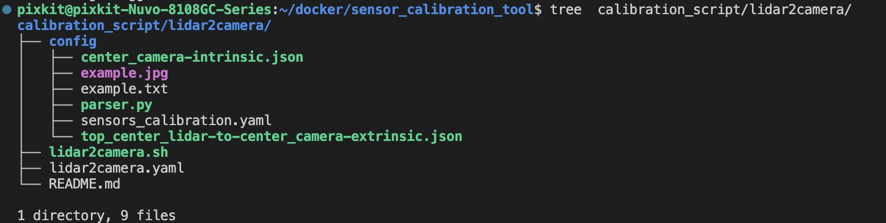
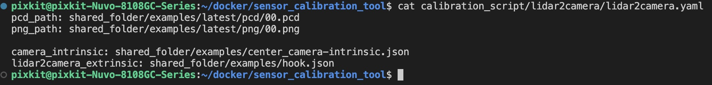
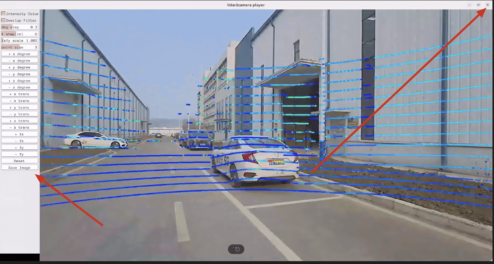
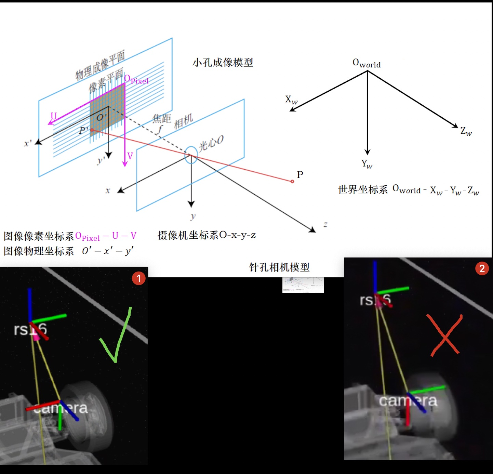
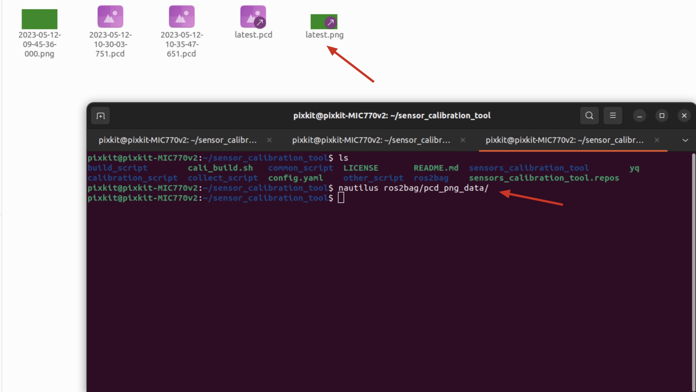

# LiDAR-camera标定

## 概要

激光雷达到相机的标定的作用是将激光雷达的3D点云数据和相机的2D图像数据进行配准，从而实现对物体的三维感知。通过激光雷达和相机的标定，可以确定它们之间的相对位置和姿态，以及它们之间的转换矩阵，从而能够将激光雷达采集的三维点云数据映射到相机图像中，将相机采集的图像信息转化为三维坐标信息。这对于自动驾驶、机器人视觉等应用非常重要，可以实现对环境的精确感知和理解。

## 本章目标

- 理解外参标定
- 掌握激光雷达到相机的标定技巧
- 标定出合格的外参

## 标定车辆
- hook 
    - 顶部激光雷达[RS-Helios-16P]
    - 车头相机[SG2-OX03CC-5200-GMSL2F-H120]

## 前提条件

- 完成了[camera内参标定](./camera%E5%86%85%E5%8F%82%E6%A0%87%E5%AE%9A.md)
- 寻找合适的标定场景
    - 摄像头的图像中有轿车
    - 摄像头的图像中有电线杆
    - 摄像头的图像中有带窗户的墙面



## 开始标定

### step-1: 采集标定数据
#### 开始采集
```shell
# 工作路径是标定工具根目录<sensor_calibration_tool>
./collect_script/data_collect_script/pcd_png_extractor.sh
```


#### 检查采集的数据是否采集成功
```shell
ll -h ros2bag/pcd_png_data
```
> 会看见latest.pcd和latest.png两个文件，查看时间是最近产生的


```shell
nautilus ros2bag/pcd_png_data/
```

> 会看见latest.pcd和latest.png两个文件，点击打开latest.png图片，查看图片是否异常



### step-2: 启动标定程序
#### 文件结构


|脚本|说明|备注
| ---- | ---- | ---- |
|lidar2camera.sh | 标定程序启动脚本 | 无 |
|lidar2camera.yaml | 标定程序配置文件 | 标定程序的输入参数 |
|parser.py|生成sensors_calibration.yaml文件|生成autoware可用的参数文件|
|input|标定原始数据|标定程序需要的原始数据|
|input/output_camera-intrinsic.json| 相机内参文件| 完成了[camera内参标定](./camera%E5%86%85%E5%8F%82%E6%A0%87%E5%AE%9A.md)输出文件|
|input/top_center_lidar-to-center_camera-extrinsic.json|外参初始文件|默认即可|
|output/sensors_calibration.yaml|外参数文件|用于autoware可用的参数文件|
|output/example.jpg|标定输出示例结果| |
|output/example.txt|标定输出示例结果| |


#### calibration_script/lidar2camera/lidar2camera.yaml 



|参数名称|参数作用| 来源 |
| ---- | ---- | --- |
|pcd_path|标定程序需要的输入图片路径| ros2bag/pcd_png_data/latest.pcd |
|png_path|标定程序需要的输入点云路径| ros2bag/pcd_png_data/latest.png |
|camera_intrinsic_filename|标定程序需要的输入点云路径| calibration_script/camera_intrinsic/output/output_camera-intrinsic.json |
|lidar2camera_extrinsic_filename|标定程序需要的输入点云路径| 默认即可 |

### 复制标定原始数据到input文件夹
|复制文件|
| -- |
|ros2bag/pcd_png_data/latest.pcd > calibration_script/lidar2camera/input/latest.pcd|
|ros2bag/pcd_png_data/latest.png > calibration_script/lidar2camera/input/latest.png|
|calibration_script/camera_intrinsic/output/output_camera-intrinsic.json > calibration_script/lidar2camera/input/output_camera-intrinsic.json|

### 启动标定
```shell
./calibration_script/lidar2camera/lidar2camera.sh
```


### step-3: 参数配置

可以看到图中，电线杆，车辆牌子，窗口的点云都对齐的，这就是一个标定好的结果，想要到达这样的结果，需要调节参数到达这样的标定效果，需要点击程序按钮进行微调

#### 外参调节
| 按钮 | 说明 | 
| --- | --- | 
| +x degree | 调节翻滚角 | 
| +y degree | 调节俯仰角 | 
| +z degree | 调节偏航角 |
| +x trans | 调节x轴位移 | 
| +y trans | 调节y轴位移 |
| +z trans | 调节z轴位移 | 

#### 相机内参调节
| 按钮 | 说明 |
| --- | --- | 
| \+ fy | 相机内参默认即可 | 
| \+ fx | 相机内参默认即可 | 

<kbd>Intensity Color</kbd>: LiDAR强度是记录激光束返回强度的参数，可以看见点云在不同材质下的强度

<kbd>Overlap Filter</kbd>: 消除深度在0.4m以内的重叠激光雷达点。

<kbd>deg step</kbd> <kbd>t step</kbd> <kbd>fxfy scale</kbd>: 这三个按钮可以更改每次单击或键盘输入的调整步长 -- 默认即可

<kbd>point size</kbd>: 调整投影图像中激光雷达点的大小。

<kbd>Reset</kbd>: 单击此按钮以重置所有手动调整，恢复最初参数。

<kbd>Save Image</kbd>: 当标定结束后，单击此按钮，则默认情况下将校准图像、外参和内参矩阵存储在`./calibration_script/lidar2camera/output`文件夹下

> 当标定完成时，先点击`Save Image`按钮，在点击`图像化界面的关闭按钮`


### step-4: 验证标定结果
- 把标定结果填入参数配置文件
    - 文件1：`~/pix/pit-kit/Autoware/install/individual_params/share/individual_params/config/default/pixkit_sensor_kit/sensors_calibration.yaml`
    - 文件2：`~/pix/pit-kit/Autoware/install/pixkit_sensor_kit_description/share/pixkit_sensor_kit_description/config/sensors_calibration.yaml`
    - 标定结果：`calibration_script/lidar2camera/output/sensors_calibration.yaml`

第一步：备份`文件2`和`文件2`

第二步：把`标定结果`，填写到`文件2`和`文件2`里

- 启动模拟查看
```shell
./calibration_script/lidar2camera/inspect/autoware_sim.sh
```



## NEXT
现在，您已经完成`LiDAR-camera标定`，接下来可以开始[IMU标定](./IMU%E6%A0%87%E5%AE%9A.md)

## 常见问题
### Q1: 执行`step-1: 采集标定数据` -> `检查采集的数据是否采集成功`时，图片显示异常,如下图

- 数据采集失败
- 解决：在工控机上，重新插拔相机的USB接口，在次采集
