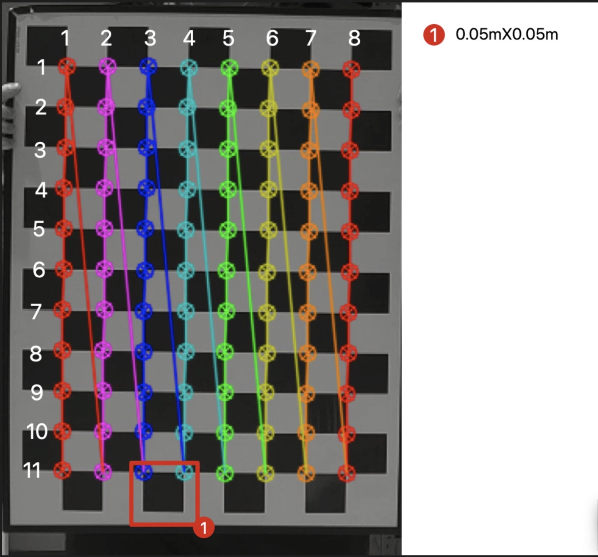
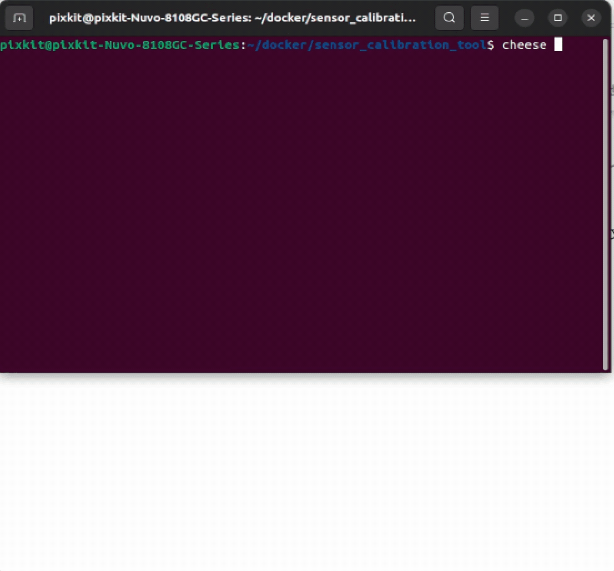
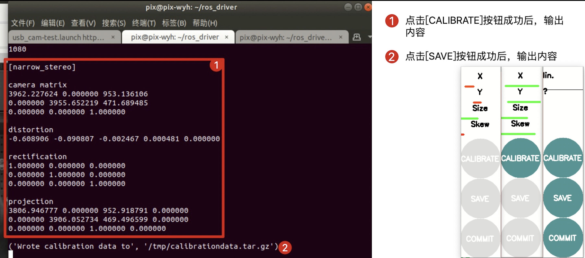
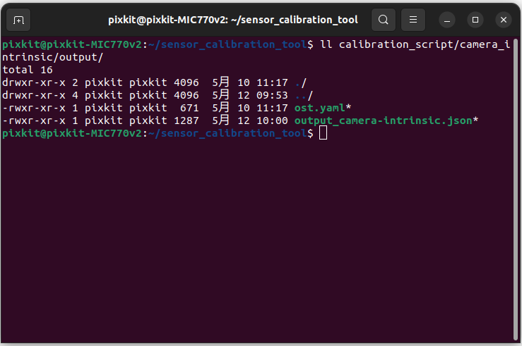

# camera内参标定

## 概要
相机内参标定是计算机视觉中的一项重要任务，它的作用是确定相机的内部参数，例如相机的焦距、光心、畸变等参数。这些内部参数是相机成像的关键因素，可以影响图像的质量和几何形状。

内参标定可以通过拍摄一系列已知物体（例如棋盘格）的图像来完成。通过分析这些图像，可以推导出相机的内参参数，并将其保存为相机标定参数的形式。一旦知道了相机的内参参数，就可以对图像进行校正，消除畸变并纠正图像的几何形状。这可以使计算机视觉算法更加准确地分析和理解图像。

相机内参标定在许多计算机视觉应用中都是必要的。例如，三维重建、目标跟踪、虚拟现实等领域都需要准确的相机参数。此外，内参标定也是机器人视觉和自主驾驶汽车等领域的重要任务。

## 前提条件
- 完成了[标定工具安装](./%E6%A0%87%E5%AE%9A%E5%B7%A5%E5%85%B7%E5%AE%89%E8%A3%85.md)
- 准备标定板
    - 8x11 角点
    - 小方块 0.05m X 0.05mX
    - 材质：漫反射铝型材


## 开始标定
> 确保没有其他程序占用摄像头，可以工控机重启后执行以下步骤

### step-1: 检测摄像头是否联通工控机
```shell
# 打开Ubuntu自带摄像头软件`cheese`
cheese
```
> 可能因为摄像头图像色彩空间与软件默认色彩空间不同，所以产生颜色错误，不影响后续操作



### step-2: 启动标定程序
> 关闭cheese软件，防止摄像头被占用
```shell
./calibration_script/camera_intrinsic/run_usb_cam.sh 
```


### step-3: 标定过程

> 标定熟练的情况下，基本2-3分钟标定完成 

|  参数 | 说明  | 按钮 | 说明 |
| ---- | ---- | ---- | ---- |
|  X   |相机的光心在图像平面上的位置X轴|CALIBRATE|标定按钮，点击后开始标定|
|  Y   |相机的光心在图像平面上的位置Y轴|SAVE     |保存按钮，点击后保存标定结果|
| Size |像素尺寸的缩放因子           |COMMIT   |提交按钮，点击后标定程序退出|
| SKew |表示图像平面的非垂直倾斜角度   |         |      |

> 标定过程时间越长，点击三个按钮后，程序计算时间越长，所以点击后，等待程序即可，不要重复点击

- `X`参数标定：通过左右移动标定板
- `Y`参数标定：通过上下移动标定板
- `Size`参数标定：通过靠近摄像头时，上下翻转标定板
- `SKew`参数标定：通过上下左右翻转标定板


- <kbd>CALIBRATE</kbd>按钮：
    - X-Y-Size-Skew四个参数达标后，按钮从灰色变为绿色，表示可以点击
    - 点击后，开始计算标定结果，成功标志-终端输出结果
- <kbd>SAVE</kbd>按钮：
    - 点击<kbd>CALIBRATE</kbd>按钮，终端输出后，按钮从灰色变为绿色，表示可以点击
    - 点击后，保存标定结果，成功标志-终端输出结果
- <kbd>COMMIT</kbd>按钮：
    - 点击<kbd>CALIBRATE</kbd>按钮，终端输出后，按钮从灰色变为绿色，表示可以点击
    - 点击后，成功标志-终端输出结果，程序GUI界面退出[如果没有退出，在终端界面按下ctrl+c结束即可]




### step-4: 标定成功验证

> 会输出内参文件`output_camera-intrinsic.json`,查看时间是最近产生的

> 注意：可以复制，但请不要移动或删除该文件

```shell
ll -h ./calibration_script/camera_intrinsic/output
```


## NEXT
现在，您已经完成`camera内参标定`，接下来可以开始[LiDAR-camera标定](./LiDAR-camera%E6%A0%87%E5%AE%9A.md)