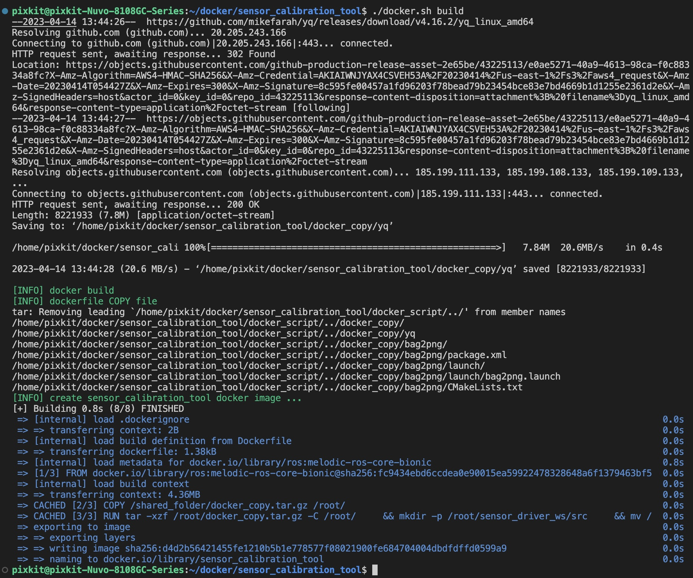
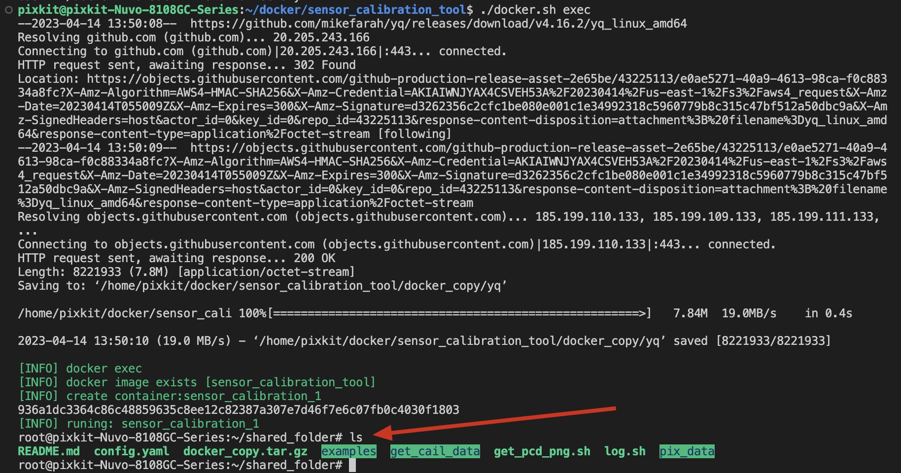
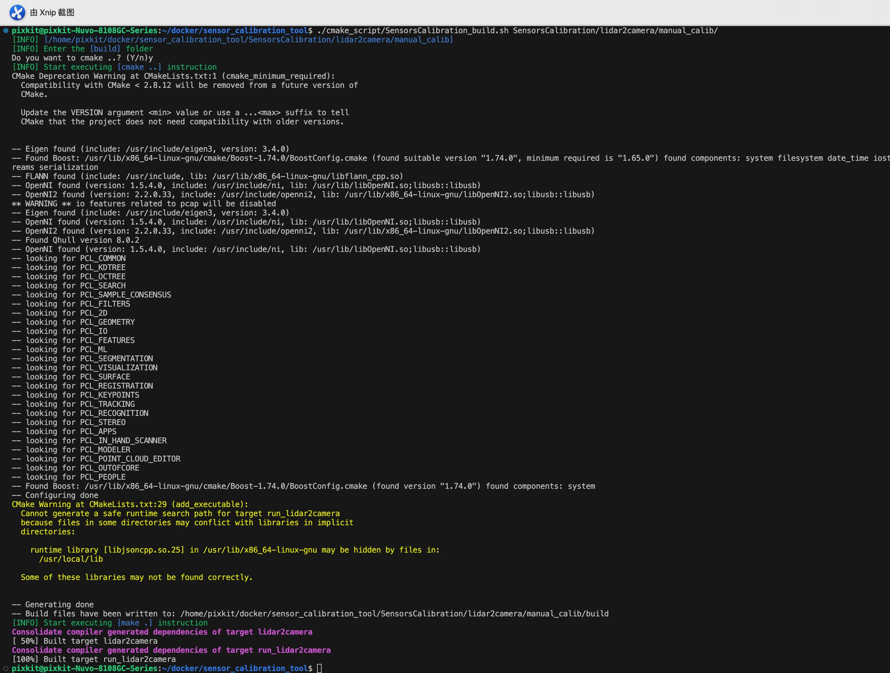
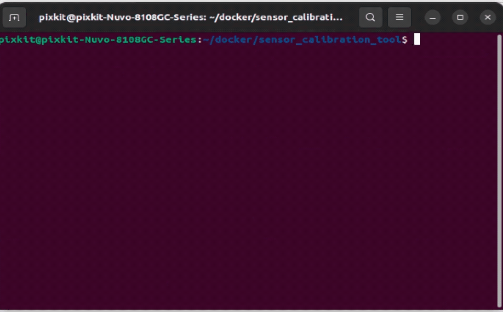

# 标定工具集合安装
> 购买pixkit的用户，已帮您完成此步骤，请直接开始[camera内参标定](./camera%E5%86%85%E5%8F%82%E6%A0%87%E5%AE%9A.md)
## 概要
采用docker和源码编译的方式，对标定工具集合进行部署

docker部署的作用是：

- 采集相机和主激光雷达的标定原始数据，采集格式为png图片和pcd点云文件

源码编译部署的作用是：

- 标定采集的传感器数据

## 前提条件
- ubuntu22.04
- Linux kernel == 5.19.0-40-generic
- ROS2：Humble
- [autoware](https://github.com/pixmoving-moveit/Autoware/tree/feature/pixkit_sensors)


## 安装部署
### step-1: docker部署 - 安装docker
[install docker](https://docs.docker.com/engine/install/ubuntu/)

### step-2: docker部署 - build docker image
- clone代码仓库
```shell
git clone -b feature/deploy-calibration-tools https://github.com/pixmoving-moveit/sensor_calibration_tool.git
mkdir sensors_calibration_tool
vcs import src ＜ sensors_calibration_tool.repos --recursive
```

- 使用仓库内Dockerfile构建docker image

> ./docker.sh [option]

> option ：

> - build : 编译dockerfile文件，生成docker镜像
> - exec : 进入docker容器
```shell
./docker.sh build
```


- step-2成功标志
```shell
./docker.sh exec
```



### step-3: 源码部署 - `SensorsCalibration标定工具集`

- 安装依赖[源码编译]
    - [gflags](https://github.com/gflags/gflags)
    - [jsoncpp](https://github.com/open-source-parsers/jsoncpp)
    - [Pangolin](https://github.com/stevenlovegrove/Pangolin/tree/v0.6) -- branch==v0.6
    - [fast_gicp](https://github.com/SMRT-AIST/fast_gicp)
- 开始编译

> ./cail_build.sh [calibration_name]

|  标定名称   | 标定程序 | 程序地址
|  ----  | ----  | ----  |
| lidar2camera | 激光雷达到相机标定可执行程序 | /sensors_calibration_tool/SensorsCalibration/lidar2camera/manual_calib/
|lidar2imu|激光雷达到IMU标定可执行程序|sensors_calibration_tool/SensorsCalibration/lidar2imu/manual_calib/
|calibration_ws|相机内参和lidar2lidar标定可执行程序|sensors_calibration_tool/calibration_ws/


```shell
# 激光雷达到相机的标定可执行程序
./cail_build.sh lidar2camera
# 激光雷达到IMU的标定可执行程序
./cail_build.sh lidar2imu
```



- step-3成功标志
> 验证[激光雷达到相机]和[激光雷达到IMU]标定程序是否编译成功

```shell
# 执行指令，如下图输出
cd ./sensors_calibration_tool/SensorsCalibration/lidar2camera/manual_calib/
./bin/run_lidar2camera data/0.png data/0.pcd data/center_camera-intrinsic.json data/top_center_lidar-to-center_camera-extrinsic.json
cd -
```


### step-4: 源码部署 - `相机内参标定工具`
- 安装依赖
```shell
sudo apt install ros-$ROS_DISTRO-camera-calibration-parsers
sudo apt install ros-$ROS_DISTRO-camera-info-manager
sudo apt install ros-$ROS_DISTRO-launch-testing-ament-cmake
```

- 开始编译
```shell
# 相机内参和lidar2lidar标定可执行程序
./cail_build.sh calibration_ws
```

- step-4成功标志
```shell
# 执行指令后入下图
./calibration_script/camera_intrinsic/test.sh 
```



## NEXT
现在，您已经完成`标定工具安装`，接下来可以开始:
- [camera内参标定](./camera%E5%86%85%E5%8F%82%E6%A0%87%E5%AE%9A.md)

## 常见问题
### Q1: 执行`step-2: docker部署 - build docker image`报错
- 分析：因为网络原因，导致有些文件没有下载成功
- 解决：再次重复`step-2: docker部署 - build docker image`即可
