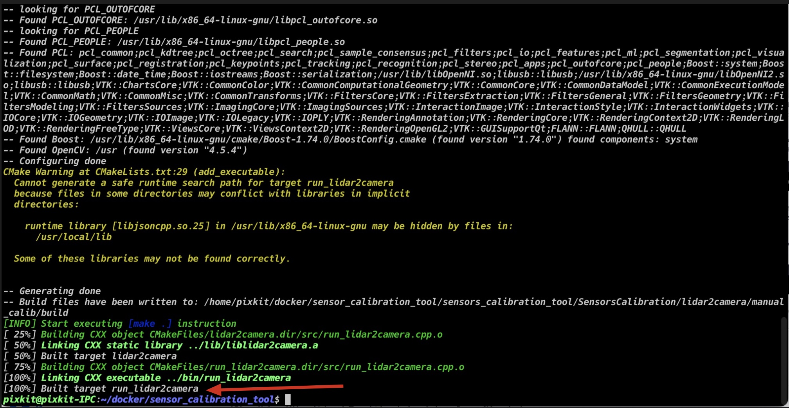
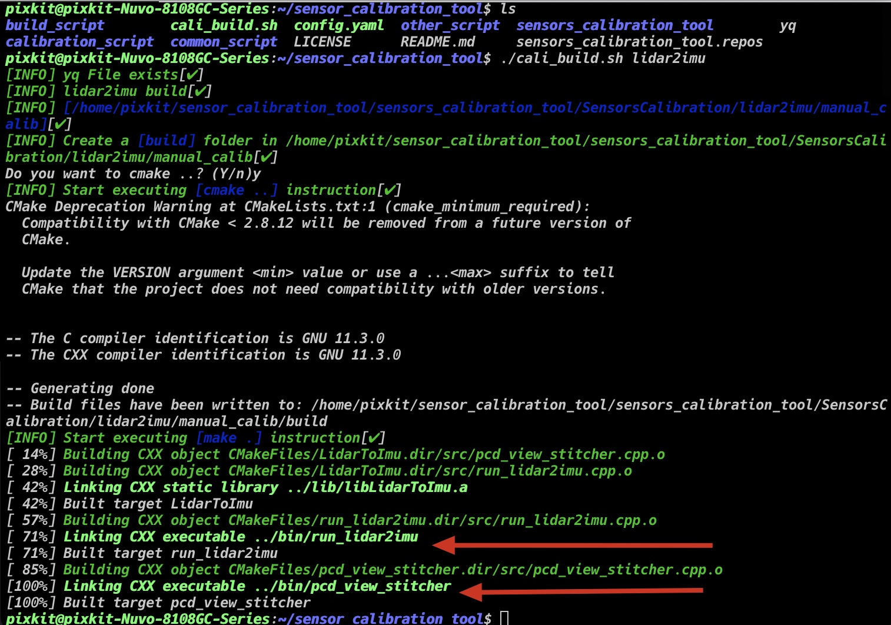
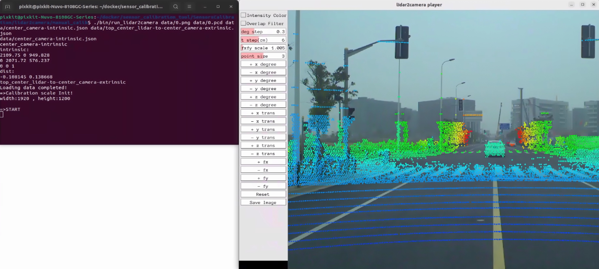

# 标定工具集合安装

> 购买pixkit的用户，已帮您完成此步骤，请直接开始[camera内参标定](./camera%E5%86%85%E5%8F%82%E6%A0%87%E5%AE%9A.md)

## 概要

- ros2采集功能包
- ros2标定功能包
- 标定可执行文件

## 前提条件

- ubuntu22.04
- Linux kernel == 5.19.0-40-generic
- ROS2：Humble
- [autoware](https://github.com/pixmoving-moveit/Autoware/tree/feature/pixkit_sensors)


## 安装部署

### step-1: clone代码仓库

```shell
git clone -b ros2-calibration-tools https://github.com/pixmoving-moveit/sensor_calibration_tool.git
cd sensor_calibration_tool
mkdir sensors_calibration_tool
vcs import sensors_calibration_tool < sensors_calibration_tool.repos --recursive
```

### step-2: 安装依赖

- 安装依赖[apt install] 

```shell
# 相机内参标定工具
sudo apt install ros-$ROS_DISTRO-camera-calibration-parsers
sudo apt install ros-$ROS_DISTRO-camera-info-manager
sudo apt install ros-$ROS_DISTRO-launch-testing-ament-cmake

# imu内参标定
sudo apt-get install libdw-dev 

# Ceres
sudo apt-get install libgoogle-glog-dev libatlas-base-dev libeigen3-dev libsuitesparse-dev

sudo apt-get install libgoogle-glog-dev
sudo apt-get install libpcl-dev pcl-tools

```

- 安装依赖[源码编译] 
    - [Ceres Solver](https://ceres-solver.googlesource.com/ceres-solver)
    - [gflags](https://github.com/gflags/gflags)
    - [jsoncpp](https://github.com/open-source-parsers/jsoncpp)
    - [Pangolin](https://github.com/stevenlovegrove/Pangolin/tree/v0.6) -- branch==v0.6
    - [fast_gicp](https://github.com/SMRT-AIST/fast_gicp)


### step-3: 开始编译

|  标定名称   | 标定程序 | 程序地址 |
|  ----  | ----  | ----  |
| lidar2camera | 激光雷达到相机标定可执行程序 | /sensors_calibration_tool/SensorsCalibration/lidar2camera/manual_calib/ |
|lidar2imu|激光雷达到IMU标定可执行程序|sensors_calibration_tool/SensorsCalibration/lidar2imu/manual_calib/ |
|calibration_ws|相机内参和lidar2lidar标定可执行程序|sensors_calibration_tool/calibration_ws/ |

#### 编译命令

``` shell
./cali_build.sh [参数]
# 以下为脚本参数
# hlep 帮助文档
# calibration_ws
#      - 标定数据采集工具包
#      - imu内参标定功能包
#      - camera内参标定功能包
#      - lidar2lidar内参标定功能包
# lidar2camera
# lidar2imu
```

#### lidar2camera编译

```shell
./cali_build.shlidar2camera
```


#### lidar2imu编译

```shell
./cali_build.shlidar2imu
```


#### calibration_ws编译

```shell
./cali_build.shcalibration_ws
```
> 成功标志：编译过程中没有任何爆红，即是成功标志
ros2package_calibration_ws


### step-4：成功标志
#### 验证[激光雷达到相机](#lidar2camera编译)和[激光雷达到IMU](#lidar2imu编译)标定程序是否编译成功

```shell
# 执行指令，如下图输出
cd ./sensors_calibration_tool/SensorsCalibration/lidar2camera/manual_calib/
./bin/run_lidar2camera data/0.png data/0.pcd data/center_camera-intrinsic.json data/top_center_lidar-to-center_camera-extrinsic.json
cd -
```


## NEXT
现在，您已经完成`标定工具安装`，接下来可以开始:

- [camera内参标定](./camera%E5%86%85%E5%8F%82%E6%A0%87%E5%AE%9A.md)


