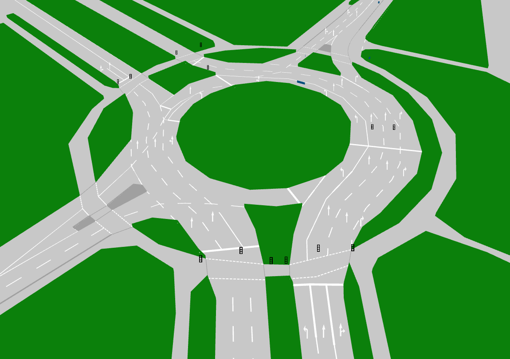

# Lanelet2地图
## Overview

[Lanelet2](https://github.com/fzi-forschungszentrum-informatik/Lanelet2)是一个处理自动驾驶地图数据的C++库，在设计Lanelet2之初，其就被用于高效地处理面向复杂交通场景的高精度地图数据。灵活性与可拓展性作为Lanelet2的核心原则，使其能够处理未来地图的新特性。



## Lanelet2的基本元素
lanelet2地图由一些基本单元组成，基础单元由`node/point`、`linestring`、`polygon`、`lanelet`、`area`、`regulatory element`组成。

### node
node由一个唯一的id、经纬度高度与笛卡尔坐标系的坐标组成，并具有扩展能力，通过设置tag中的k来增加新特性，通过设置v来设置新特性的值。
```xml
<node id="1" lat="" lon="">
  <tag k="mgrs_code" v="99XXX0000-2"/>
  <tag k="local_x" v="11.5354"/>
  <tag k="local_y" v="-184.0996"/>
  <tag k="ele" v="-0.2962"/>
</node>
```
上面的例子为一个`node`，其`id`为1，`local_x`为x坐标，`local_y`为y坐标，`ele`为高度。用于组成linestring、area基本结构。
### area
area由一个唯一的id、一系列有序顶点的node_id，area类型与是否是area的标识，并具有扩展能力，通过设置tag中的k来增加新特性，通过设置v来设置新特性的值。
```xml
<way id="88">
  <nd ref="84"/>
  <nd ref="85"/>
  <nd ref="86"/>
  <nd ref="87"/>
  <tag k="type" v="detection_area"/>
  <tag k="area" v="yes"/>
</way>
```
上例中，`area_id`为`88`，按顺序引用`node`的id分别为`17`，`12`，`13`，`15`，`16`，`area`为`yes`。


### linestring
Linestring由一系列有序的node_id、linestring类型与拓展类型组成，并具有扩展能力，通过设置tag中的k来增加新特性，通过设置v来设置新特性的值。
```xml
<way id="3">
  <nd ref="1"/>
  <nd ref="2"/>
  <nd ref="8"/>
  <nd ref="10"/>
  <tag k="type" v="line_thin"/>
  <tag k="subtype" v="solid"/>
</way>
```
上例中，Linestring的id为”3”，按顺序引用node “1””2””8””10”，linestring的类型为”line_thin”，可选的linestring类型与子类型参考下表。

| **type** | **subtype** | **description** | **lane change?** |
|----------|-------------|-----------------|------------------|
|line_thin | solid    | a solid lane marking | no       |
|line_thin | solid_solid | a double solid lane marking | no       |
|line_thin | dashed      | a dashed lane marking | yes        |
|line_thin | dashed_solid | a marking that is dashed on the left and solid on the right | left->right: yes |
|line_thin | solid_dashed | the other way around | right->left: yes |
|line_thick | same as above for thin |     |                  |
|curbstone | high        | a curbstone that is to high for a vehicle to drive over | no |
|curbstone | low         | curb that is low and can be driven for a vehicle | no |
|virtual   | -           | a non-physical lane boundary, intended mainly for intersections | no |
|road_border | -         | the end of the road. | no          |

### polygon
polygon由一条linestring组成，并具有扩展能力，通过设置tag中的k来增加新特性，通过设置v来设置新特性的值。
```xml
<relation id="35">
  <member type="way" role="outer" ref="32"/>
  <tag k="type" v="multipolygon"/>
</relation>
```
### lanelet
lanelet由左右两个linestring组成，引用的regulatory element与lanelet的类型组成，并具有扩展能力，通过设置tag中的k来增加新特性，通过设置v来设置新特性的值。
```xml
<relation id="48">
  <member type="way" role="left" ref="47"/>
  <member type="way" role="right" ref="44"/>
  <member type="way" role="centerline" ref="80"/>
  <member type="relation" role="regulatory_element" ref="89"/>
  <member type="relation" role="regulatory_element" ref="100"/>
  <tag k="type" v="lanelet"/>
  <tag k="subtype" v="road"/>
  <tag k="speed_limit" v="10"/>
  <tag k="location" v="urban"/>
  <tag k="one_way" v="yes"/>
</relation>
```
上例中，Lanelet的ID为`48`，lane的左、右边界分别引用`id`为`47`为`44`的`Linestring`，`centerline`引用id为`80`的`linestring`；`regulatory_element`引用`id`为`89`与`100`的`regulatory_elemen`；`type`为`lanelet`，`subtype`为`road`，`speed_limit`为`10`km/h，`location`为`urban`，`one_way`为`yes`。lanelet可选的tag参考下表。

| **subtype** | **location** | **description**                  | **Inferred Participants** | **Speed limit**  | 
|-------------|--------------|----------------------------------|------------------|------------------|
| **road**    | **urban**    | A part of a road in urban region | All vehicles and bikes | City speed limit |
| **road**    | **nonurban** | A part of a road in nonurban region | All vehicles and bikes | Nonurban speed limit |
| **highway** | **urban**    | A part of a highway in urban region | All vehicles  | Urban highway limit |
| **highway** | **nonurban**   | A part of a highway in nonurban region | All vehicles  | Nonurban highway limit |
| **play_street** | **-**    | A part of a play street          | Vehicles, bikes, pedestrians | play street speed limit |
| **emergency_lane** | **-** | Lane for emergency vehicles      | Emergency vehicles | Average emergency vehicle speed |
| **bus_lane** | **urban**       | Lane for buses                   | Bus, Emergency, Taxi | City speed limit |
| **bus_lane** | **nonurban**       | Lane for buses                   | Bus, Emergency, Taxi | Nonurban speed limit |
| **bicycle_lane** | **-**   | A lane that is usable only for bikes | Bikes        | Average bike speed |
| **exit**    | **urban**    | Exit area of a house or garage that crosses the crosswalk   | Vehicles, bikes, pedestrians | Urban speed limit |
| **walkway** | **-**        | A part of a way for pedestrians  | Pedestrians      | Average pedestrian walking speed |
| **shared_walkway** | **-** | A way shared by bikes and pedestrians | Bikes, Pedestrians | Average bike/pedestrian speed |
| **crosswalk** | **-**      | A part of a crosswalk            | Pedestrians      | Average pedestrian walking speed |
| **stairs**  | **-**        | Well ... stairs                  | Pedestrians      | Average pedestrian walking speed |

### regulatory element
regulatory element由一系列的linestring与regulatory elemenet的类型组成，并具有扩展能力，通过设置tag中的k来增加新特性，通过设置v来设置新特性的值。
```xml
<relation id="100">
  <member type="way" role="refers" ref="95"/>
  <member type="way" role="ref_line" ref="92"/>
  <member type="way" role="light_bulbs" ref="99"/>
  <tag k="type" v="regulatory_element"/>
  <tag k="subtype" v="traffic_light"/>
</relation>
```
上例中，`regulatory_element`的`id`为`100`；引用`id`为`95`的`linestring`作为交通灯的参考线；引用`id`为`92`的`linestring`作为停止线；引用`id`为`95`的`linestring`作为灯泡；`type`为`regulatory_element`，`subtype`为`traffic_light`。`regulatory_element`的`subtype`见下表.

| **subtype** | **description**                  |
|-------------|----------------------------------|
|traffic_sign|交通信号标志|
|traffic_light|交通信号灯|
|speed_limit|限速标志|

## lanelet2地图制作

### 画图工具
使用[TierIv Inc.](https://tier4.jp/en/)开发的[Vector Map Builder](https://tools.tier4.jp/feature/vector_map_builder_ll2/)工具进行制作。


### 导入点云地图
制作地图之前，首先需要导入点云地图，作为矢量地图几何特征的参考。[点云地图制作方法](./%E7%82%B9%E4%BA%91%E5%9C%B0%E5%9B%BE.md)

1. 点击`file`-`Import PCD`


2. 点击`browser`选取PCD文件


3. 选去好PCD文件后点击`import`


4. 可以看到地图可视化框中导入了点云地图


### 创建lanelet2地图
1. 点击`create`菜单，`create_lanelet2Map`


### 编辑lanelet
1. 找到道路，可以看到两侧路沿间的可行驶区域

2. 点击上方菜单内`lanelet`按钮进入`lanelet编辑模式`

3. 单击地图上的可行驶区域选择`lanelet`的初始点

4. 移动鼠标选择下一个`lanelet`节点，在弯道的部分可以多选择一些节点以确保弯道的平滑

5. 取消选择`lanelet`按钮退出`lanelet编辑模式`

6. 修改lanelet宽度
- 可以选择右侧`Action`内的`Change Lanelet Width`进行修改


- 可以点击`node`进行三维的移动改变lanelet的宽度


### 编辑parking_lot（停车场）
parking_lot在自动驾驶车辆进入泊车模式时会将`parking_lot`转换成为
1. 找到停车场区域，选择`linestring`描绘停车场区域

2. 取消`linestring`绘制工具勾选，点击右侧`Change to Polygon`按钮，将`linestring`转换成为`polygon`

3. 在右侧属性编辑栏将`type`属性设置为`parking_lot`


### 编辑trafficlight（交通信号灯）
1. 选择一条`lanelet`，选择上方工具栏的`trafficlight`工具

2. 点击这条`lanelet`，就会生成一条`type`为`stop_line`的`linestring`，一条`type`为`traffic_light`的`linestring`，一条`type`为`light_bulbs`的`linestring`；可以移动这些这些组件的位置，但是`traffic_light`的方向不能够改变，因为在交通信号灯检测过程中，`traffic_light`方向是作为过滤的考虑因素。

3. 将`traffic_light`的`sub_type`设置为`red_yellow_green`，其中有一个`key`为`height`，代表为以这条`traffic_light`的`linestring`为长，`height`为宽的矩形作为交通信号灯的粗ROI，所以可以适当调整`height`的值。

4. 增加`light_bulbs`的一个名为`traffic_light_id`的`optional_tag`，其值设置为`traffic_light`这条`linestring`的id。

5. 调整`light_bulbs`的颜色，点击某一个灯泡，就能够在右侧属性编辑栏设置`color`为`read`、`green`、`yellow`。


## lanelet2地图示例
[lanelet2地图示例下载](https://drive.google.com/file/d/1499_nsbUbIeturZaDj7jhUownh5fvXHd/view?usp=sharing)

## 参考资料
 - [https://www.autoware.org/_files/ugd/984e93_9978752488284f4ab6853f83a0c044bc.pdf?index=true](https://www.autoware.org/_files/ugd/984e93_9978752488284f4ab6853f83a0c044bc.pdf?index=true)
 - [https://github.com/fzi-forschungszentrum-informatik/Lanelet2](https://github.com/fzi-forschungszentrum-informatik/Lanelet2)
 - [https://tools.tier4.jp/feature/vector_map_builder_ll2/](https://tools.tier4.jp/feature/vector_map_builder_ll2/)
 - [https://autowarefoundation.github.io/autoware-documentation/main/design/autoware-interfaces/components/planning/#lanelet2-map](https://autowarefoundation.github.io/autoware-documentation/main/design/autoware-interfaces/components/planning/#lanelet2-map)