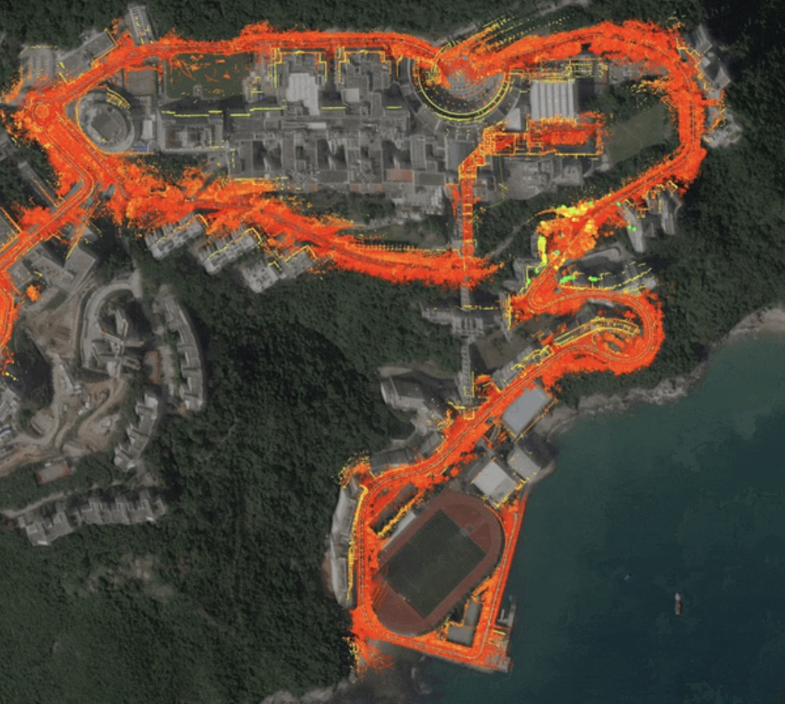
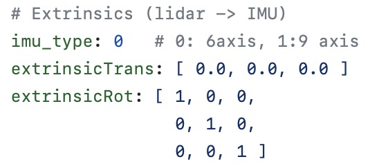

# 点云地图制作
## LIO-SAM-6AXIS

### step-1: 安装docker
[install docker](https://docs.docker.com/engine/install/ubuntu/)

### step-2: 安装nvidia docker
[install nvidia docker](https://docs.nvidia.com/datacenter/cloud-native/container-toolkit/install-guide.html)

### step-3: build docker image
- clone代码仓库(仓库地图还需修改)
```shell
git clone https://github.com/pixmoving-moveit/LIO_SAM_6AXIS.git # clone代码仓库
cd lio_sam_6axis # 进入代码仓库文件夹
```
- 使用仓库内Dockerfile构建docker image
```shell
sudo docker build - < Dockerfile -t lidar_mapping
```

### step-4: 运行image
```shell
docker run -it --net=host --gpus all --name lidar_mapping -v $HOME/shared_dir:/home/lidar_mapping/data lidar_mapping /bin/zsh
```
如果需要多个terminal窗口进行操作的话，可以通过一下命令进入container
```shell
docker exec -it lidar_mapping /bin/zsh
```
### step-5: 构建建图工作空间
创建工作空间
```shell
mkdir mapping_ws
cd mapping_ws
mkdir src
cd src
git clone https://github.com/pixmoving-moveit/LIO_SAM_6AXIS.git
cd ..
```
编译package
```shell
cd ~/mapping_ws
catkin_map
```
### step-6: 标定传感器
在建图之前，需要准备好你的IMU的内参，还有LiDAR与IMU的外参

- [标定IMU内参](../%E4%BC%A0%E6%84%9F%E5%99%A8%E6%A0%87%E5%AE%9A/IMU%E6%A0%87%E5%AE%9A.md)
- [标定LiDAR与IMU外参](../%E4%BC%A0%E6%84%9F%E5%99%A8%E6%A0%87%E5%AE%9A/LiDAR-IMU%E6%A0%87%E5%AE%9A.md)

### step-7: 修改配置文件
launch文件
```xml
<launch>
    <arg name="project" default="lio_sam_6axis"/>
    <arg name="bag_path" default="/media/xchu/e81eaf80-d92c-413a-a503-1c9b35b19963/home/xchu/data/hkust/outdoors/hkust_20201105full.bag"/>
    <arg name="sequence" default="hkust_campus"/>

    <!--set your own Parameters -->
    <!--    <rosparam file="$(find lio_sam_6axis)/config/params_ouster.yaml" command="load"/>-->
    <rosparam file="$(find lio_sam_6axis)/config/params_vlp.yaml" command="load"/>

    <!--- LOAM -->
    <param name="saveDirectory" type="string" value="$(find lio_sam_6axis)/data/"/>
    <param name="configDirectory" type="string" value="$(find lio_sam_6axis)/config/"/>
    <rosparam param="sequence" subst_value="true">$(arg sequence)</rosparam>
    <include file="$(find lio_sam_6axis)/launch/include/module_loam.launch"/>

    <!--- Robot State TF -->
    <include file="$(find lio_sam_6axis)/launch/include/module_robot_state_publisher.launch"/>

    <!--show satellite-->
    <!--set your orgin gps lla  22.3387279108228 114.263622199692 87.7310562180355 -->
    <node pkg="rostopic" type="rostopic" name="fake_gps_fix"
          args="pub gps/fix sensor_msgs/NavSatFix '{ header: auto, latitude: 22.3387279108228, longitude: 114.263622199692, altitude:  87.7310562}'"
          output="screen"/>

    <!--- Run Navsat -->
    <node pkg="lio_sam_6axis" type="lio_sam_6axis_gpsOdometry" name="lio_sam_6axis_gpsOdometry" output="log"/>

    <!--- Run Rviz-->
    <node pkg="rviz" type="rviz" name="$(arg project)_rviz"
          args="-d $(find lio_sam_6axis)/launch/include/config/vlp.rviz"/>

    <node pkg="rosbag" type="play" name="bag_play" args="$(arg bag_path) --clock -d 5 -r 2.0"/>

</launch>
```
需要根据launch文件修改对应的参数文件，以上述的launch文件为例，使用的参数文件是`$(find lio_sam_6axis)/config/params_vlp.yaml`，所以应该在这个文件中修改相关参数

- 需要修改为你的传感器配置的msg


|**参数**|**msg 类型**|**描述**|
|--|--|--|
|pointCloudTopic|sensor_msgs/Pointcloud2|LiDAR点云的topic|
|imuTopic|sensor_msgs/Imu|IMU的topic|
|odomTopic|nav_msgs/Odometry|IMU里程计topic，不需要修改|
|gpsTopic|nav_msgs/NavSatFix|gnss的定位topic|

- 如果使用GNSS，需要将`useGPS`设为`true`，并且将正确的gps频率设置在`gpsFrequence`中


- LiDAR参数


|**参数**|**描述**|
|--|--|
|sensor|LiDAR的类型，可选`velodyne`, `ouster`, `livox`, `hesai`|
|N_SCAN|点云通道数，16线激光雷达即为16|
|Horizon_SCAN|LiDAR的横向分辨率，(Velodyne:1800, Ouster:512,1024,2048, Livox Horizon: 4000)|
|downsampleRate|下采样率，让N_SCAN/downsampleRate=16|
|lidarMinRange|最小点云距离，默认为1.5|
|lidarMaxRange|最大点云距离，默认为1000.0|

- IMU内参，参考[IMU标定](../%E4%BC%A0%E6%84%9F%E5%99%A8%E6%A0%87%E5%AE%9A/IMU%E6%A0%87%E5%AE%9A.md)获取IMU内参


|**参数**|**描述**|
|--|--|
|imuAccNoise|3轴加速度计白噪声均值 (m/s^s)|
|imuGyrNoise|3轴陀螺白噪声均值 (rad/s)|
|imuAccBiasN|3轴加速度计零偏均值 (m/s^s)|
|imuGyrBiasN|3轴陀螺零偏均值 (rad/s)|
|imuGravity|当地重力加速度 (m/s^2)|
|imuRPYWeight|角度权重，默认0.01|

- IMU外参，参考[LiDAR与IMU外参标定](../%E4%BC%A0%E6%84%9F%E5%99%A8%E6%A0%87%E5%AE%9A/LiDAR-IMU%E6%A0%87%E5%AE%9A.md)


|**参数**|**描述**|
|--|--|
|imu_type|IMU类型(0: 6 axis, 1: 9 axis)|
|extrinsicTrans|平移矩阵|
|extrinsicRot|旋转矩阵|

### step-8: 运行建图程序
运行建图launch文件
```shell
roslaunch lio_sam_6axis run.launch
```
播放rosbag
```shell
rosbag play -r 3.0 [path of bag file]
```

### step-9: 保存地图
```shell
rosservice call /lio_sam_6axis/save_map
```
保存好地图之后能够在地图文件夹内看到以下文件

|**name**|**描述**|
|--|--|
|global_map_lidar.pcd|点云地图，如果使用GNSS的话方向已经转换至ENU方向|
|origin.txt|点云地图原点的经纬高|

## 引用
- [LIO_SAM_6AXIS](https://github.com/JokerJohn/LIO_SAM_6AXIS)

- [creating maps for Autoware](https://autowarefoundation.github.io/autoware-documentation/pr-335/how-to-guides/creating-maps-for-autoware/open-source-slam/fast-lio-lc/)