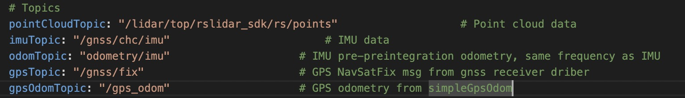
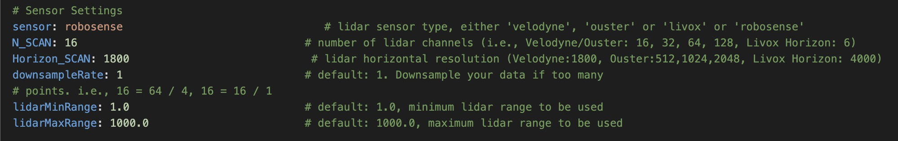

# 点云地图制作
## LIO-SAM-6AXIS


### prerequest
- Ubuntu 22.04
- ROS2 Humble

### step-1: 构建建图工作空间
创建工作空间
```shell
mkdir ~/mapping_ws
cd ~/mapping_ws
mkdir src
cd src
```

### step-2 clone仓库
```shell
git clone https://github.com/pixmoving-moveit/LIO-SAM-ROS2-PIXKIT # clone 仓库代码
```

### step-3 安装依赖
```shell
sudo apt install ros-humble-perception-pcl \
  	   ros-humble-pcl-msgs \
  	   ros-humble-vision-opencv \
  	   ros-humble-xacro
# Add GTSAM-PPA
sudo add-apt-repository ppa:borglab/gtsam-release-4.1
sudo apt install libgtsam-dev libgtsam-unstable-dev
```

### step-4 编译package
```shell
cd ~/mapping_ws
colcon build --symlink-install --cmake-args -DCMAKE_BUILD_TYPE=Release
```
### step-5 标定传感器
在建图之前，需要准备好你的IMU的内参，还有LiDAR与IMU的外参

- [标定IMU内参](../%E4%BC%A0%E6%84%9F%E5%99%A8%E6%A0%87%E5%AE%9A/IMU%E6%A0%87%E5%AE%9A.md)
- [标定LiDAR与IMU外参](../%E4%BC%A0%E6%84%9F%E5%99%A8%E6%A0%87%E5%AE%9A/LiDAR-IMU%E6%A0%87%E5%AE%9A.md)

### step-6 修改配置文件
launch文件
```python3
import os
from ament_index_python.packages import get_package_share_directory
from launch import LaunchDescription
from launch.actions import DeclareLaunchArgument
from launch.substitutions import LaunchConfiguration, Command
from launch_ros.actions import Node


def generate_launch_description():

    share_dir = get_package_share_directory('lio_sam')
    parameter_file = LaunchConfiguration('params_file')
    xacro_path = os.path.join(share_dir, 'config', 'robot.urdf.xacro')
    rviz_config_file = os.path.join(share_dir, 'config', 'rviz2.rviz')

    params_declare = DeclareLaunchArgument(
        'params_file',
        default_value=os.path.join(
            share_dir, 'config', 'params_rs16.yaml'),
        description='FPath to the ROS2 parameters file to use.')

    print("urdf_file_name : {}".format(xacro_path))

    return LaunchDescription([
        params_declare,
        Node(
            package='tf2_ros',
            executable='static_transform_publisher',
            arguments='0.0 0.0 0.0 0.0 0.0 0.0 map odom'.split(' '),
            parameters=[parameter_file],
            output='screen'
            ),
        Node(
            package='robot_state_publisher',
            executable='robot_state_publisher',
            name='robot_state_publisher',
            output='screen',
            parameters=[{
                'robot_description': Command(['xacro', ' ', xacro_path])
            }]
        ),
        Node(
            package='lio_sam',
            executable='lio_sam_imuPreintegration',
            name='lio_sam_imuPreintegration',
            parameters=[parameter_file],
            output='screen'
        ),
        Node(
            package='lio_sam',
            executable='lio_sam_imageProjection',
            name='lio_sam_imageProjection',
            parameters=[parameter_file],
            output='screen'
        ),
        Node(
            package='lio_sam',
            executable='lio_sam_featureExtraction',
            name='lio_sam_featureExtraction',
            parameters=[parameter_file],
            output='screen'
        ),
        Node(
            package='lio_sam',
            executable='lio_sam_mapOptimization',
            name='lio_sam_mapOptimization',
            parameters=[parameter_file],
            output='screen'
        ),
        Node(
            package='lio_sam',
            executable='lio_sam_simpleGpsOdom',
            name='lio_sam_simpleGpsOdom',
            parameters=[parameter_file],
            output='screen'
        ),
        Node(
            package='rviz2',
            executable='rviz2',
            name='rviz2',
            arguments=['-d', rviz_config_file],
            output='screen'
        )
    ])

```
需要根据launch文件修改对应的参数文件，以上述的launch文件为例，使用的参数文件是`params_rs16.yaml`，所以应该在这个文件中修改相关参数

- 需要修改为你的传感器配置的msg


|**参数**|**msg 类型**|**描述**|
|--|--|--|
|pointCloudTopic|sensor_msgs/Pointcloud2|LiDAR点云的topic|
|imuTopic|sensor_msgs/Imu|IMU的topic|
|odomTopic|nav_msgs/Odometry|IMU里程计topic，不需要修改|
|gpsTopic|nav_msgs/NavSatFix|gnss的定位topic|

- 如果使用GNSS进行方位初始化，需要将`useImuHeadingInitialization`设为`true`


- LiDAR参数


|**参数**|**描述**|
|--|--|
|sensor|LiDAR的类型，可选`velodyne`, `ouster`, `livox`, `robosense`|
|N_SCAN|点云通道数，16线激光雷达即为16|
|Horizon_SCAN|LiDAR的横向分辨率，(Velodyne:1800, Ouster:512,1024,2048, Livox Horizon: 4000)|
|downsampleRate|下采样率，让N_SCAN/downsampleRate=16|
|lidarMinRange|最小点云距离，默认为1.5|
|lidarMaxRange|最大点云距离，默认为1000.0|

- IMU内参，参考[IMU标定](../%E4%BC%A0%E6%84%9F%E5%99%A8%E6%A0%87%E5%AE%9A/IMU%E6%A0%87%E5%AE%9A.md)获取IMU内参


|**参数**|**描述**|
|--|--|
|imuAccNoise|3轴加速度计白噪声均值 (m/s^s)|
|imuGyrNoise|3轴陀螺白噪声均值 (rad/s)|
|imuAccBiasN|3轴加速度计零偏均值 (m/s^s)|
|imuGyrBiasN|3轴陀螺零偏均值 (rad/s)|
|imuGravity|当地重力加速度 (m/s^2)|
|imuRPYWeight|角度权重，默认0.01|

- IMU外参，参考[LiDAR与IMU外参标定](../%E4%BC%A0%E6%84%9F%E5%99%A8%E6%A0%87%E5%AE%9A/LiDAR-IMU%E6%A0%87%E5%AE%9A.md)

> IMU外参，可以使用[LiDAR与IMU外参标定]，也可以使用卷尺手动量取(坐标系为右手法则)
> 当手动量取时：
> - extrinsicTrans:卷尺手动量取
> - extrinsicRot: 单位矩阵即可


|**参数**|**描述**|
|--|--|
|extrinsicTrans|平移矩阵|
|extrinsicRot|旋转矩阵|

### step-8: 运行建图程序
运行建图launch文件
```shell
ros2 launch lio_sam run.launch.py
```
播放rosbag
```shell
ros2 bag play --clock -r 3.0 -s sqlite3 [your_ros2_bag]
```

### step-7: 保存地图
```shell
ros2 service call /lio_sam/save_map  lio_sam/srv/SaveMap "{resolution: 0.2, destination: [Absolute path to store your map]}"
```
保存好地图之后能够在地图文件夹内看到以下文件

|**name**|**描述**|
|--|--|
|GlobalMap.pcd|点云地图，如果使用GNSS的话方向已经转换至ENU方向|

你能够看到点云地图的原点WGS84坐标，用于GNSS定位

> 建议把终端里的信息保存下来，方便用于GNSS定位时使用

## 引用
- [LIO_SAM](https://github.com/TixiaoShan/LIO-SAM)

- [LIO_SAM_6AXIS](https://github.com/JokerJohn/LIO_SAM_6AXIS)

- [LIO-SAM-ROS2-PIXKIT](https://github.com/pixmoving-moveit/LIO-SAM-ROS2-PIXKIT)

- [creating maps for Autoware](https://autowarefoundation.github.io/autoware-documentation/pr-335/how-to-guides/creating-maps-for-autoware/open-source-slam/fast-lio-lc/)