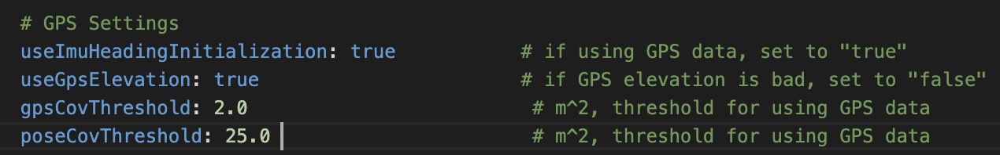

# 点云地图制作
## LIO-SAM-6AXIS


### step-1 标定传感器 （初始参数已设置，可跳过，若建图效果不佳标定请重新标定）
在建图之前，需要准备好你的IMU的内参，还有LiDAR与IMU的外参

- [标定IMU内参](../%E4%BC%A0%E6%84%9F%E5%99%A8%E6%A0%87%E5%AE%9A/IMU%E6%A0%87%E5%AE%9A.md)
- [标定LiDAR与IMU外参](../%E4%BC%A0%E6%84%9F%E5%99%A8%E6%A0%87%E5%AE%9A/LiDAR-IMU%E6%A0%87%E5%AE%9A.md)


### step-2 录制ros2 bag
 **注意** 录制前先检查话题输出，录制话题过程中车辆尽量平稳缓速行使，建议回环的您的地图场景。
```shell
先启动autoware

方式一脚本录制话题： ~/pixkit/pix/ros2_bag目录下
                  ros2 bag record $(cat rosbag.txt)
方式二手动录制话题： ~/pixkit/pix/ros2_bag目录下
                  ros2 bag record  /lidar_topic /gnss_topic /imu_topic 
                  这里的 /lidar_topic：雷达设备的话题
                        /gnss_topic ：惯导设备的话题
                        /imu_topic  : IMU的话题
```

### step-3 修改配置文件
launch文件下run.launch：
```python3
import os
from ament_index_python.packages import get_package_share_directory
XXX
XXX

def generate_launch_description():

    share_dir = get_package_share_directory('lio_sam')
    parameter_file = LaunchConfiguration('params_file')
    xacro_path = os.path.join(share_dir, 'config', 'robot.urdf.xacro')
    rviz_config_file = os.path.join(share_dir, 'config', 'rviz2.rviz')

    params_declare = DeclareLaunchArgument(
        'params_file',
        default_value=os.path.join(
            share_dir, 'config', 'params_rs16.yaml'),
        description='FPath to the ROS2 parameters file to use.')
```
`params_rs16.yaml`：读取config下的配置文件，如需改动请注意这里

- 需要修改为你的传感器配置的topic


|**参数**|**msg 类型**|**描述**|
|--|--|--|
|pointCloudTopic|sensor_msgs/Pointcloud2|您录制LiDAR点云的topic|
|imuTopic|sensor_msgs/Imu|您录制IMU的topic|
|odomTopic|nav_msgs/Odometry|IMU里程计topic，不需要修改|
|gpsTopic|nav_msgs/NavSatFix|您录制gnss的定位topic|

- 如果使用GNSS进行方位初始化，需要将`useImuHeadingInitialization`设为`true`，



### step-4: 运行建图程序
 **注意** 结束autoware

mapping_ws下运行建图launch文件 
```shell
source install/setup.bash
ros2 launch lio_sam run.launch.py
```

### step-4: 播放rosbag
```shell
ros2 bag play  [your_ros2_bag] --clock 
your_ros2_bag： 您录制的ros2bag，等待您的ros2bag播放结束执行以下操作
```
### step-5: 保存地图
mapping_ws文件下：
```shell
source install/setup.bash
ros2 service call /lio_sam/save_map  lio_sam/srv/SaveMap 
```
保存好的地图在Downloads下LOAM

|**name**|**描述**|
|--|--|
|GlobalMap.pcd|点云地图，如果使用GNSS的话方向已经转换至ENU方向|

点云地图的原点WGS84坐标，用于GNSS定位
> 建议把终端里的信息保存下来，方便用于GNSS定位时使用 
   

## 代码git
### prerequest
- Ubuntu 22.04
- ROS2 Humble

### step-1: 构建建图工作空间
创建工作空间
```shell
mkdir ~/mapping_ws
cd ~/mapping_ws
mkdir src
cd src
```

### step-2 clone仓库
```shell
git clone https://github.com/pixmoving-moveit/LIO-SAM-ROS2-PIXKIT # clone 仓库代码
```

### step-3 安装依赖
```shell
sudo apt install ros-humble-perception-pcl \
  	   ros-humble-pcl-msgs \
  	   ros-humble-vision-opencv \
  	   ros-humble-xacro
# Add GTSAM-PPA
sudo add-apt-repository ppa:borglab/gtsam-release-4.1
sudo apt install libgtsam-dev libgtsam-unstable-dev
```

### step-4 编译package
```shell
cd ~/mapping_ws
colcon build --symlink-install --cmake-args -DCMAKE_BUILD_TYPE=Release
```

## LiDAR参数说明 

  

|**参数**|**描述**|
|--|--|
|sensor|LiDAR的类型，可选`velodyne`, `ouster`, `livox`, `robosense`|
|N_SCAN|点云通道数，16线激光雷达即为16|
|Horizon_SCAN|LiDAR的横向分辨率，(Velodyne:1800, Ouster:512,1024,2048, Livox Horizon: 4000)|
|downsampleRate|下采样率，让N_SCAN/downsampleRate=16|
|lidarMinRange|最小点云距离，默认为1.5|
|lidarMaxRange|最大点云距离，默认为1000.0|

- IMU内参，参考[IMU标定](../%E4%BC%A0%E6%84%9F%E5%99%A8%E6%A0%87%E5%AE%9A/IMU%E6%A0%87%E5%AE%9A.md)获取IMU内参


|**参数**|**描述**|
|--|--|
|imuAccNoise|3轴加速度计白噪声均值 (m/s^s)|
|imuGyrNoise|3轴陀螺白噪声均值 (rad/s)|
|imuAccBiasN|3轴加速度计零偏均值 (m/s^s)|
|imuGyrBiasN|3轴陀螺零偏均值 (rad/s)|
|imuGravity|当地重力加速度 (m/s^2)|
|imuRPYWeight|角度权重，默认0.01|

- IMU外参，参考[LiDAR与IMU外参标定](../%E4%BC%A0%E6%84%9F%E5%99%A8%E6%A0%87%E5%AE%9A/LiDAR-IMU%E6%A0%87%E5%AE%9A.md)

> IMU外参，可以使用[LiDAR与IMU外参标定]，也可以使用卷尺手动量取(坐标系为右手法则)
> 当手动量取时：
> - extrinsicTrans:卷尺手动量取
> - extrinsicRot: 单位矩阵即可


|**参数**|**描述**|
|--|--|
|extrinsicTrans|平移矩阵|
|extrinsicRot|旋转矩阵|

## 引用
- [LIO_SAM](https://github.com/TixiaoShan/LIO-SAM)

- [LIO_SAM_6AXIS](https://github.com/JokerJohn/LIO_SAM_6AXIS)

- [LIO-SAM-ROS2-PIXKIT](https://github.com/pixmoving-moveit/LIO-SAM-ROS2-PIXKIT)

- [creating maps for Autoware](https://autowarefoundation.github.io/autoware-documentation/pr-335/how-to-guides/creating-maps-for-autoware/open-source-slam/fast-lio-lc/)