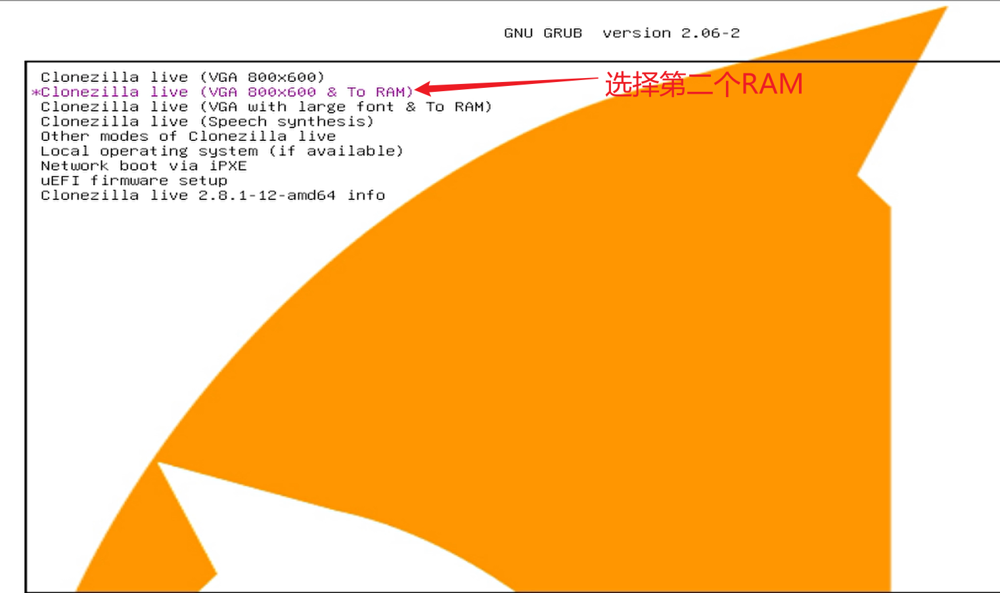
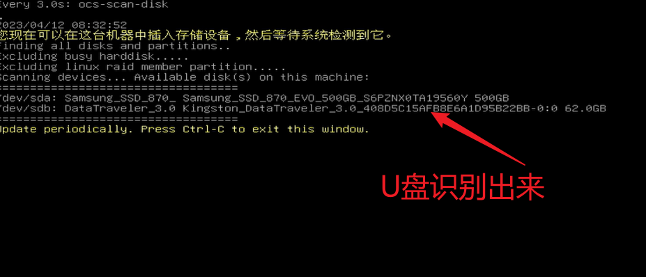
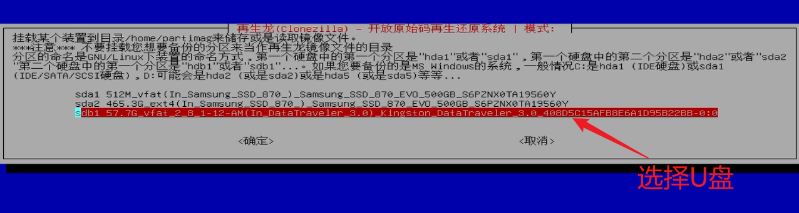
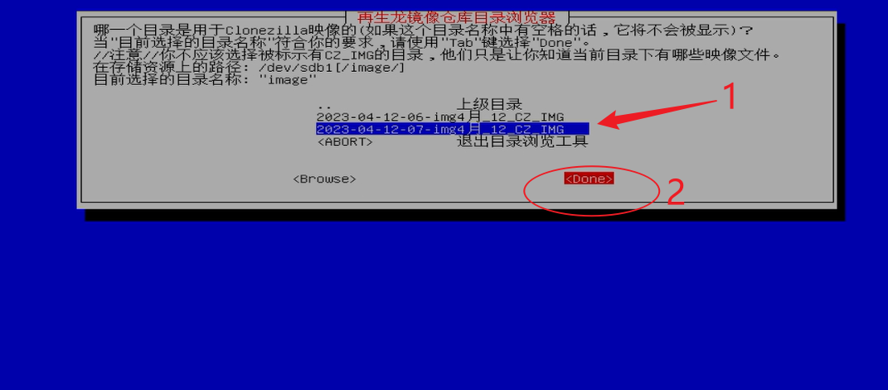
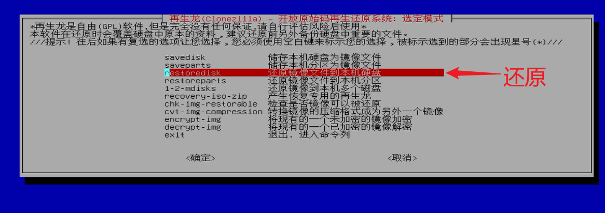
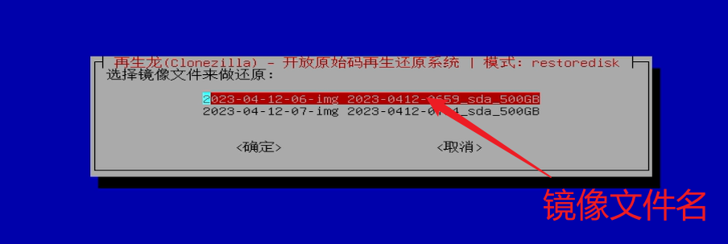
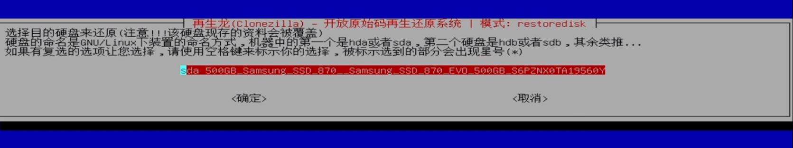
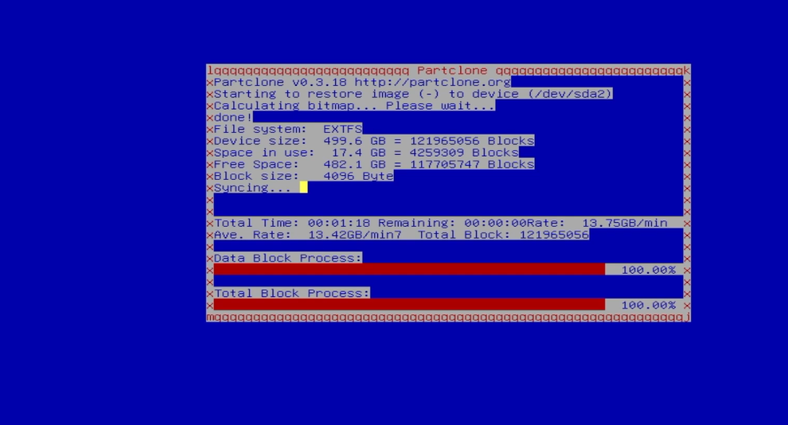

# 刷写系统镜像

> 基本原则：将系统备份好的镜像文件刷写到工控机
> 声明：当工控机系统被破坏、缺失文件导致无法运行自动驾驶或在黑屏导致无法进入系统时，可以用U盘来还原工控机系统恢复出场设置。
> 参考资料：<https://www.youtube.com/watch?v=YEFt2LPSYMk>

## 根据以下步骤
第一步：插入U盘，开机按住F12（可以使用有线键盘操作），进入刷机启动界面

第二步：使用U盘还原镜像时选择第二个选项

第三步：选择中文界面

第四步：默认键盘

第五步：使用再生龙

第六步：镜像文件来自U盘
 
第七步：已读取到镜像分区
 
第八步：ctrl+c
 
第九步：选择插入时U盘
 
第十步：选择U盘里的镜像文件
 
第十一步：默认第一个选项 

第十二步：选择第三个选项，用于把U盘的镜像还原到工控机 
 
第十三步：选择需要还原的镜像名    
  
第十四步：系统盘位置
 
第十五步：默认选择还原前检查

第十六步：可以选择直接关机（poweroff）

第十七步：读取镜像

第十八步：输入 y

第十九步：等待刷机（10分钟左右） 
 
第二十步：系统自动关机——已完成刷写

**注意事项**： 此U盘建议仅用于还原镜像，不要做任何修改、添加或者保存其他文件，以免破坏启动盘的环境。

