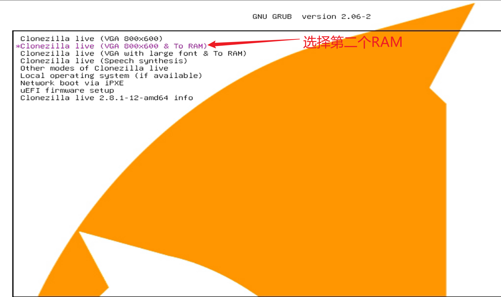
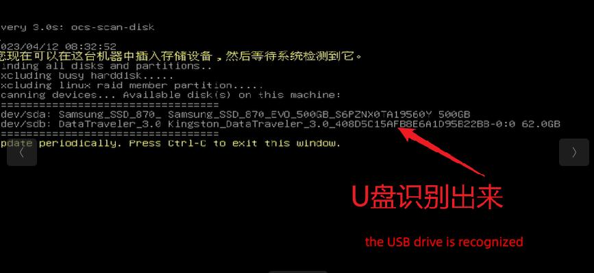
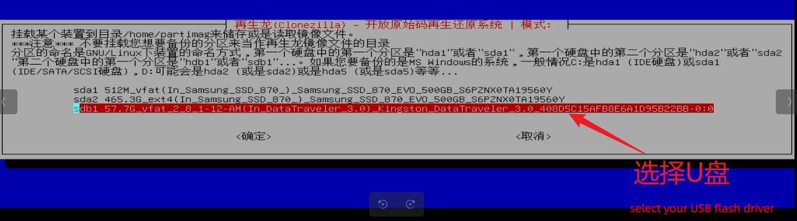
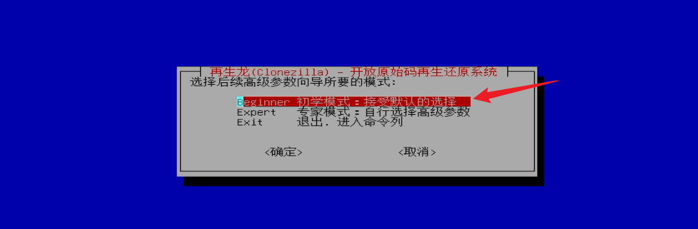
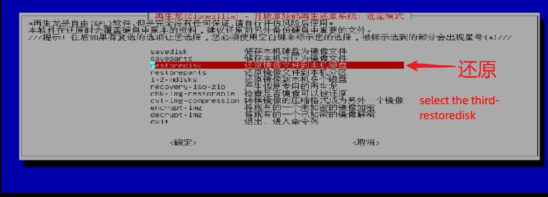
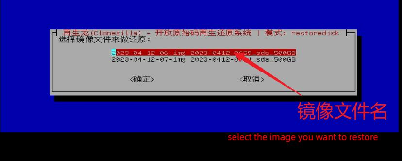
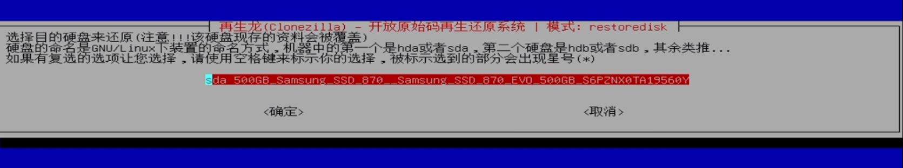
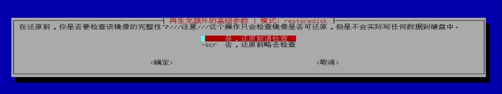
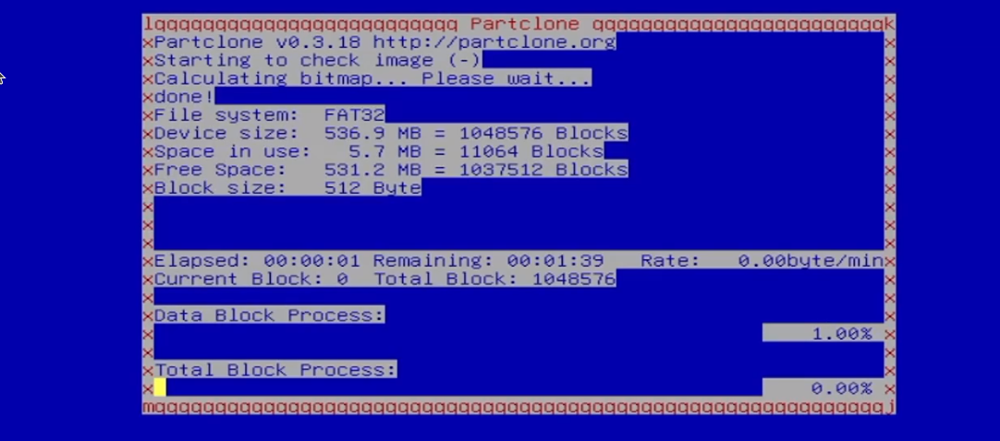
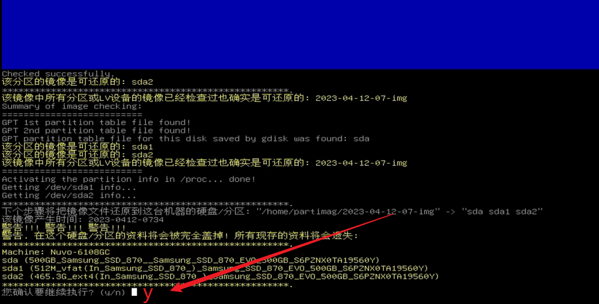

# 刷写系统镜像

> 基本原则：将系统备份好的镜像文件刷写到工控机

> 声明：当工控机系统被破坏、缺失文件导致无法运行自动驾驶或在黑屏导致无法进入系统时，可以用U盘来还原工控机系统恢复出场设置。

## 前提条件

- [再生龙启动U盘制作](https://clonezilla.nchc.org.tw/clonezilla-live/liveusb.php#windows-method-b)
- [备份系统镜像](./%E5%A4%87%E4%BB%BD%E7%B3%BB%E7%BB%9F%E9%95%9C%E5%83%8F.md)

## 根据以下步骤

### step-1：插入`再生龙启动U盘`，开机按住F12（可以使用有线键盘操作），进入刷机启动界面

### step-2：使用`再生龙启动U盘`还原镜像时选择第二个选项

> 系统的最初镜像已附带在U盘里，选择使用U盘里的镜像刷写还原

### step-3：选择中文界面

### step-4：默认键盘

### step-5：使用再生龙

### step-6：镜像文件来自U盘
 
### step-7：已读取到镜像分区
 
### step-8：ctrl+c

> 等待出现硬盘信息(如下图)，才能按下`ctrl+c`

 
### step-9：选择插入时U盘
 
### step-10：选择U盘里的镜像文件
 
### step-11：默认第一个选项 

### step-12：选择第三个选项，用于把U盘的镜像还原到工控机 
 
### step-13：选择需要还原的镜像名    
  
### step-14：系统盘位置
 
### step-15：默认选择还原前检查

### step-16：可以选择直接关机（poweroff）

### step-17：读取镜像

### step-18：输入 y

### step-19：等待刷机（10分钟左右） 
 

### step-20：系统自动关机——已完成刷写

**注意事项**： 此U盘建议仅用于还原镜像，不要做任何修改、添加或者保存其他文件，以免破坏启动盘的环境。

## 参考资料
[Clonezilla 再生龍](https://clonezilla.nchc.org.tw/intro/)
[还原镜像视频](https://www.youtube.com/watch?v=YEFt2LPSYMk)