# 备份系统镜像
 
> 基本原则：将工控机系统制作镜像，用户需要提供一个超过100G的硬盘
 
> 声明：避免用户在工控机里安装其他的驱动或在软件时破坏系统配置导致无法运行自动驾驶及启动驱动，可以通过备份的镜像来还原最初系统（系统的最初镜像已附带在U盘里）。用户也可以备份自己的系统镜像，可以用硬盘来保存工控机镜像。  

## 前提条件

- [再生龙启动U盘制作](https://clonezilla.nchc.org.tw/clonezilla-live/liveusb.php#windows-method-b)

##  根据以下几个步骤
### step-1：插入`再生龙启动U盘`，开机按住F12（可以使用有线键盘操作），进入刷机启动界面
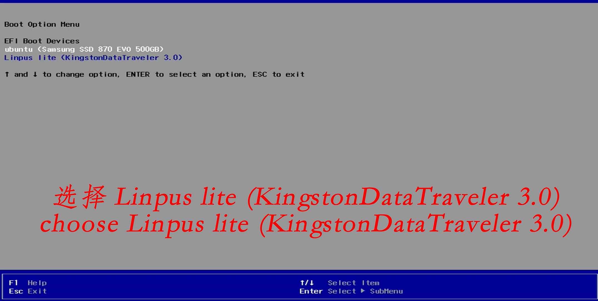
### step-2：使用一个新的`100G以上的移动硬盘`或者`100G以上的U盘`作为`镜像文件存储盘`

> 系统的出厂镜像已附带在`再生龙启动U盘`里，用户需要备份镜像，则需要重新准备一个`100G以上的移动硬盘`或者`100G以上的U盘`

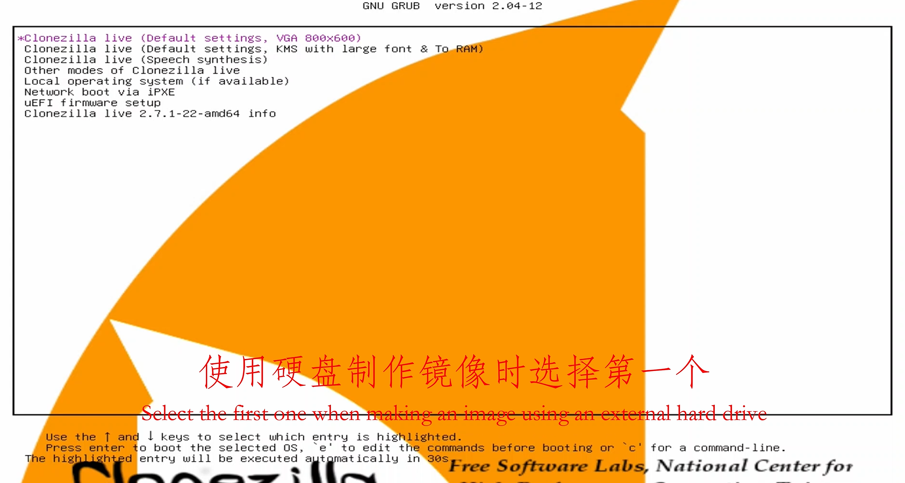
### step-3：选择中文界面
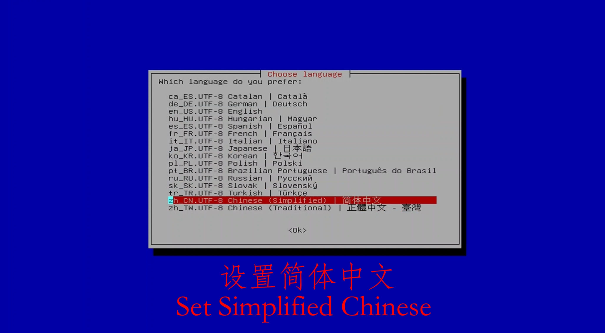
### step-4：默认键盘

### step-5：使用再生龙

### step-6：保存镜像文件至移动硬盘
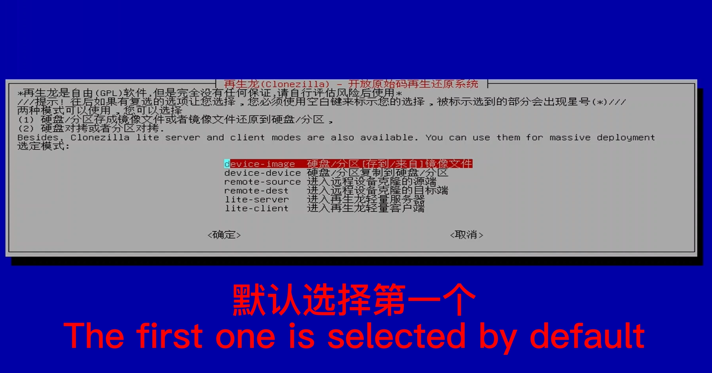
### step-7：使用挂载设备时选择第一个
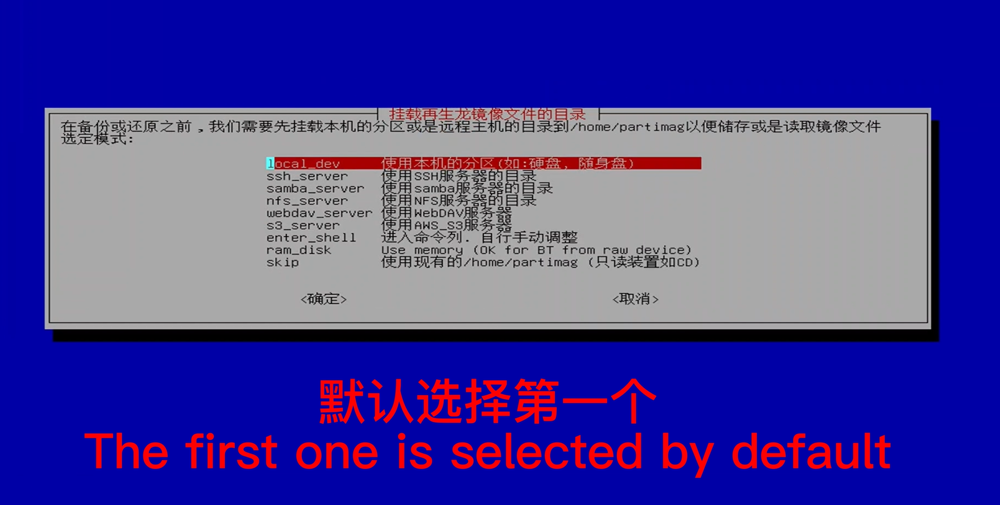
### step-8：插入硬盘
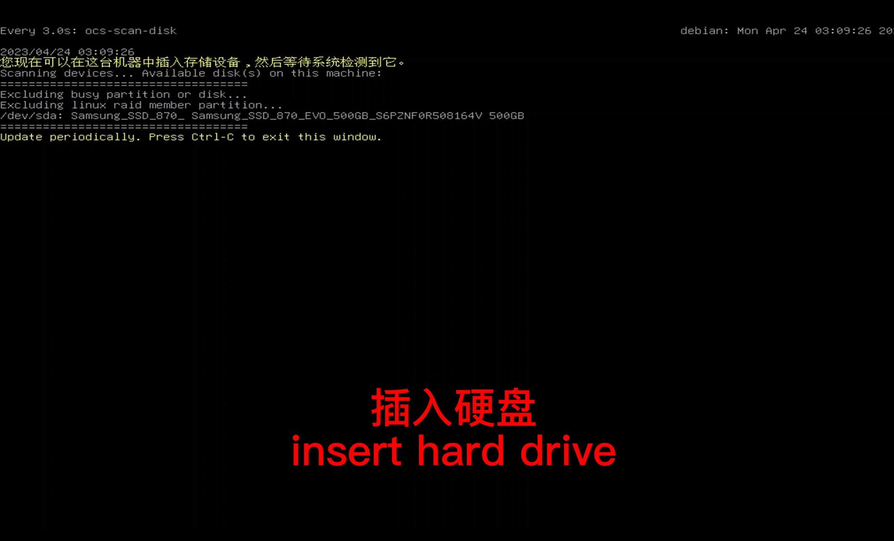
### step-9：ctrl+c

> 等待出现硬盘信息(如下图)，才能按下`ctrl+c`

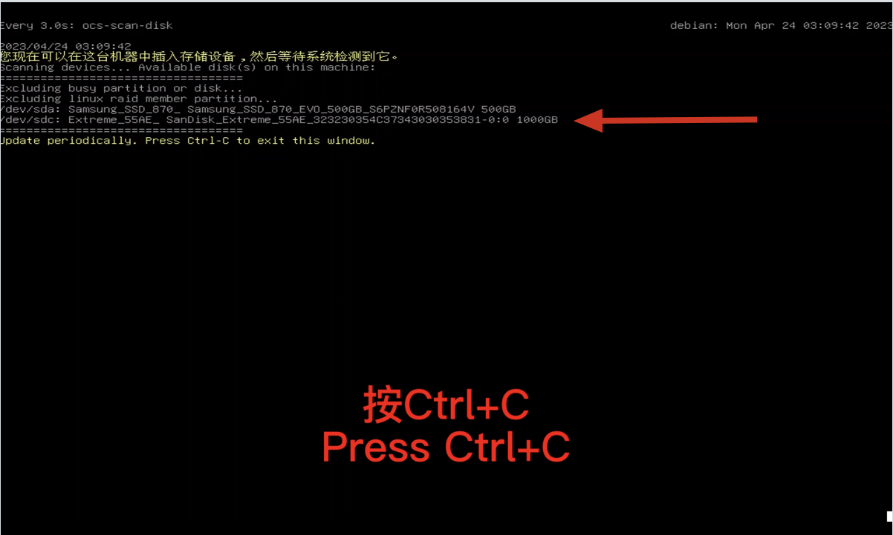
### step-10：刚才挂载的硬盘
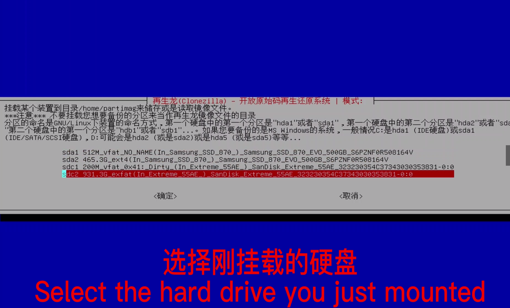
### step-11：默认选择
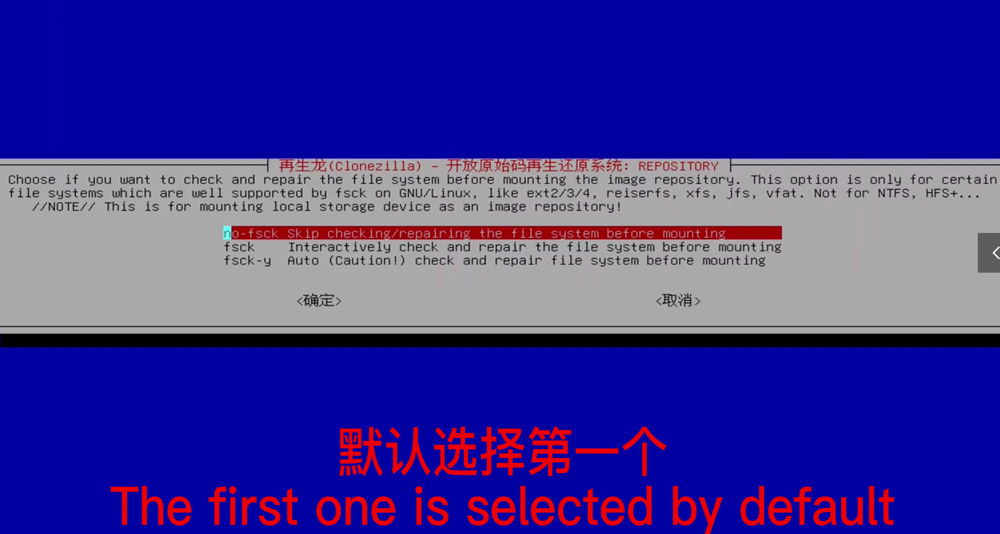
### step-12：选择要保存的文件名

### step-13：选择Done
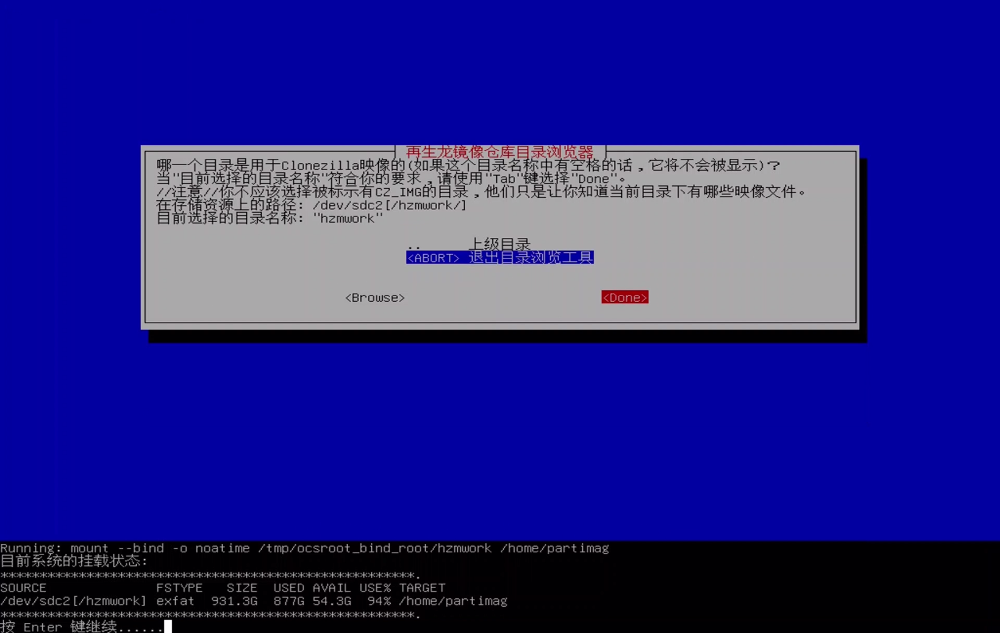
### step-14：默认选择
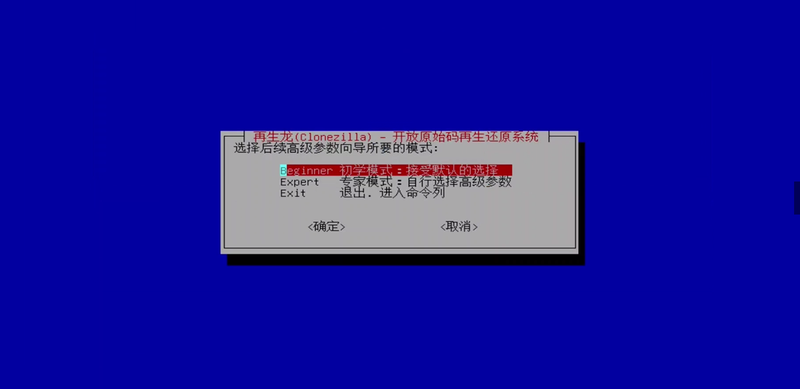
### step-15：储存本机镜像  

### step-16：文件命名   
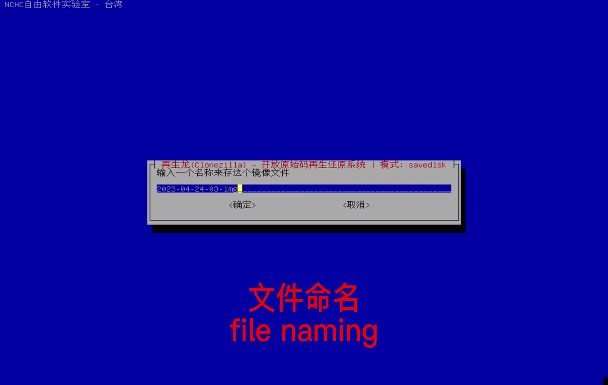
### step-17：以zip方式压缩储存   
  
### step-18：默认    
  
### step-19:默认 
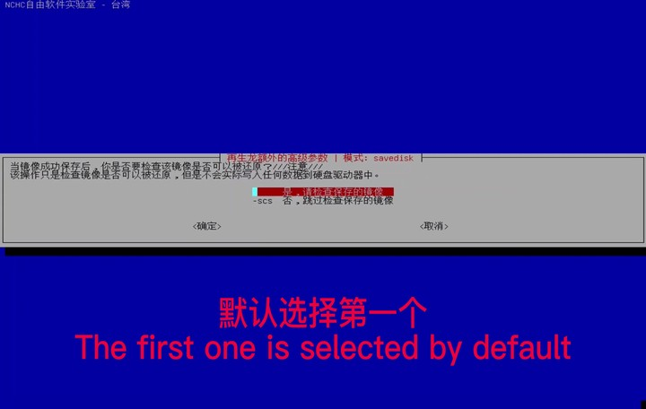  
### step-20：默认 
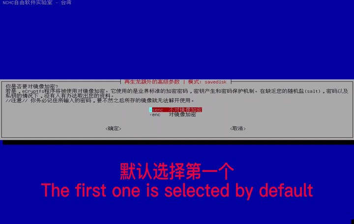  
### step-21：执行完选择选择poweroff   
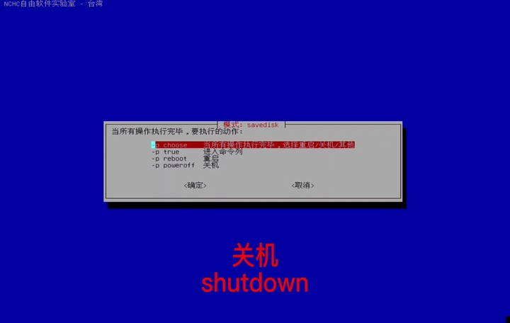   
### step-22：开始拷贝    
   
### step-23：等待完成自动关机

**注意事项**： U盘作为启动盘，需要保存自己镜像时候需要用户提供硬盘，不要在U盘上做任何修改、添加或者保存其他文件，以免破坏启动盘的环境。

## 参考资料
[Clonezilla 再生龍](https://clonezilla.nchc.org.tw/intro/)  
[制作再生龙镜像视频](https://www.youtube.com/watch?v=8-7w5zwD9M4)