# 备份系统镜像
 
> 基本原则：将工控机系统制作镜像  
> 声明：避免用户在工控机里部署其他的驱动或在软件时破坏系统配置导致无法运行自动驾驶及启动驱动，可以通过备份的镜像来还原最初系统（系统的最初镜像已附带在U盘里）。用户也可以备份自己的系统镜像，可以用硬盘来保存工控镜像。  
> 参考资料：<https://www.youtube.com/watch?v=8-7w5zwD9M4>

####  根据以下几个步骤
第一步：插入U盘，开机按住F12（可以使用有线键盘操作），进入刷机启动界面

第二步：使用硬盘来作镜像

第三步：选择中文界面

第四步：默认键盘
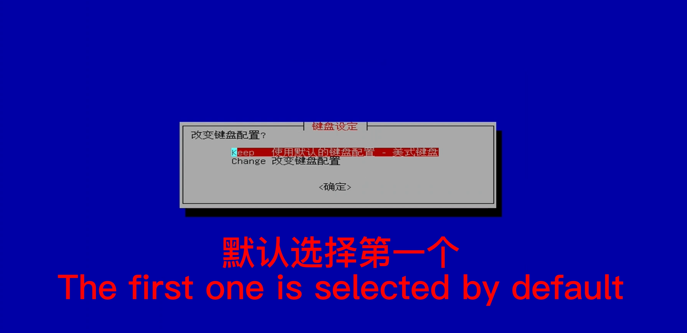
第五步：使用再生龙
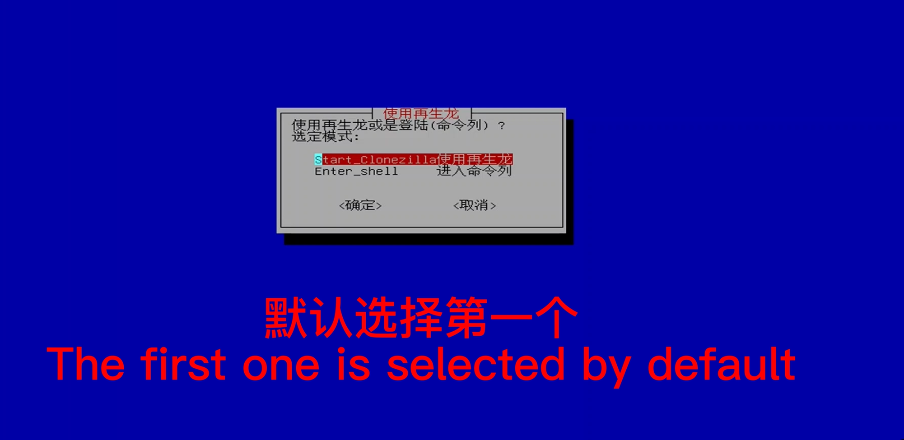
第六步：保存镜像文件至硬盘

第七步：使用挂载设备时选择第一个

第八步：插入硬盘
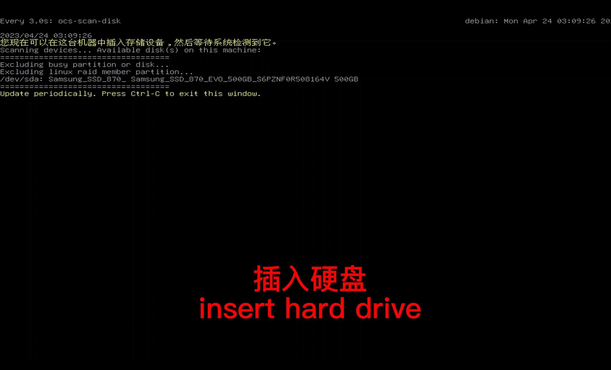
第九步：ctrl+c
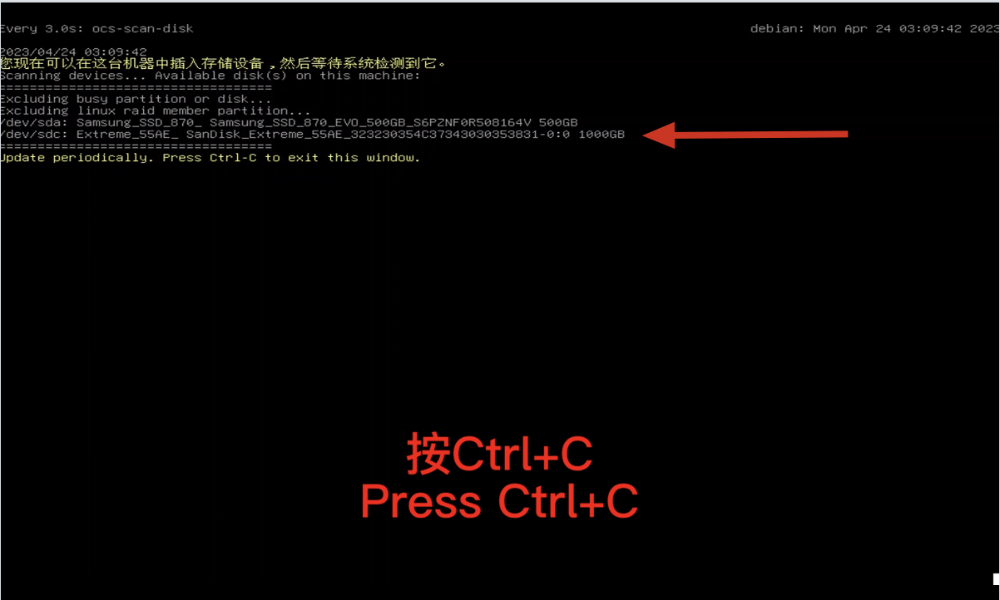
第十步：刚才挂载的硬盘
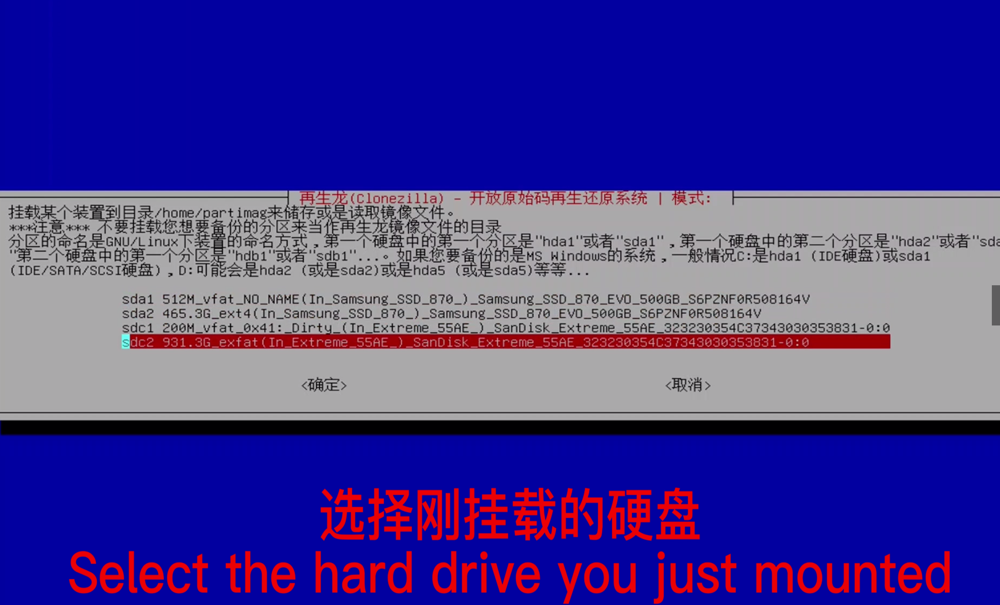
第十一步：默认选择

第十二步：选择要保存的文件名
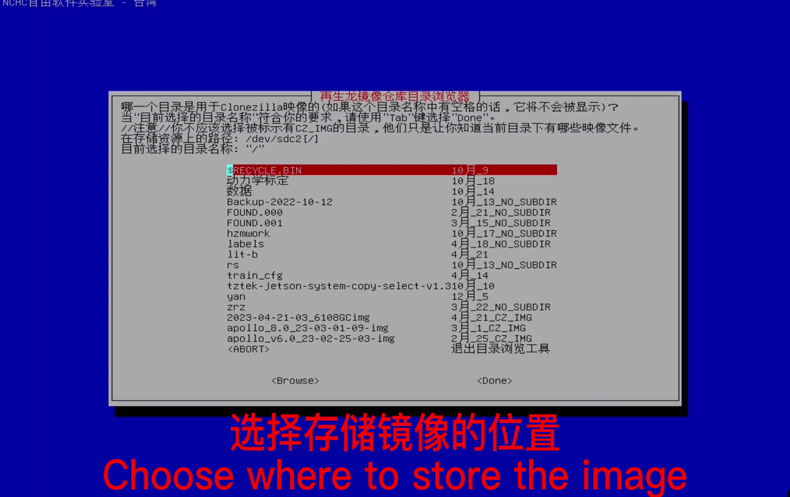
第十三步：选择Done
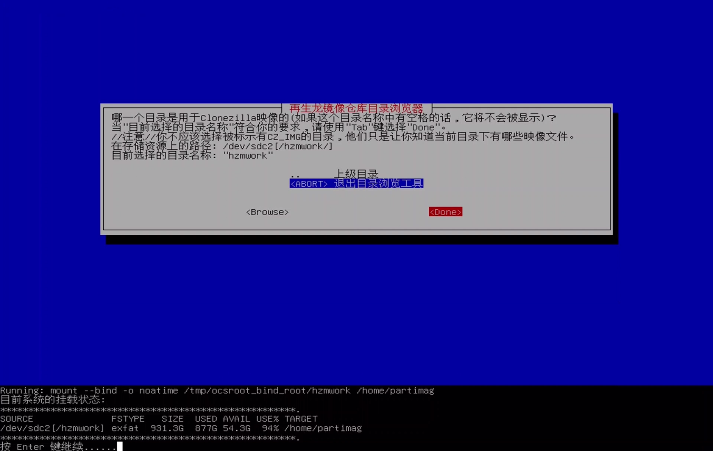
第十四步：默认选择
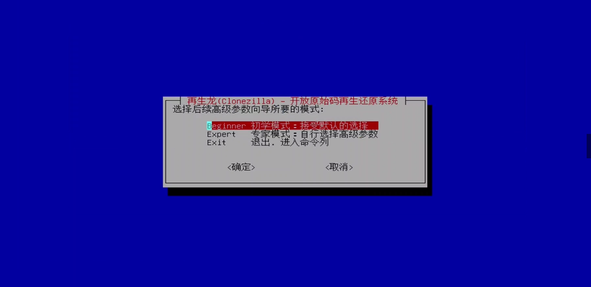
第十五步：储存本机镜像  
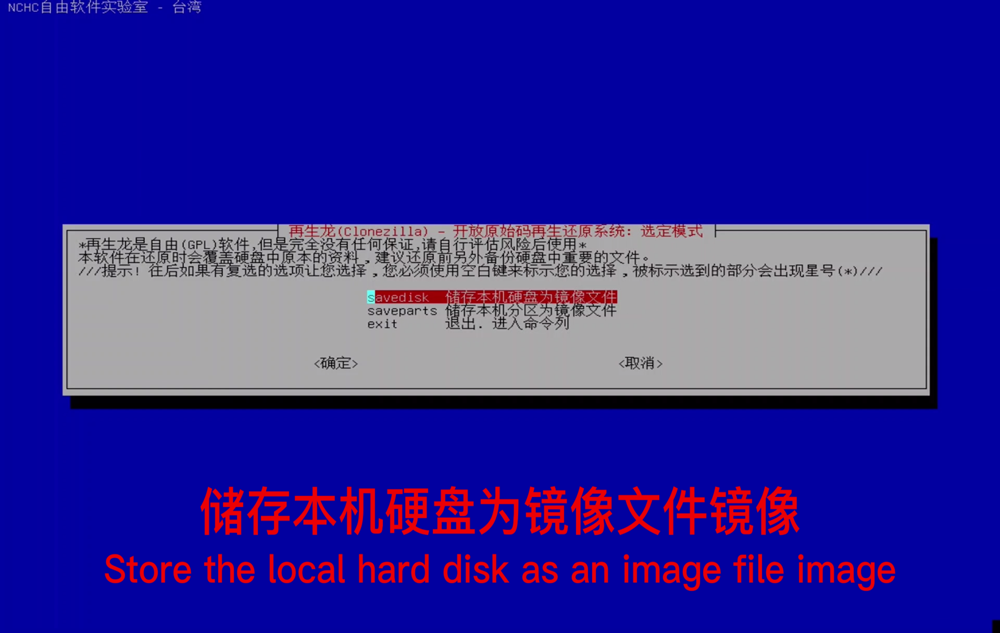
第十六步：文件命名   

第十七步：以zip方式压缩储存   
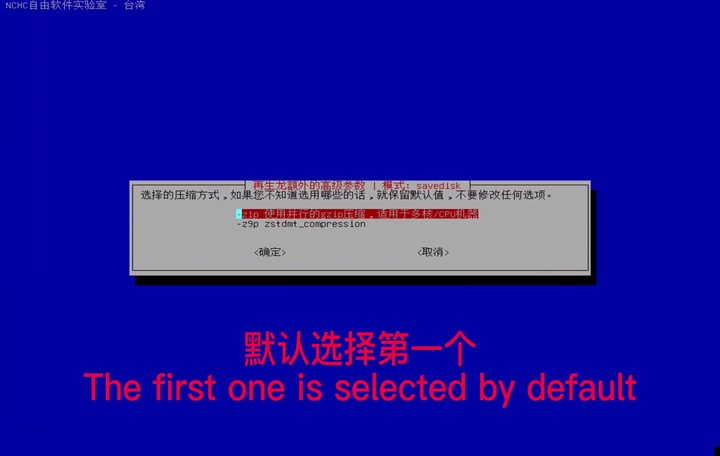  
第十八步：默认    
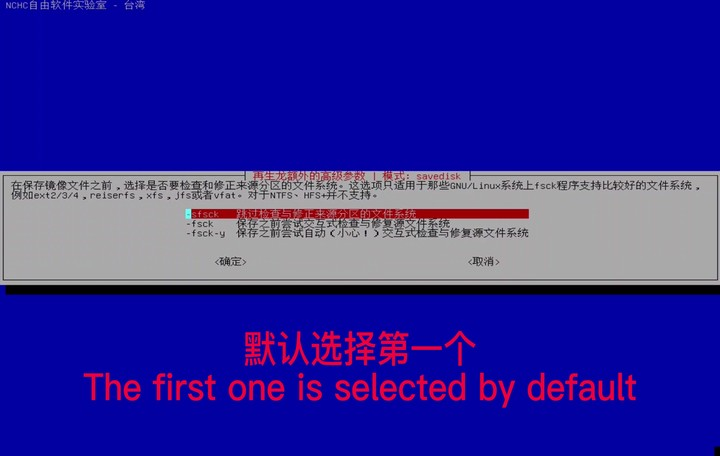  
第十九步:默认 
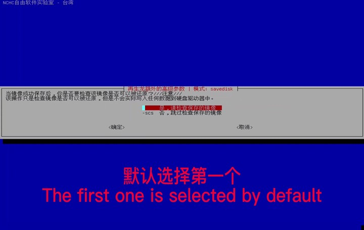  
第二十步：默认 
  
第二十一步：执行完选择选择poweroff   
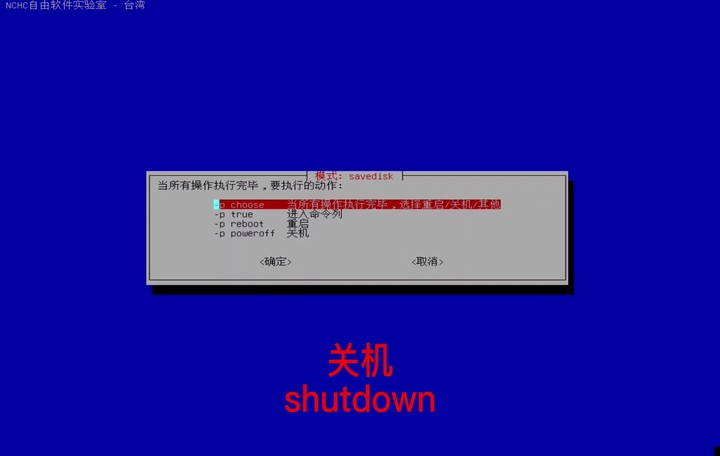   
第二十二步：开始拷贝    
   
###等待完成自动关机

## 注意事项： U盘作为启动盘，需要保存自己镜像时候需要用户提供硬盘，不要在U盘上做任何修改、添加或者保存其他文件，以免破坏启动盘的环境。
