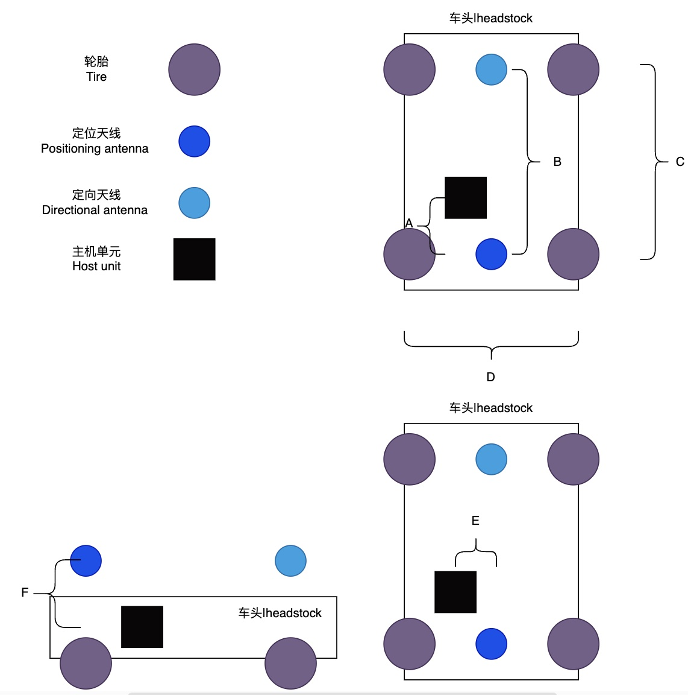
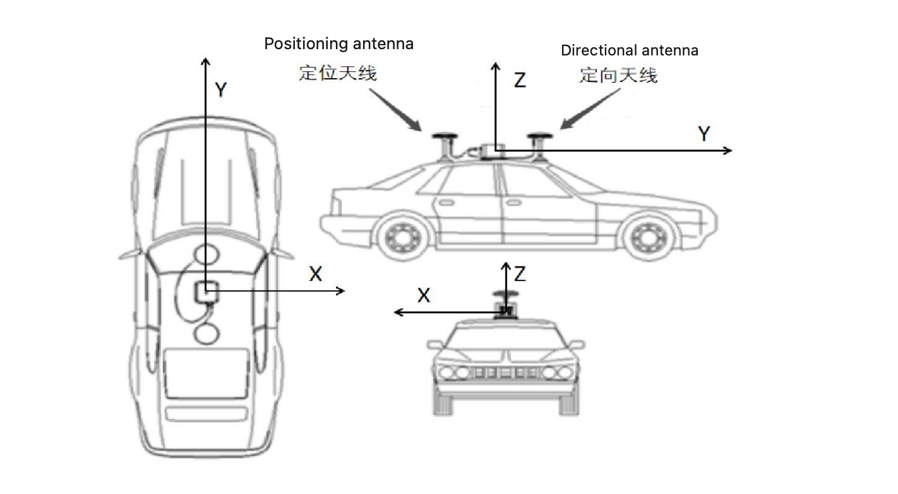
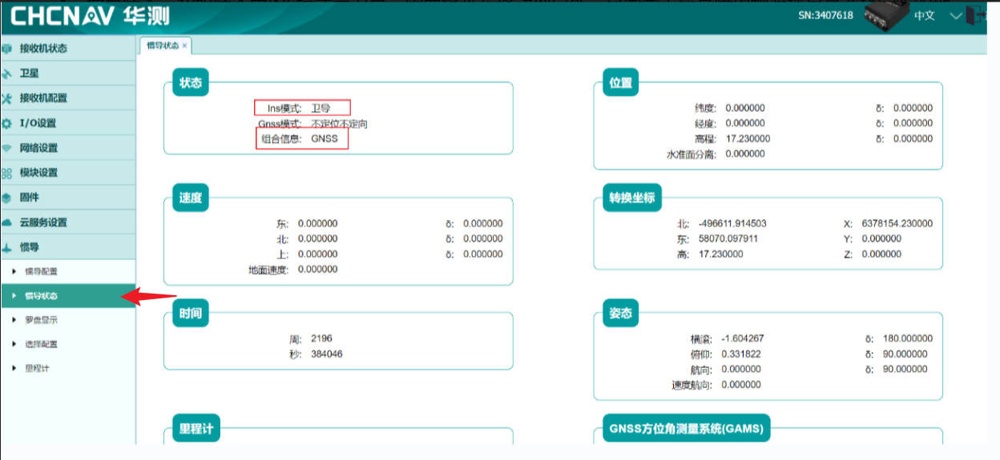
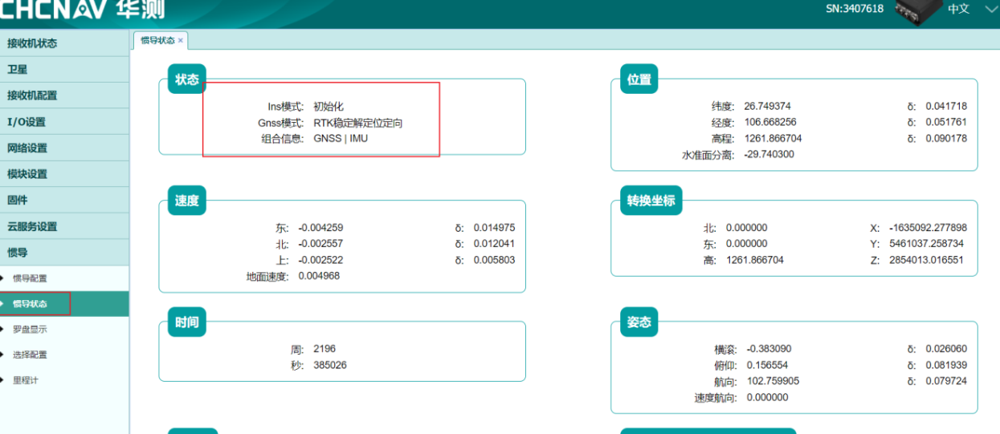
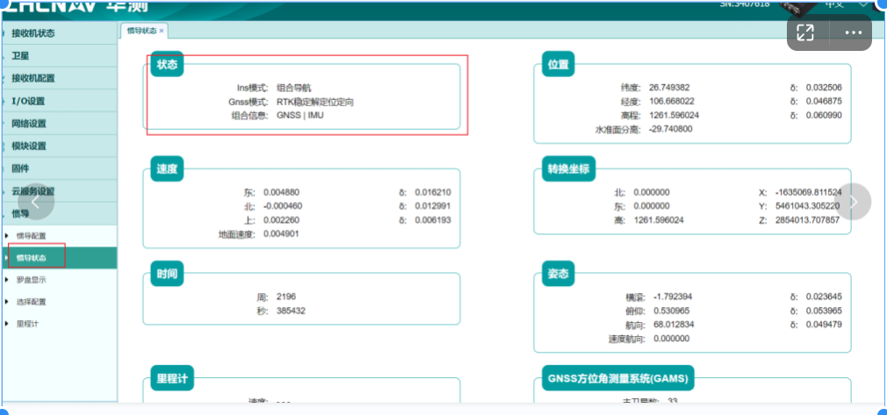

# GNSS安装
## 硬件安装
## 设备接线

## 硬件参数配置
### 设备信息检测
- 天线和电缆的安装完成后，给接收机上电开机，当接收机启动后，可以使用 WiFi 来访问、配置和监视接收机，不需要连接到接收器的线缆。请遵循以下步骤，通过 WiFi 从网页开始。
- 打开电脑 WiFi，搜索名为 GNSS-XXXXXXX 的无线网络（其中 XXXXXXX 代表你的接收器的 SN 号，可以在主机设备上查看到），然后建立连接，密码是 12345678；打开浏览器，在地址栏输入 192.168.200.1，弹出登陆界面，账号：admin，密码：password；如果选中“记住我”选项，那么浏览器将会记住您下次登录时输入的登录账户和密码
**注意**：不要用火狐浏览器打开，否则参数不能修改成功。
   
- 界面显示为中文，右上角可切换成英文和俄语
   
- 点击“固件升级”，在弹出的对话框中选择本地固件升级包，点击定即可自动升级

> 默认不操作此步骤，当有“固件升级”需求时在操作
   
- 点击“接收机注册”，通过注册软件提供的注册码进行注册后，使接收机在当前的注册期限中才能正常的使用，收到设备后联系PIX同事注册 

> 默认不操作此步骤，当有“接收机过期提示时”提示时在操作
   

- 确定有线网络IP地址192.168.1.110（出厂IP，切勿修改）

> 默认不修改IP，当有“修改IP”需求时在操作
    

### 参数适配
#### 车辆参数设置

> 购买PIXKIT套件，不需要`车辆参数设置`，出厂已经设置完毕

- 使用天线数：后天线接设备GNSS1为定位天线，前天线接设备GNSS2为定向天线；
- 工作模式：为移动机器人，选择低速模式；
- 惯导到车辆坐标系夹角：标准安装，参数均为0；
- `定位天线到后轮中心杆臂`：以定位天线为原点坐标，分别为 xyz，左右方向为 x（右正左负），前后方向为 y（前正后负），上下方向为 z（上正下负），单位为m。例如：天线在后轮中心的左边 0.3 米（一般放在车子中心线，则为 0），前面 0.5 米，上面 1 米，输入值则为 0.3，-0.5，-1；
- GNSS 定向基线与车辆坐标系夹角：标准安装，参数均为0；
- `惯导到GNSS定位天线杆臂`：以惯导设备为原点坐标，分别为 xyz，左右方向为 x（右正左负），前后方向为 y（前正后负），上下方向为 z（上正下负），单位为 m，定位天线在设备的右前上，则x，y，z均为正值；
- 里程计轮速精度(km/h)/转角精度(deg)和里程计延迟：默认值均为0；
- `轮距`：客户根据收到车辆进行测量填写。
完成配置后点击保存即可。

1. `轮距`: 图中`D`长度，车尾两轮中心的距离
2. `惯导到GNSS定位天线杆臂`: 把`主机单元`看成坐标系原点，`定位天线`看成一个点,`定位天线`这个点在`主机单元`这个坐标系下的x,y,z值,比如(E, -A, F)
3. `定位天线到后轮中心杆臂`: 把`定位天线`看成坐标系原点，`后轴中心`看成一个点,`后轴中心`这个点在`定位天线`这个坐标系下的x,y,z值。

#### RTK账号登录

- 进入到IO 配置界面，选择“RTK 客户端”，点击“连接”，连接协议可以选择 NTRIP/TCP/APIS协议，输入账号密码等相关信息后，最后点击“确定”。
    

**注意1**：获取源列表时，一定要注意右下角弹出源列表获取成功，否则RTK登录失败，检查是否给设备供网。

**注意2**：CGI-410支持国外差分，但必须保证基站播发的是标准的RTCM语句，国内外统一支持卫星：GPS，北斗，伽利略，格洛纳斯，准天顶。

#### 设备校准
实车操作:INS模式先是卫导，然后初始化，最后组合惯导，车辆一定要开到户外，且周围较为空旷，无高大遮挡建筑物，车辆前后移动，**8**字形移动，前后转圈行驶，大概需要二十分钟左右方可校准成功，如果INS模式一直没变化，请检查RTK账号是否登录成功。
- 惯导状态1：INS模式为卫导；
    
- 惯导状态2：INS模式为初始化；
    
- 惯导准态3：INS模式为组合惯导状态，组合信息为GNSS | MIU
    
**注意**：标定半小时，INS模式初始化，GNSS模式一直不出现RTK稳定解定位定向，请查设备RTK是否正常，臂杆值是否正确，定位天线（后天线是否接设备GNSS1），定向天线（前天线是否接设备GNSS2）。如果设备是安装在整车项目，不方便检查，请检查惯导状态中的姿态信息中的航向度数，手机打指南针，与车的行驶方向一直，查看度数是是否一直，10度以内偏差正常，如果超过180度偏差，则线束接反，请将GNSS1，与GNSS2接口位置调换。

#### 数据输出
- 输出格式TCP：通过RJ45输出数据到主机设备，组合导航数据分别输出：GPCHC 50HZ，GPGGA 50HZ，其他数据均为关闭，保存数据；
    
    
- 启动工控机，Ctrl+Alt+t打开终端，nc 192.168.1.110 9904，有数据输出表示TCP通讯成功；
    
- 如需使用其他参数请参考CGI-410使用手册。
    [CGI-410使用手册](./image/CGI-410.pdf)
