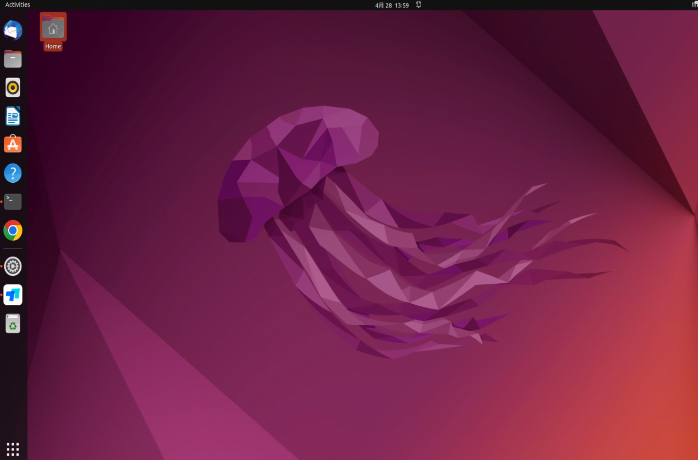

# IPC安装
## 硬件安装
## 设备接线
## 硬件参数检查
- 接线完成后，点击开机按钮，稍等几秒即可登入界面
    
- Ctrl+Alt+t 启动终端：用户名：pixkit，用户名密码：pixmoving
- 检查主机静态IP：192.168.1.102，如果不是，请修改静态IP地址，否则传感器数据传输异常
    
- 设置主机静态IP:打开网络设置，选择设置端口，点击IPV4，根据图片修改ip，网关，子网掩码，DNS，完成后点击右上角应用。
    

Ctrl+Alt+t 启动终端，ifconfig检测是否修改成功
    

> 网口位置对应关系
    
注意：该图片仅供参考，如果收到工控机与图片不符，请忽略此图片。

- 检查底盘can数据
```shell
candump can0
```
终端输出数据正常
    

- 检查激光雷达：RS-Helios-16P ；192.168.1.200
```shell
ping 192.168.1.200
```
终端输出数据正常
    

- 检查组合惯导：CGI-410 ；192.168.1.110
```shell
ping  192.168.1.110
```
终端输出数据正常
    

- 如果适配的有路由器及物联网卡，请检查是否能正常上网
```shell
ping baidu.com
```
终端输出数据正常
    
**注意1**：需要根据路由器IP地址，设置主机IP，方可正常上网。

**注意2**：如果传感器参数不能正常输出，请点击相应硬件安装文档，根据操作文档检查线束连接。
