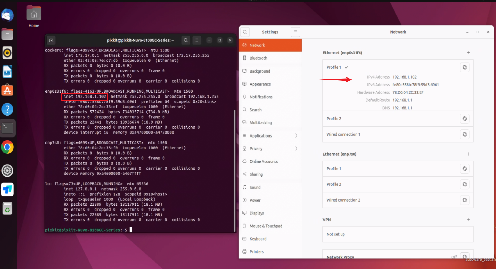

# IPC安装
## 硬件安装
## 设备接线
## 硬件参数检查
- 接线完成后，按住开机键，听见滴的一声稍等几秒，即可登入界面
    
- Ctrl+Alt+t 启动终端：用户名：pixkit，用户名密码：pixmoving
- 检查主机静态IP：192.168.1.102，如果不是，请修改静态IP地址，否则传感器数据不能接收
    
- 检查底盘can数据
    
- 检查激光雷达：RS-Helios-16P ；192.168.1.200
    
- 检查组合惯导：CGI-410 ；192.168.1.110
    
- 如果适配的有路由器，请检查是否能正常上网
    
**注意**：如果传感器参数不能正常输出，请点击相应硬件安装文档，根据操作文档检查线束连接。

