# LiDAR安装
## 硬件安装
## 设备接线
## 硬件参数配置

### 设备信息检测

- 雷达型号：RS-Helios-16P
- RSView可视化软件使用
- 点击下载：[RS-Helios-16p资料](https://www.robosense.ai/resources-81)
- 根据操作文档设置雷达IP地址，出厂IP：192.168.1.200(切勿修改)

#### rviz2 可视化显示
- 打开工控机，Ctrl+Alt+t 启动终端，进入该路径
    

```shell 
source install/setup.bash 

ros2 run rslidar_sdk rslidar_sdk_node 
```
- 启动ros2 驱动
    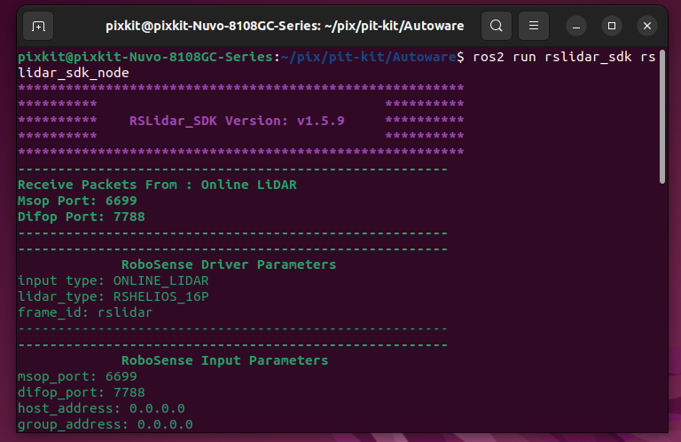

- 启动rviz2 查看点云数据，修改Fixed Frame ：rs16，增加点云话题
    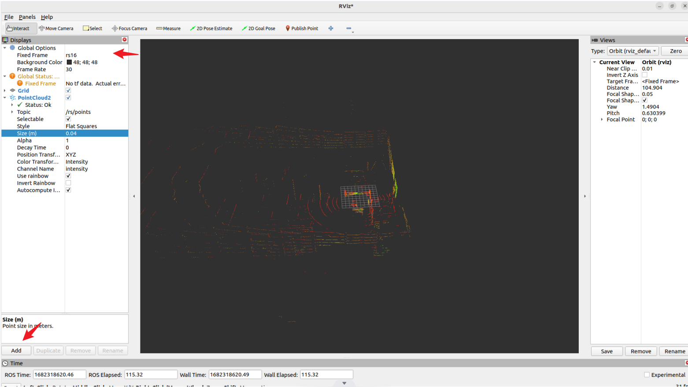
    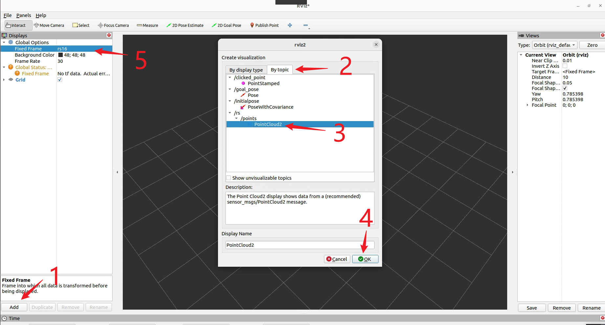

- 启动顺序
    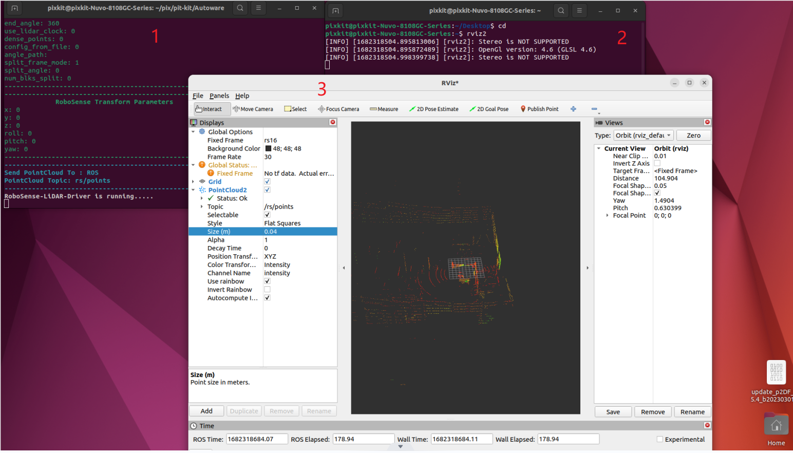

#### RSview软件

**注意**：RSview是速腾官方软件，使用方法建议按照RS官方文档操作，此处作为参考，官方软件更新迭代，操作界面或有不同。

- 启动设备：带RJ45网口Window系统笔记本电脑
- 设置笔记本IPV4IP地址：192.168.1.102
    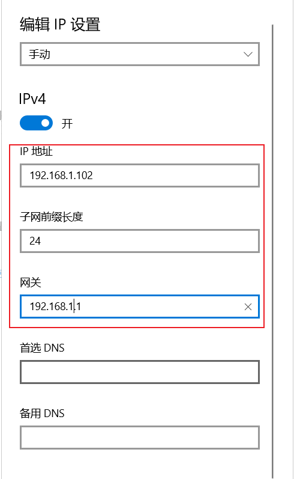
- 关闭系统防火墙
    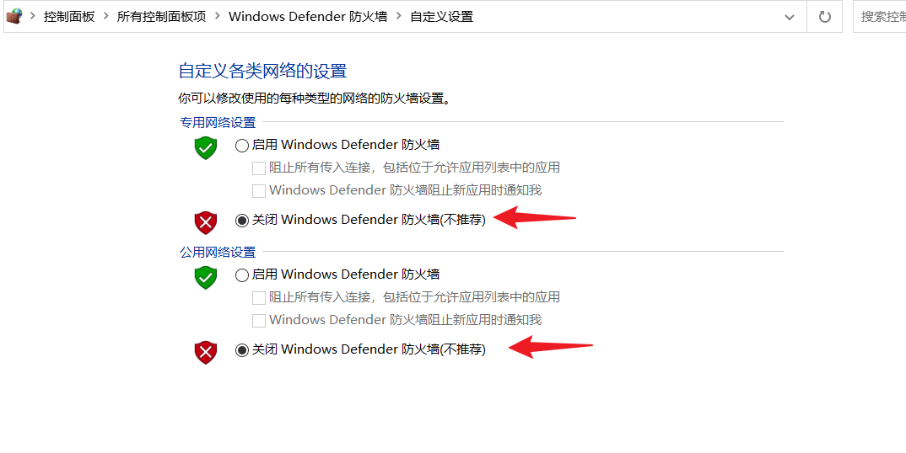
- 启动RSview软件(根据雷达型号下载相应软件)
    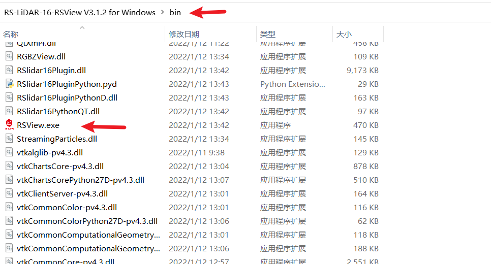
- 点击雷达标志，查看点云数据是否正常
    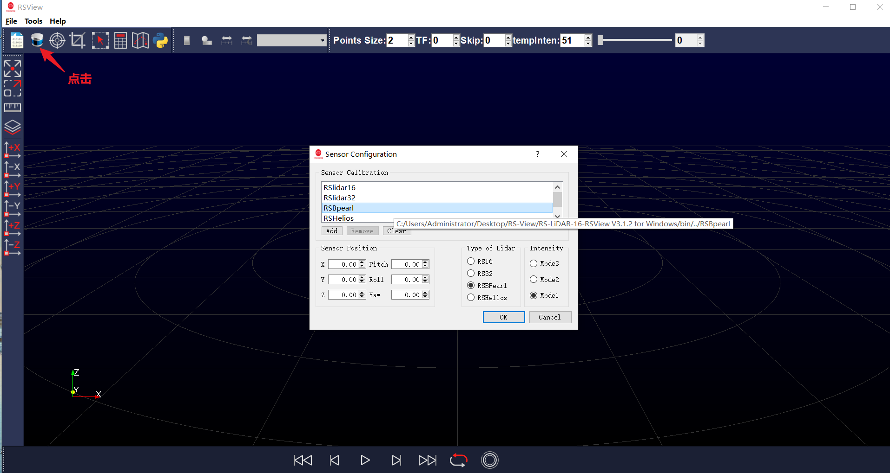
    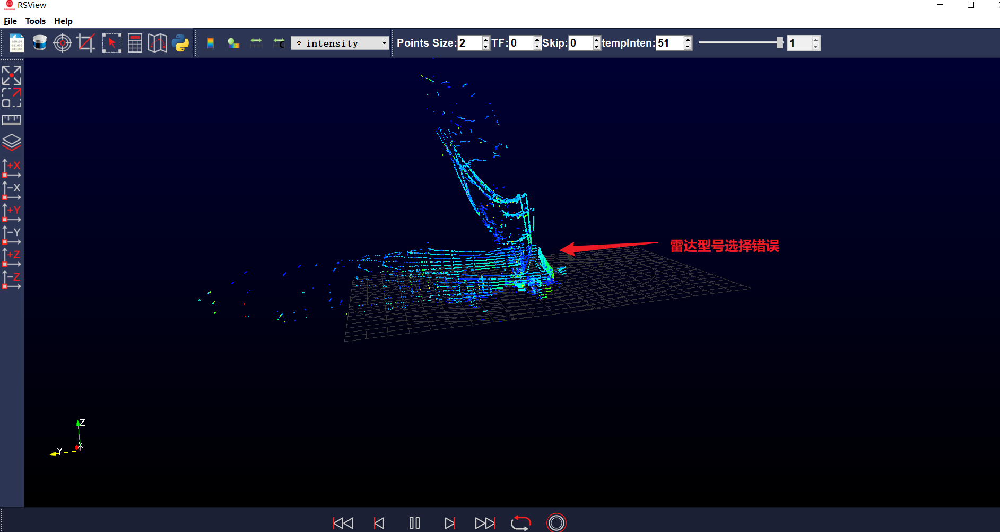
    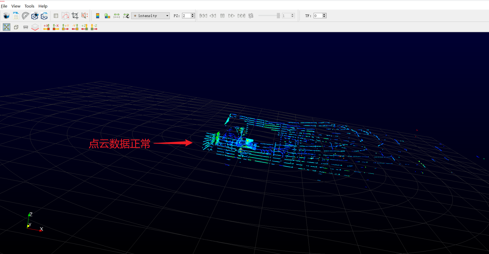
- 支持Web查看设备信息，更新固件，修改IP，打开浏览器，输入192.168.1.200即可
    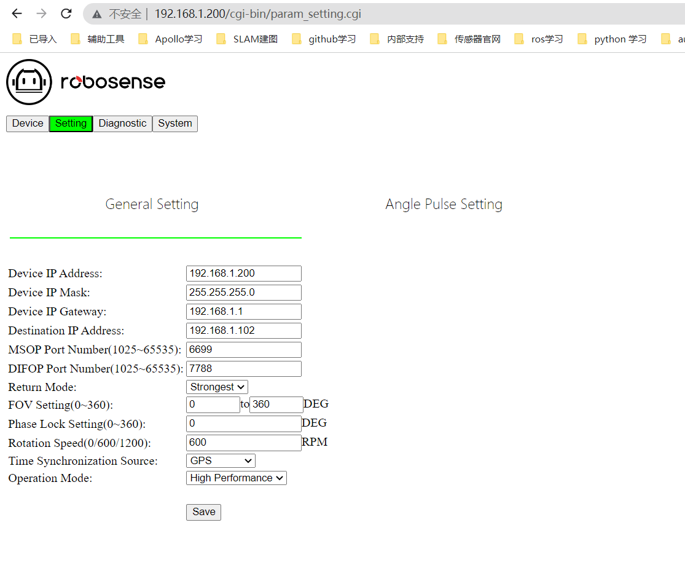


