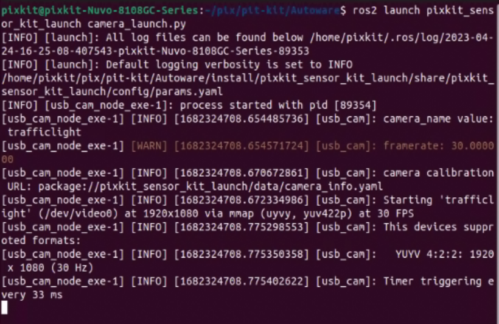
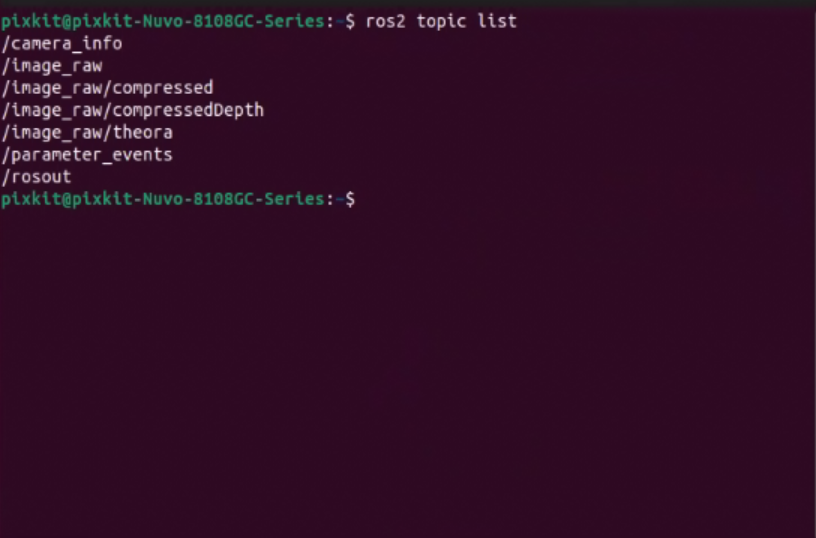

# camera安装
## 硬件安装
## 设备接线
## 硬件启动
- 打开工控机，Ctrl+Alt+t 启动终端
```shell
source  ~/pix/pit-kit/Autoware/install/setup.bash 
ros2 launch pixkit_sensor_kit_launch camera_launch.py 
```
- 启动相机驱动
    
- 查看话题数据
```shell
ros2 topic list
```
重新打开一个终端
    
- rqt工具包查看
```shell
ros2 run rqt_image_view rqt_image_view
```
在终端输入指令回车，会自动弹出可视化界面
    
**注意**：如果不能输出话题列表或查看可视化图像，请检查线束，或查看ros驱动是否启动成功。