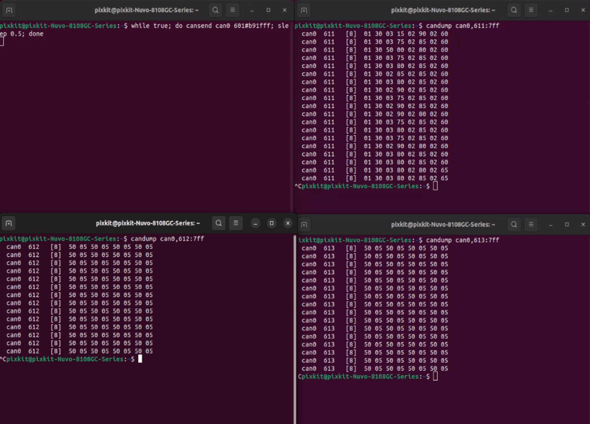

# 超声波雷达安装
## 硬件安装
## 设备接线
## 硬件参数检查
- 已经完成硬件安装
- 启动终端
    
```shell
激活超声波：while true; do cansend can0 601#b91fff; sleep 0.5; done
查看1-4号探头数据：candump can0,611:7ff
查看5-8号探头数据：candump can0,612:7ff
查看9-12号探头数据：candump can0,613:7ff
```
- 参考文档
[F40-16TR7B超声波传感器CAN使用文档](./image/F40-16TR7B超声波传感器.pdf)
