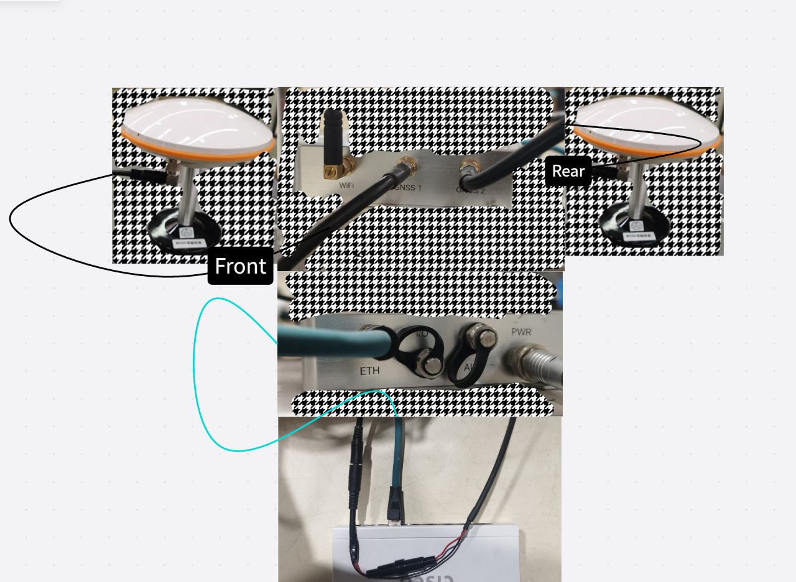
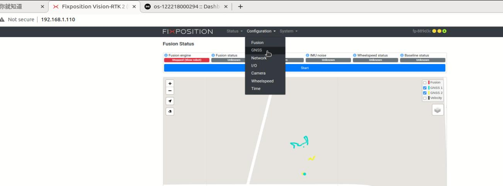
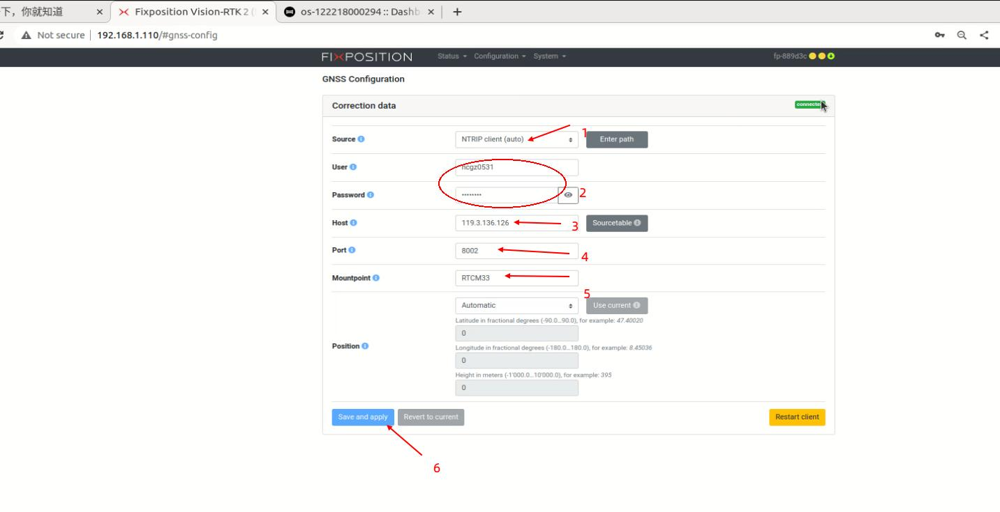
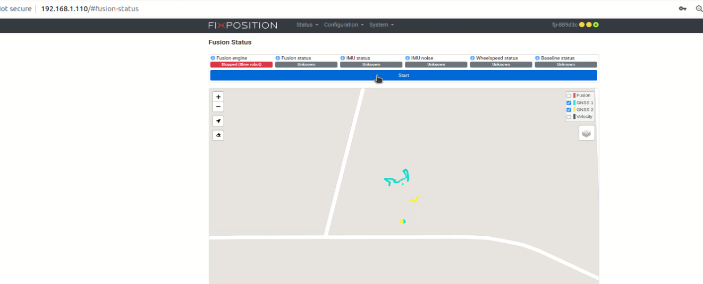
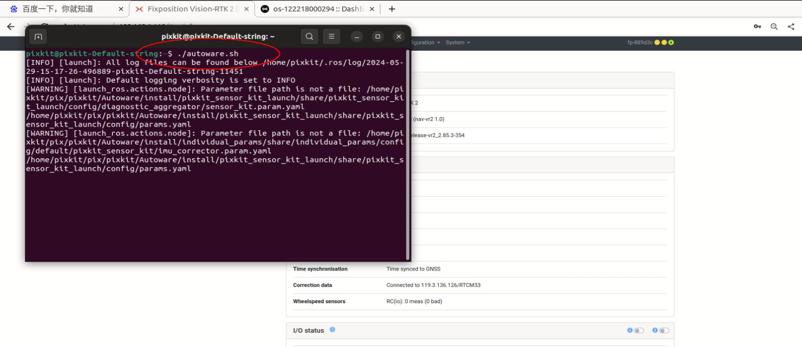
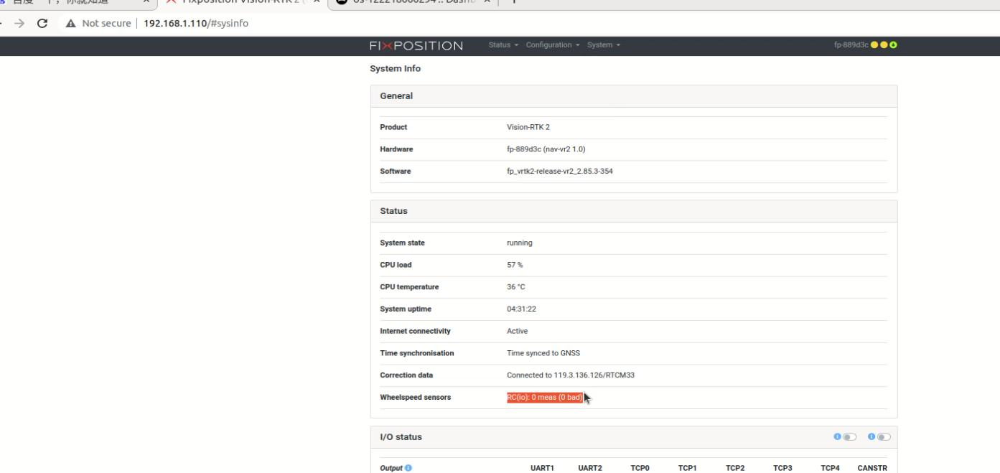
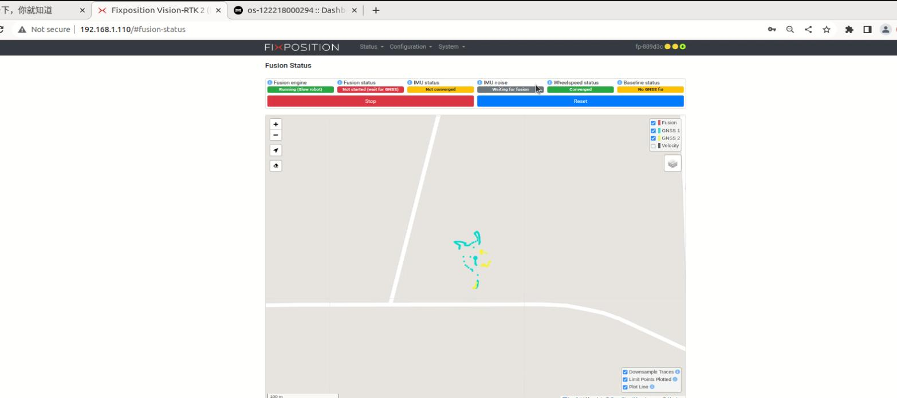
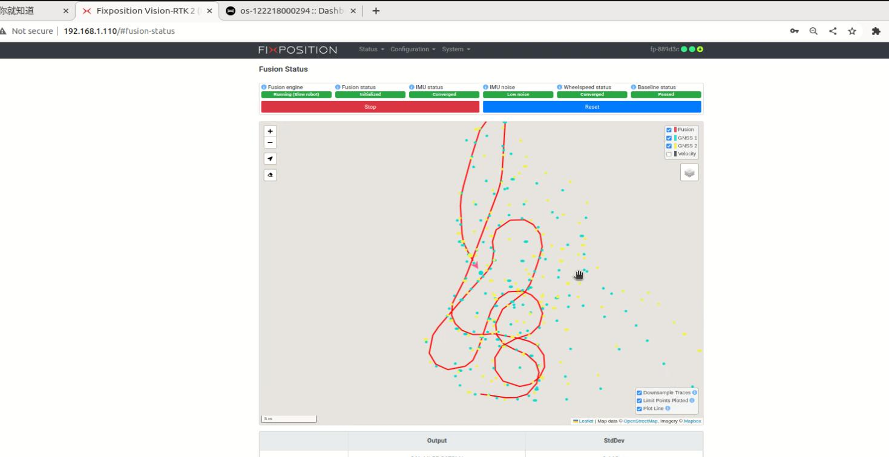

# GNSS—FP
## 设备接线
   
## 硬件参数配置
### 设备检测
- 工控机打开google浏览器：在地址栏输入 192.168.1.110（出厂IP，切勿修改）
### RTK账号登录（需填—您的RTK账号密码）
- 进入fixposition网页后，在Configuration下选择GNSS
    
- 进入rtk按如下设置：user：您的账号，password：您的密码，Host：119.3.136.126,Mountpoint:RTCM33
    
**注意1**：检查网络是否正常，否则RTK登录失败，检查给网设备。
### 数据检查
```shell 
nc 192.168.1.110 21000
```

### 设备校准
```shell 
将车辆需开到户外先静止5分钟左右，车辆移动使，绕**8**字形回环，前后转圈行驶，注意车头蘑菇头连接GNSS1,车尾连接GNSS2，以及连接的rtk账号检查。
```
- 返回主页，点击start
  
- FP设备需要用到轮速反馈，将会更快的融合，执行autoware.sh开启,给个初始位置，使点云显示在地图上。这里需要注意一下底盘是否正常连接到auotware，可通过遥控方向盘左右转向查看rviz2上的steer变化，没有时重启autoware，以及雷达没有显示时需要激活。

  网页System下选择info查看Wheelspeed sensors查看，如有数据反馈表示轮速已连接
  
- 融合前状态：车辆移动绕8字,转弯和直行一段距离。大概需要10分钟左右，直到所有状态为绿色。
  
- 融合后状态：融合后所有状态均为绿色，表示已融合。
  

- 参考手册   
    [VRTK文档](./image/VRTK2%20快速使用手册2.0.pdf)