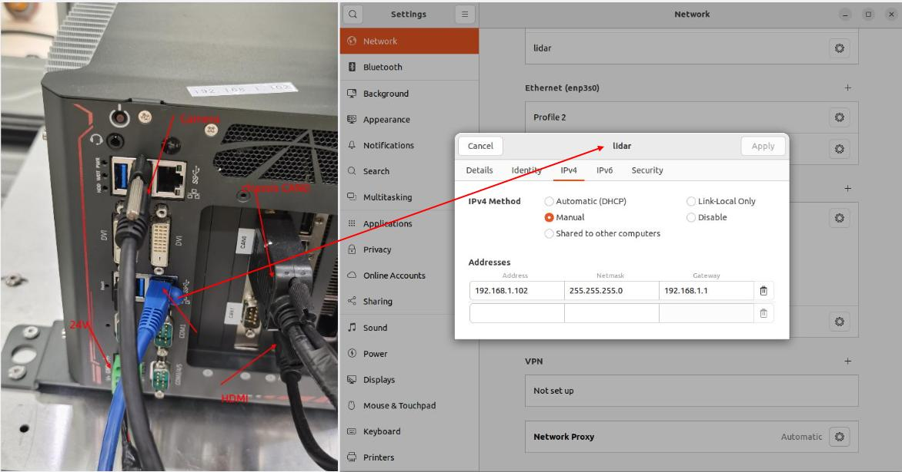
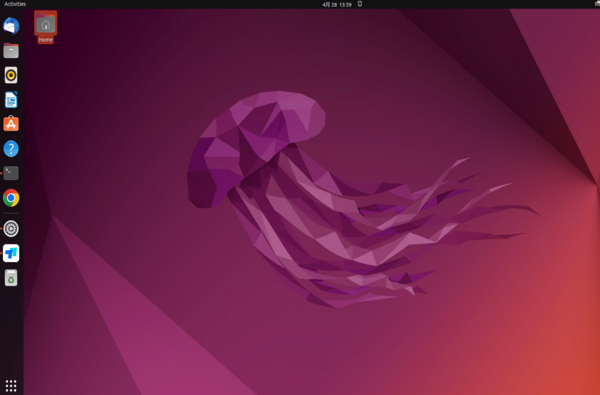
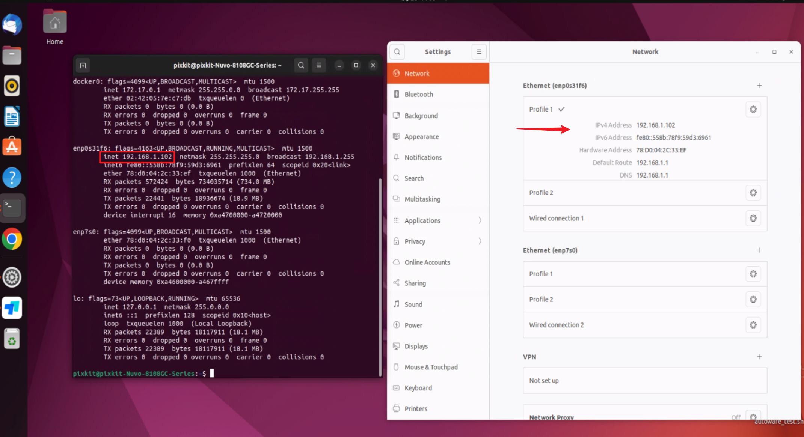
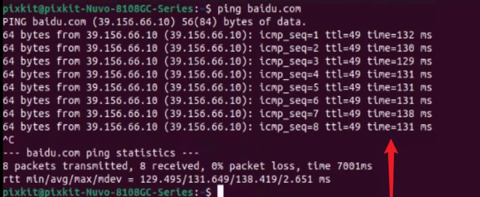
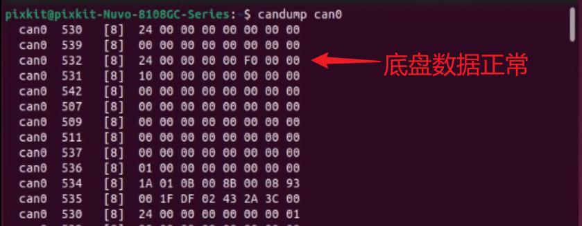
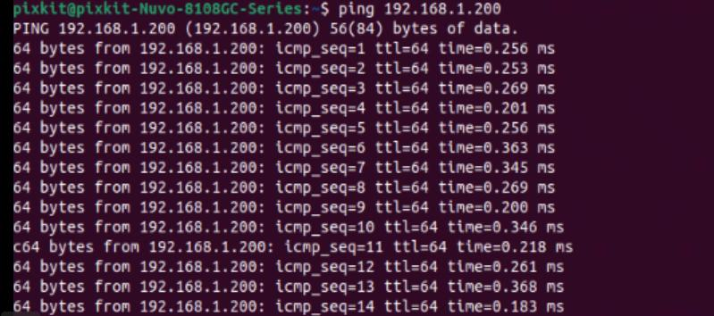
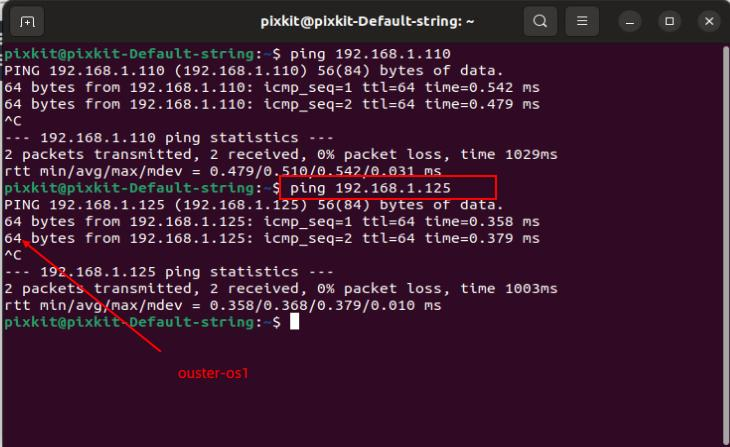
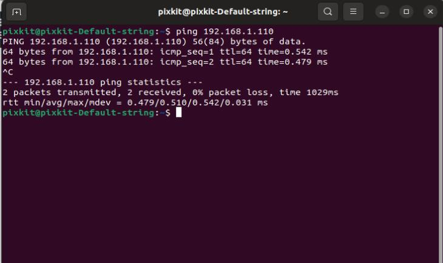

# IPC
用户名：pixkit，用户名密码：pixmoving
## 设备接线
**说明** 传感器设备（相机除外）均需要连接车载12V电源以及工控机24V电源，RJ45网线传输数据
lidar-ouster、robosense、fixposition和华测CHC。 
 
## IPC网络设置

> 将交换机或者路由器的RJ45网线连接到工控机网口（IPC）
    
注意：图片仅供参考，若工控机型号与图片不符，注意连接网口。
- 接线完成后，点击开机按钮，稍等几秒即可登入界面。
    
- Ctrl+Alt+t 启动终端terminal   
  **注意**：Ctrl+Alt+t是开启terminal，Ctrl+c是结束terminal，Ctrl+shift+t是开启侧边terminal之后文档将不再复述。
### 检查主机静态IP
打开网络设置，查看当前连接端口，点击IPV4查看，若不同需按图修改，完成后点击Apply。
    

- 检查主机静态IP（ifconfig）：如果静态IP地址不是192.168.1.102，需检查网络设置，否则传感器数据传输异常
    
###  检查网络 
 本公司提供的物联网卡可以正常使用一年，如不能上网请检查DNS192.168.1.1或更换路由器网口
```shell
ping baidu.com
```
 

**注意1**：路由器IP地址切勿修改，若不能上网先检查网口连接，检查DNS，通过浏览器访问路由器查看  
**注意2**：物联网卡到期，若需购买可联系公司或自行更换


### 检查底盘can数据
- 底盘的can数据接口需连到can0接口，若不能输出数据请更换can口
```shell
candump can0
```
终端输出数据正常
    

### 检查激光雷达数据  
   RS-Helios-16P 静态IP 192.168.1.200     
   OUSTER-OS    静态IP  192.168.1.125
                   
```shell
ping 192.168.1.200
ping 192.168.1.125
```
终端输出数据正常
    
    

### 检查组合惯导
192.168.1.110
```shell
ping  192.168.1.110
```
终端输出数据正常
    
