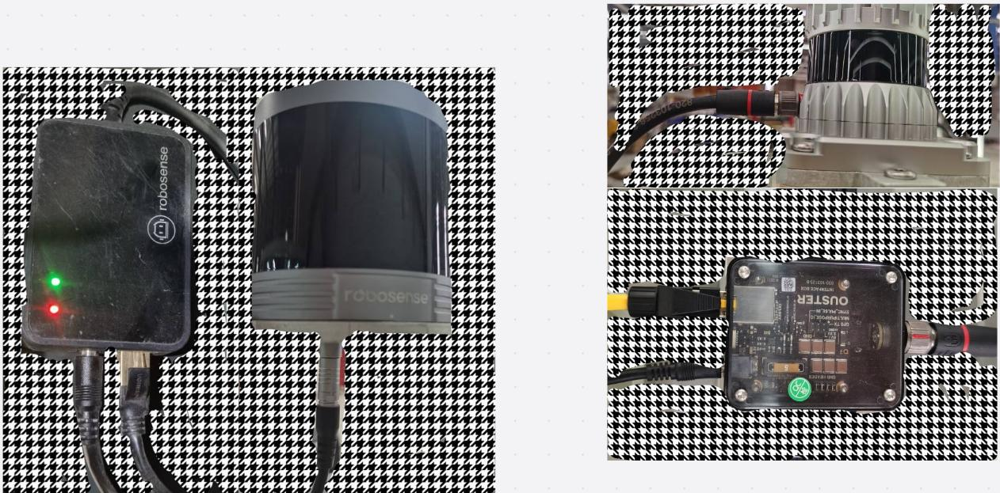
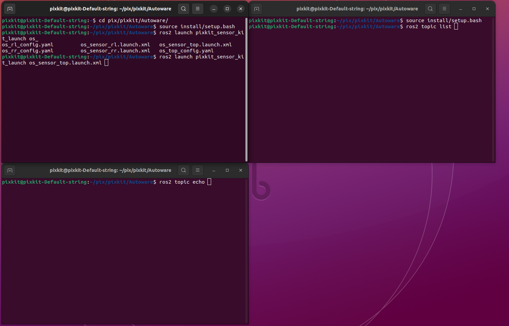
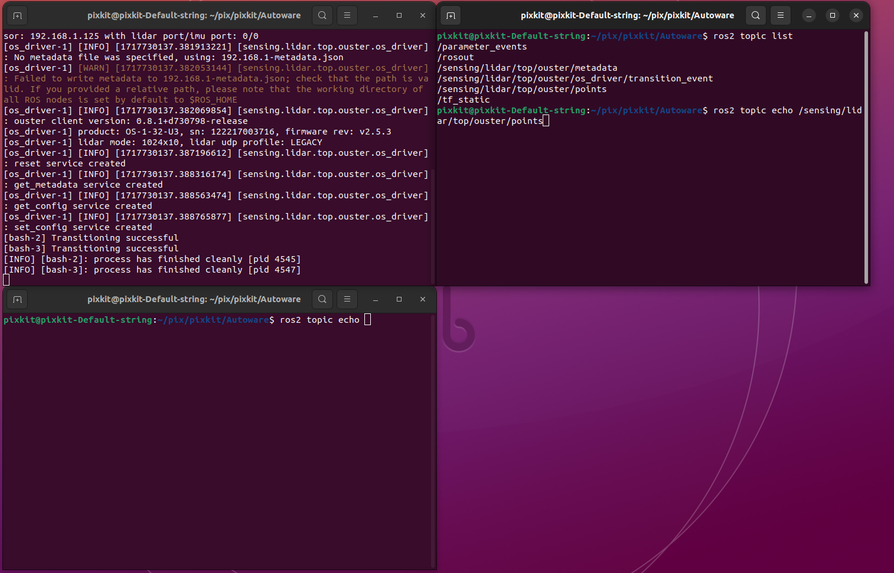
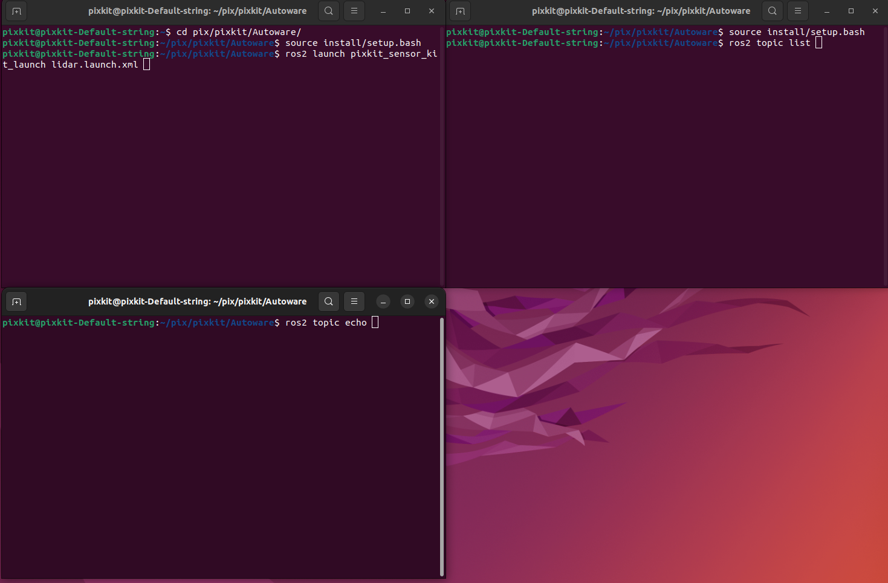
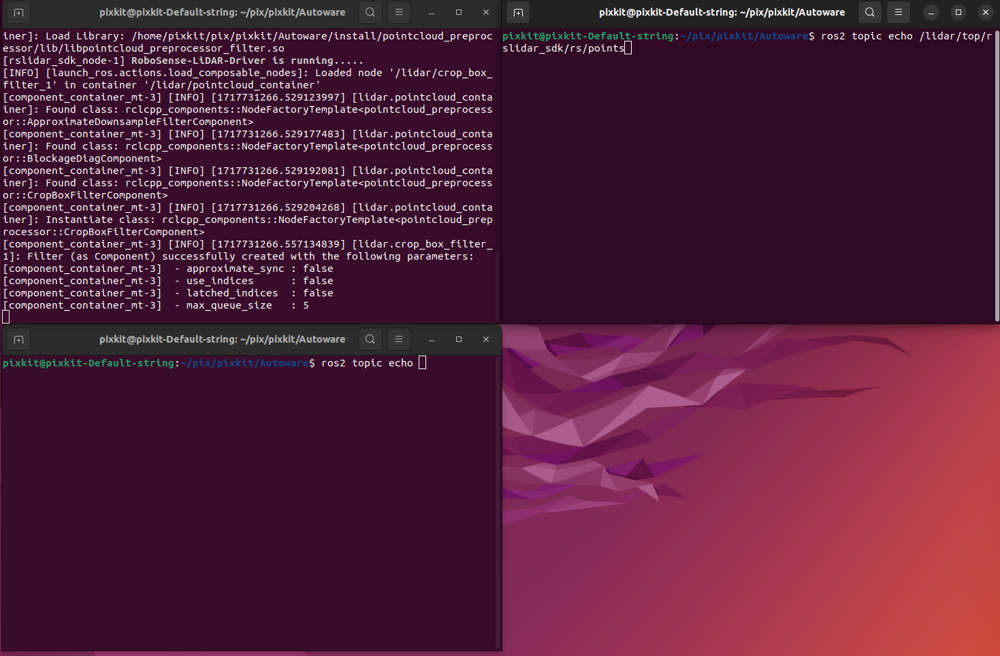

# LiDAR
## 设备接线
 
### 设备

- 雷达型号：RS-Helios-16P或OUSTER-OS

- 雷达静态IP：192.168.1.200(RS-Helios-16P)或192.168.1.125(OUSTER-OS)(切勿修改)

### ROS驱动程序
在Autoware文件下

#### ouster_driver
```shell 
source install/setup.bash
ros2 launch pixkit_sensor_kit_launch os_sensor_top.launch.xml
``` 
 
 通过ros topic list 查看 lidar/points的话题
  
#### rs_driver
```shell 
source install/setup.bash
ros2 launch pixkit_sensor_kit_launch lidar.launch.xml
``` 
  
   通过ros topic list 查看 lidar/points的话题，echo可以打印话题输出
    
 
 
- 驱动下载：[RS-Helios-16p](https://github.com/RoboSense-LiDAR/rslidar_sdk)
- 驱动下载：[OUSTER-OS](https://github.com/ouster-lidar/ouster-ros)
