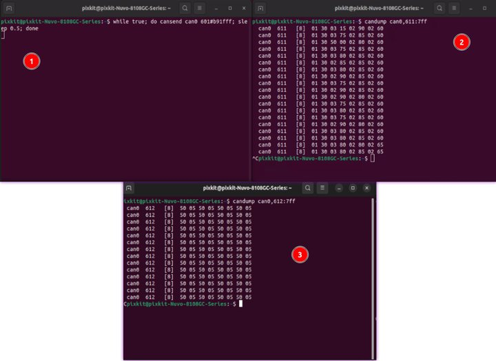
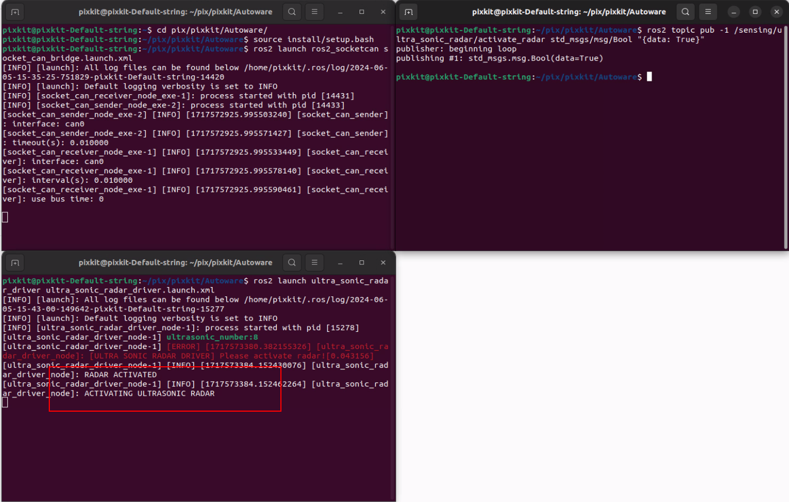

# 超声波雷达
## 设备
- 正常连接CAN0
## 硬件激活检查
- 已经完成硬件安装
- 启动终端
```shell
激活超声波：while true; do cansend can0 601#b91fff; sleep 0.5; done
查看1-4号探头数据：candump can0,611:7ff
查看5-8号探头数据：candump can0,612:7ff
```
 

## 硬件启动
- auotware文件下打开Terminal
```shell
1. 启动CAN驱动
    source install/setup.bash 
    ros2 launch  ros2_socketcan socket_can_bridge.launch.xml
2. 启动超声波程序
    source install/setup.bash 
    ros2 launch ultra_sonic_radar_driver mc_radar_driver.launch.xml
3. 激活话题——可通过ros2 topic list查看
    ros2 topic pub -1 /sensing/ultra_sonic_radar/activate_radar std_msgs/msg/Bool "{data: True}"
```
 
'ACTIVATING ULTRASONIC RADAR' 则表示启动成功

- 参考文档

    [F40-16TR9BL2超声波传感器CAN使用文档](./image/F40-16TR9B.pdf)

    [F40-16TR9BL2驱动程序](https://github.com/pixmoving-moveit/ultra_sonic_radar_driver/tree/ros2-8-probes-ultra)
